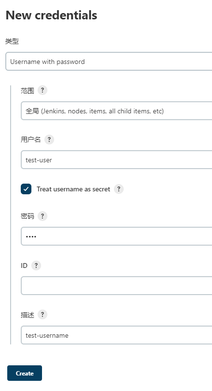

# Jenkins 在pipeline发送http请求

## 前言

在研究使用Jenkinsfile时，发现自己需要发送http请求，但不知道怎么做，便查询文档，实验并记录文档。

## 插件安装

首先Jenkins需要安装一个插件，叫`Http Request Plugin`，在插件管理中心搜索到后一键安装即可。

## 脚本编写与实验

在Jenkinsfile脚本里面实验发送http请求，代码如下

```groovy
pipeline {
    agent any

    stages {
        stage('Test Http Request') {
            steps {
                echo 'Test Http Request'
                script {
                    def response = httpRequest authentication: 'e6c8d343-ee36-48f1-88fe-b838bc03511a', url: 'http://localhost:8080/api/json?pretty=true'
                    println("Status: " + response.status)
                    println("Content: " + response.content)
                }
            }
        }
    }
}
```

之后我们可以在构建的`Console Output`内看到如下内容(部分内容省略)，证明发送请求和读取响应都成功了。

```
[Pipeline] script
[Pipeline] {
[Pipeline] httpRequest
HttpMethod: GET
URL: http://localhost:8080/api/json?pretty=true
Using authentication: e6c8d343-ee36-48f1-88fe-b838bc03511a
Sending request to url: http://localhost:8080/api/json?pretty=true
Response Code: HTTP/1.1 200 OK
Success: Status code 200 is in the accepted range: 100:399
[Pipeline] echo
Status: 200
[Pipeline] echo
Content: {
  "_class" : "hudson.model.Hudson",
  "assignedLabels" : [
    {
      "name" : "built-in"
    }
  ],
  "mode" : "NORMAL",
  "nodeDescription" : "the Jenkins controller's built-in node",
  "nodeName" : "",
  "numExecutors" : 2,
  "description" : null,
  ...
}
[Pipeline] }
[Pipeline] // script
```

### 请求使用Basic Auth

如果我们的请求需要携带`Basic Auth`信息怎么办？

1. 首先我们需要在Jenkins上配置一个凭据，使用`Username with password`的类型即可。
    - 
2. 配置完后我们可以得到这个凭据的`id`，在使用`httpRequest`发送请求时增加一个`authentication`字段，值就是凭据的`id`。
3. 这样，发送请求就可以携带`Basic Auth`信息了。

### 使用JSON读取响应体

对于使用JSON进行响应的API，我们往往需要先将响应体转换成JSON对象，再取我们需要的值。

1. 在Jenkins上安装`Pipeline Utility Steps`插件
2. 这里提供一个Pipeline代码样例来直观表明如何将字符串转换成JSON对象
```groovy
pipeline {
   agent any

   stages {
      stage('Test Http Request') {
         steps {
            echo 'Test Http Request'
            script{
               def response = httpRequest authentication: 'e6c8d343-ee36-48f1-88fe-b838bc03511a', url: 'http://localhost:8080/job/test/api/json?pretty=true'
               println("Status: " + response.status)
               def jsonResponse = readJSON text: response.content
               println("nextBuildNumber: " + jsonResponse.nextBuildNumber)
            }
         }
      }
   }
}
```
3. 于是我们就能在`Console Output`内找到如下输出：
```
[Pipeline] script
[Pipeline] {
[Pipeline] httpRequest
HttpMethod: GET
URL: http://localhost:8080/job/test/api/json?pretty=true
Using authentication: e6c8d343-ee36-48f1-88fe-b838bc03511a
Sending request to url: http://localhost:8080/job/test/api/json?pretty=true
Response Code: HTTP/1.1 200 OK
Success: Status code 200 is in the accepted range: 100:399
[Pipeline] echo
Status: 200
[Pipeline] readJSON
[Pipeline] echo
nextBuildNumber: 11
[Pipeline] }
[Pipeline] // script
```
## 参考文献

1. [Pipeline Steps Reference](https://www.Jenkins.io/doc/pipeline/steps/)
2. [HTTP Request Plugin](https://www.Jenkins.io/doc/pipeline/steps/http_request/#httprequest-perform-an-http-request-and-return-a-response-object)
3. [Basic Auth with Jenkins http-request-plugin](https://stackoverflow.com/questions/41571090/basic-auth-with-Jenkins-http-request-plugin)
4. [Pipeline Utility Steps](https://www.Jenkins.io/doc/pipeline/steps/pipeline-utility-steps/)