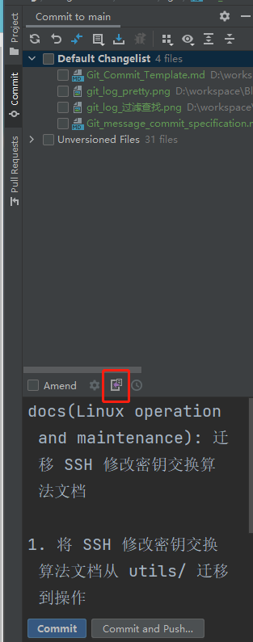
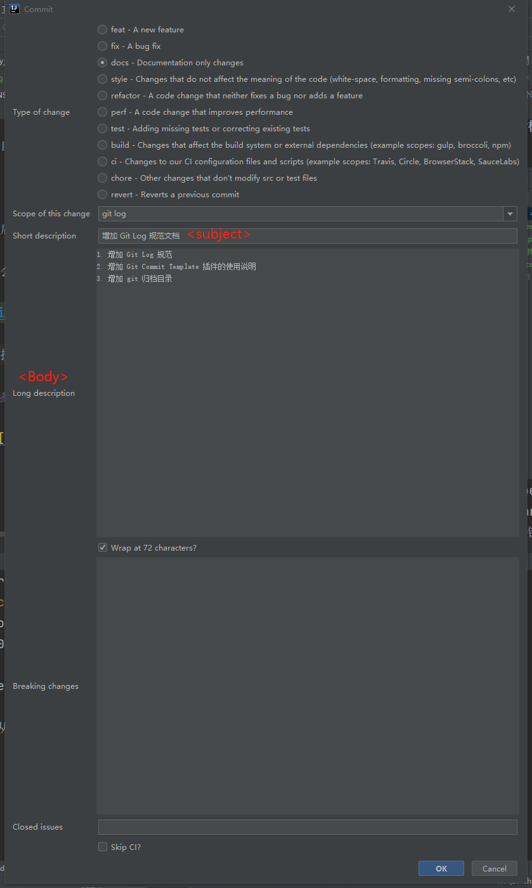

# 插件 Git Commit Template

## 前言

[Git message 提交规范](Git_message_commit_specification.md) 在入门时没有那么快就能适应，我们可以借助工具来降低使用门槛。

Git Commit Template 插件就是一个很好的工具。

## Git Commit Template

这是一个 jetbrains 系 IDE 的插件，可以帮助我们快速生成遵守 [Angular 规范](https://docs.google.com/document/d/1QrDFcIiPjSLDn3EL15IJygNPiHORgU1_OOAqWjiDU5Y/edit#heading=h.greljkmo14y0) 的提交信息。

### 安装

可以自己在 IDE 的插件市场内直接安装，也可以去 [官方 web 插件市场](https://plugins.jetbrains.com/plugin/9861-git-commit-template) 上下载安装。

### 使用

安装后在点击 commit 时，会弹出我们常见的 commit 对话框。

我们会发现这个对话框内多了个操作按钮，这个按钮就是这个插件的入口。



点击按钮后打开插件对话框。



确定后会在提交信息框内生成遵守 Angular 规范的提交信息。

```text
docs(git log): 增加 Git Log 规范文档

1. 增加 Git Log 规范
2. 增加 Git Commit Template 插件的使用说明
3. 增加 git 归档目录
```

## 参考文献

1. [Git Commit提交规范和IDEA插件Git Commit Template的使用](https://blog.csdn.net/noaman_wgs/article/details/103429171)