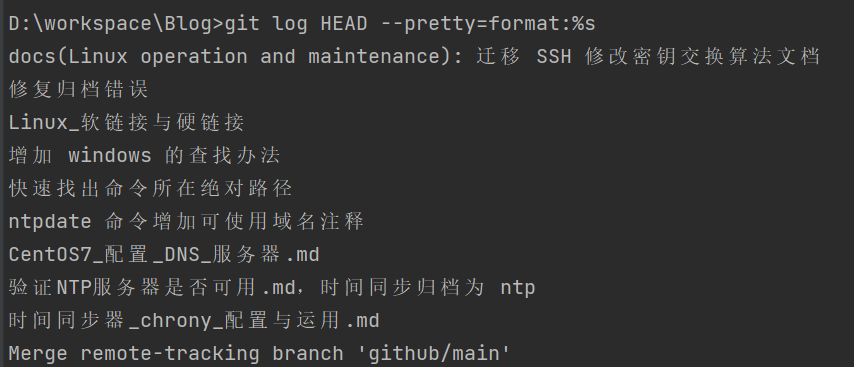
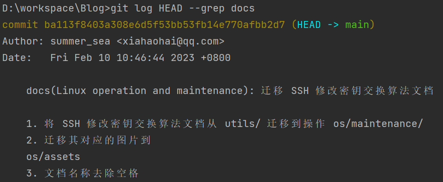

# Git message 提交规范

## 前言

我们提交 commit 的时候，message 里面写什么都行。但是一般来说，一个清晰明了的 commit message 在版本的持续迭代中会带来不少好处。所以我们应该学习一下 message 编写规范，本文介绍 [Angular 规范](https://docs.google.com/document/d/1QrDFcIiPjSLDn3EL15IJygNPiHORgU1_OOAqWjiDU5Y/edit#heading=h.greljkmo14y0) 。

## 1. Commit message 的好处

正如前言中提到的，项目 git log 中 commit message 遵循格式化的好处有很多。

### 1.1. 提供更多的历史信息，方便快速浏览。

比如，下面的命令显示上次发布后的变动，每个commit占据一行。你只看行首，就知道某次 commit 做了什么以及本次 commit 的大致分类。

```shell
git log <last tag> HEAD --pretty=format:%s
```

笔者提交了一次格式化后的 commit 用这个命令执行了一下，第一行看到的信息就比以前多了，并且因为格式的关系，会清晰一些。


### 1.2. 可以过滤某些commit（比如文档改动），便于快速查找信息。

```shell
git log <last release> HEAD --grep feature
```



### 1.3. 可以直接从commit生成Change log

Change Log 是发布新版本时，用来说明与上一个版本差异的文档。

所有人统一格式提交后，就可以用程序自动生成版本差异文档了。

## 2. Commit message 的格式

每次提交，Commit message 都包括三个部分：Header，Body 和 Footer。

```text
<type>(<scope>): <subject>
// 空一行
<body>
// 空一行
<footer>
```

其中，Header 是必需的，Body 和 Footer 可以省略。

不管是哪一个部分，任何一行都不得超过72个字符（或100个字符）。这是为了避免自动换行影响美观。

### 2.1. Header

Header部分只有一行，包括三个字段：`type`（必需）、`scope`（可选）`和subject`（必需）。

**(1) type**

`type` 用于说明 commit 的类别，常用标识如下。

- feat：新功能（feature）
- fix：修补bug
- docs：文档（documentation）
- style： 格式（不影响代码运行的变动）
- refactor：重构（即不是新增功能，也不是修改bug的代码变动）
- perf: 性能 (提高代码性能的改变)
- test：增加测试
- build: 影响构建系统或外部依赖项的更改(maven,gradle,npm 等等)
- ci: 对CI配置文件和脚本的更改
- chore：构建过程或辅助工具的变动
- revert: Revert a commit

**(2) scope**

`scope` 用于说明 commit 影响的范围，比如数据层、控制层、视图层等等，视项目不同而不同。

**(3) subject**

subject是 commit 目的的简短描述，不超过50个字符。

- 以动词开头，使用第一人称现在时，比如change，而不是changed或changes
- 第一个字母小写
- 结尾不加句号（.）

e.g:
- feat(订单模块)：订单详情接口增加订单号字段

### 2.2. Body

Body 部分是对本次 commit 的详细描述，可以分成多行。

如：

（1）增加订单号字段；

（2）增加了订单退款接口；

日常项目开发中，如果 Header 中 subject 已经描述清楚此次代码变更的内容后，Body 部分就可以为空。

有两个注意点。

（1）使用第一人称现在时，比如使用change而不是changed或changes。

（2）应该说明代码变动的动机，以及与以前行为的对比。

### 2.3. Footer

Footer 部分只用于两种情况。

（1）不兼容变动

如果当前代码与上一个版本不兼容，则 Footer 部分以 `BREAKING CHANGE` 开头，后面是对变动的描述、以及变动理由和迁移方法。

```text
BREAKING CHANGE: isolate scope bindings definition has changed.

    To migrate the code follow the example below:

    Before:

    scope: {
      myAttr: 'attribute',
    }

    After:

    scope: {
      myAttr: '@',
    }

    The removed `inject` wasn't generaly useful for directives so there should be no code using it.
```

（2）关闭 Issue

如果当前 commit 针对某个issue，那么可以在 Footer 部分关闭这个 issue 。

```text
Closes #123, #245, #992
```

### 2.4. Revert

还有一种特殊情况，如果当前 commit 用于撤销以前的 commit，则必须以 `revert:` 开头，**后面跟着被撤销 Commit 的 Header**。

```text
revert: feat(pencil): add 'graphiteWidth' option

This reverts commit 667ecc1654a317a13331b17617d973392f415f02.
```

Body部分的格式是固定的，必须写成 `This reverts commit <hash>.` ，其中的 `hash` 是被撤销 commit 的 SHA 标识符。

如果当前 commit 与被撤销的 commit，在同一个发布（release）里面，那么它们都不会出现在 Change log 里面。如果两者在不同的发布，那么当前 commit，会出现在 Change log 的 `Reverts` 小标题下面。

## 参考文献

1. [Commit message 和 Change log 编写指南](https://www.ruanyifeng.com/blog/2016/01/commit_message_change_log.html)
2. [Git Commit Message Conventions](https://docs.google.com/document/d/1QrDFcIiPjSLDn3EL15IJygNPiHORgU1_OOAqWjiDU5Y/edit#heading=h.greljkmo14y0)
3. [Git Commit提交规范和IDEA插件Git Commit Template的使用](https://blog.csdn.net/noaman_wgs/article/details/103429171)