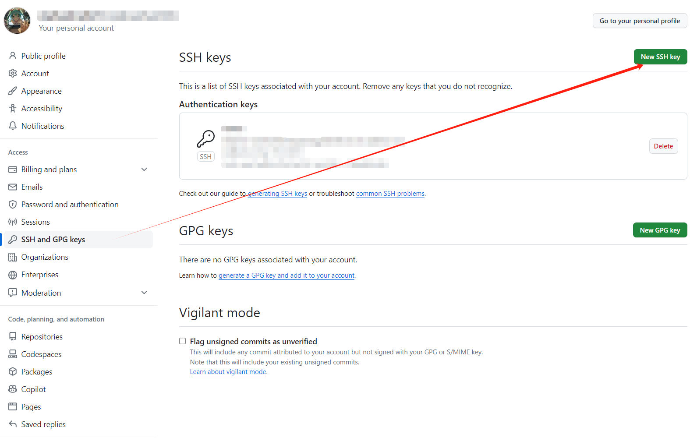
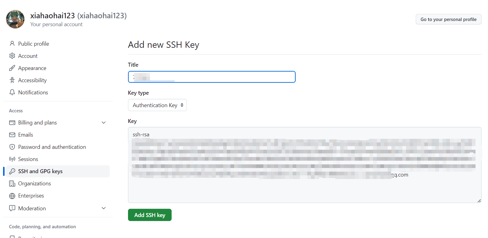
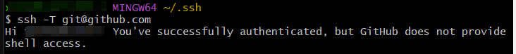
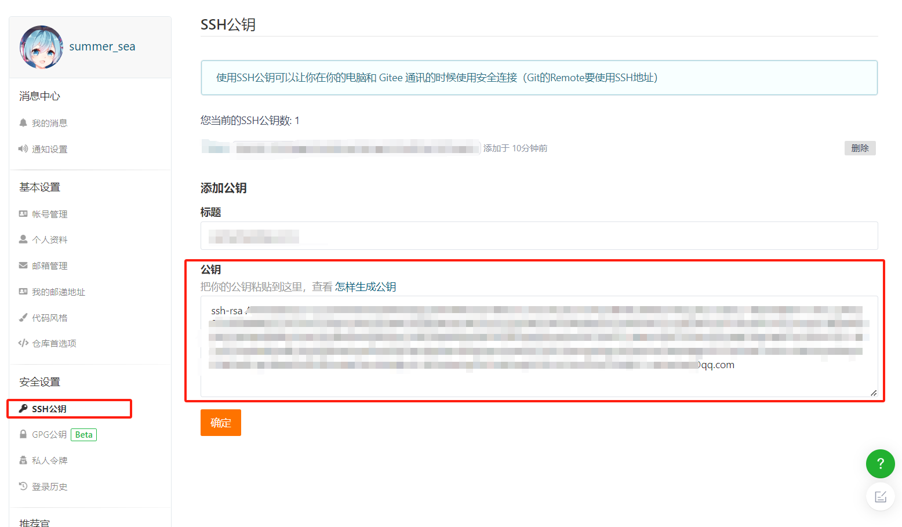
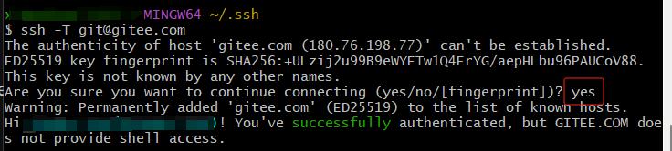

# git 配置远程仓库密钥

## windows

1. 文件夹或桌面右击，选择 git bash here

2. 进入 ssh 目录
    ```shell
    cd
    cd .ssh
    ```
3. 创建 ssh keys，不同密钥对用后缀区分，输入后弹出提示需要输入时，一直回车，不用输入。
    - _创建 gitee 用的密钥对_
    ```shell
    ssh-keygen -t rsa -f ~/.ssh/id_rsa.gitee -C "自己的邮箱@qq.com"
    ```
    - _创建 github 用的密钥对_
    ```shell
    ssh-keygen -t rsa -f ~/.ssh/id_rsa.github -C "自己的邮箱@qq.com"
    ```
   此时会在 `C:\Users\电脑登录用户名\.ssh` 下生成对应的密钥对
4. 启动 `ssh-agent`
   ```shell
   ssh-agent bash
   ```
    1. ssh-agent： SSH 代理是一个用于管理 SSH 密钥的程序。它可以帮助您在一次登录后保持对 SSH 密钥的解锁，而无需每次 SSH
       连接时都输入密码。它还提供了一种在不安全的环境中安全地存储 SSH 密钥的方法。
5. 将私钥加入到 ssh 代理中
   ```shell
   ssh-add ~/.ssh/id_rsa.github
   ssh-add ~/.ssh/id_rsa.gitee
   ```
6. 创建 config 文件
   ```shell
   touch ~/.ssh/config
   ```
7. config 中填写内容
   ```text
   #Default gitHub user Self
   Host github.com
        HostName github.com
        User git
        IdentityFile ~/.ssh/id_rsa.github
   
   # gitee
   Host gitee.com
        Port 22
        HostName gitee.com
        User git
        IdentityFile ~/.ssh/id_rsa.gitee
   ```

至此，本地的密钥就搞定了，接下来要把这些密钥关联到咱们对应的账户上。

## github 添加公钥

1. 进入[密钥设置页面 https://github.com/settings/keys](https://github.com/settings/keys)
2. 点击新增密钥
   
3. 打开密钥对中 `.pub` 后缀的文件，这是公钥，复制里面的所有内容
    1. 可以 `Ctrl + A` 后 `Ctrl + C` 以进行复制
4. 将复制的内容填入页面内的 Key 框内
   
5. 点击 `Add SSH key` 以完成添加
6. 测试连接（依旧是 git bash 内）
   ```shell
   ssh -T git@github.com
   ```
   

## gitee 添加公钥

1. 进入[密钥设置页面 https://gitee.com/profile/sshkeys](https://gitee.com/profile/sshkeys)
2. 打开密钥对中 `.pub` 后缀的文件，这是公钥，复制里面的所有内容
3. 复制内容到公钥框框内，点击确定。
   
4. 会出现让你验证的提示，按照提示进行验证即可。
5. 测试连接（依旧是 git bash 内）
   ```shell
   ssh -T git@gitee.com
   ```
   
   如果提示 `Are you sure you want to continue connecting (yes/no/[fingerprint])?`，就手动打一个 `yes`
   然后回车，出现这个提示的原因是你第一次用 `SSH` 协议连接目标主机，提示你是否信任该主机。

## Mac

同 Windows

## 其他

- 密钥对是让本地主机和远端账号关联的加密通讯技术，换电脑就要重新配，老电脑不用了以后记得一定要去仓库上删掉这个密钥对，防止泄露。
- 不同厂商的代码库建议使用不同的密钥对，分散风险。