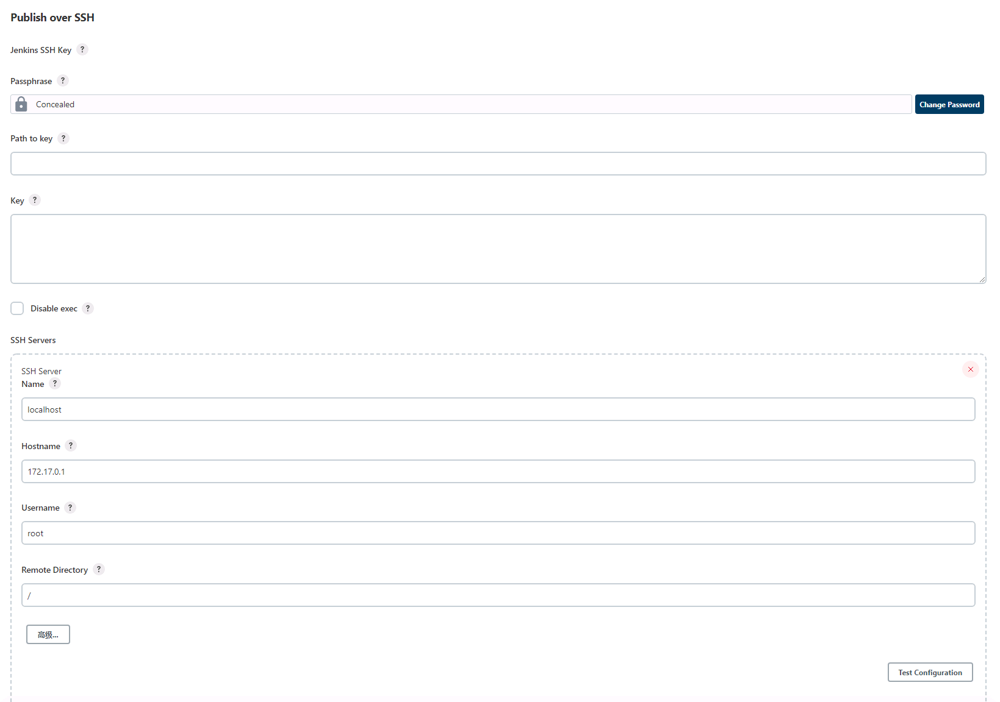

# Jenkins的pipeline使用ssh协议发布文件

## 前言

当我们使用`Jenkins`构建出产品包后，还需要将其发布出去，于是我们可以借用一个插件: [Publish Over SSH](https://plugins.jenkins.io/publish-over-ssh/) 以达到目的。

## 正文

1. 在`Jenkins`上安装`Publish Over SSH`插件。
2. 系统管理/系统配置/Publish over SSH配置服务器
   
    1. 注意Remote Directory，为使用该插件传输时，在目标服务器上的工作空间，不配置的话会使用用户名的家目录作为工作空间，建议配置。
3. 编写pipeline代码以支持发布。
    1. 其中`removePrefix`与`sourceFiles`配合使用，用来指定不应在远程服务器上创建的文件路径的第一部分。
    2. 官方举例: 您通常不希望在服务器上创建这些文件的完整路径。例如，如果源文件是`target/deployment/images/**/`那么您可能希望`removePrefix`是`target/deployment`
       这将在远程目录下创建`images`文件夹，而不是`target/deployment`。
    3. 此处的`remoteDirectory`与上图的`Remote Directory`配置配合起来后，文件会被存放于`/home/nginx/files/`中。

```groovy
stage('Deploy') {
    steps {
        echo 'deploy'
        sshPublisher(
                publishers: [
                        sshPublisherDesc(
                                configName: "localhost",
                                verbose: true,
                                transfers: [
                                        sshTransfer(
                                                sourceFiles: "${upgradePackageDirPath}.tar",
                                                removePrefix: "${distroSpace}/",
                                                remoteDirectory: "home/nginx/files/",
                                        )
                                ]
                        )
                ]
        )
    }
}
```

## 参考文献

1. [Publish Over SSH](https://plugins.jenkins.io/publish-over-ssh/)
2. [pipeline 传输文件](https://blog.csdn.net/weixin_44814672/article/details/112852840)
3. [transferring 0 files using publish over SSH plugin in Jenkins](https://stackoverflow.com/questions/27051543/transferring-0-files-using-publish-over-ssh-plugin-in-jenkins)