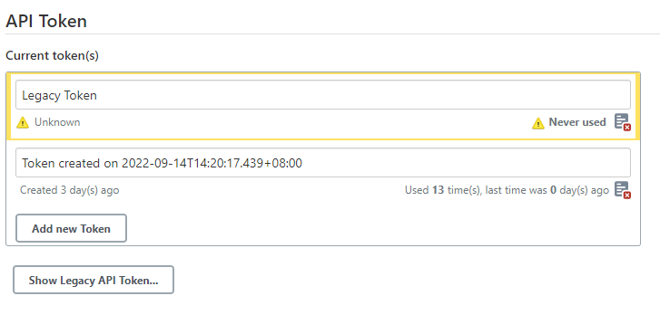
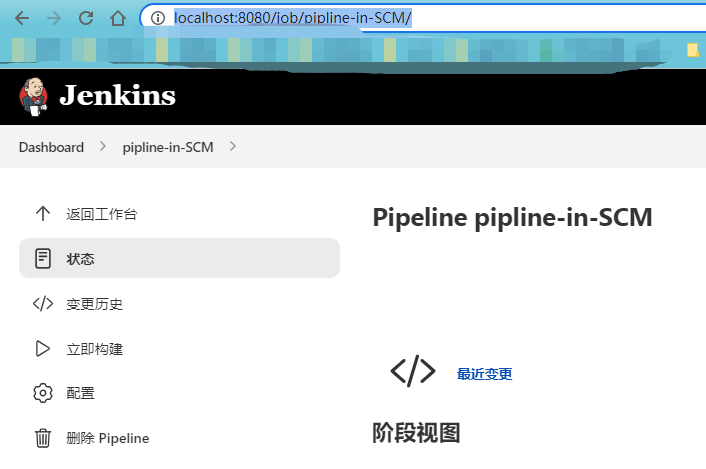
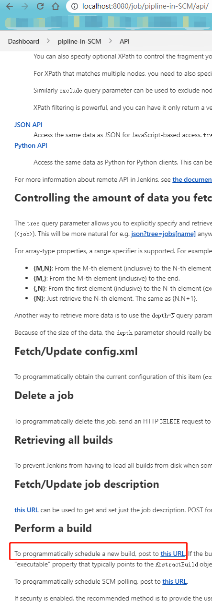

# 使用API触发Jenkins上的构建工作

## 前言

研发升级包构建demo时，需要借助公司Jenkins已存在的构建任务配置，让公司的Jenkins来构建rpm，所以我的demo需要通过http的API与公司的Jenkins进行交互以新增rpm构建任务。

## 正文

### API认证

访问Jenkins的API需要经过认证，Jenkins使用的认证方式为`Basic Auth`，我们只需要在请求时加上`Basic Auth`信息即可。
`Basic Auth`由两个原始参数生成，分别为`Username`和`Password`。

- `Usernmae`: 使用登录Jenkins页面的用户名即可。
- `Password`: 在使用`Get`请求时可以使用登录Jenkins页面的密码，但是`Post`请求不行。
    - 一般来说，此时我们需要在Jenkins上申请一个token作为这里的密码。
    - 创建位置一般在用户的`Configure`页面，如图所示
        - 

### 查找自己需要的API

Jenkins的api设计很有意思，是自动生成的。Jenkins的每一个页面url(地址栏内的信息)，都可以在后面加一个`/api`以获取当前页面可用的api链接，非常便于查找。

例如，当我想要获取某个构建任务的构建api时，我会进入对应的构建页面，如下所示：

此时在地址栏最后加上`/api`即可直接看到所有可用api，我要找的api也在其中。

直接在对应超链接上右键复制链接即可拿到我想要的api请求接口。

## 参考文献

1. [Authenticating scripted clients](https://www.jenkins.io/doc/book/system-administration/authenticating-scripted-clients/)
2. [Remote Access API](https://www.jenkins.io/doc/book/using/remote-access-api/)