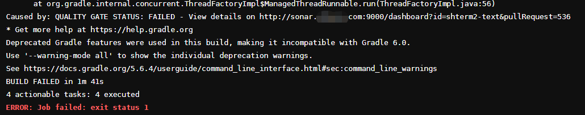
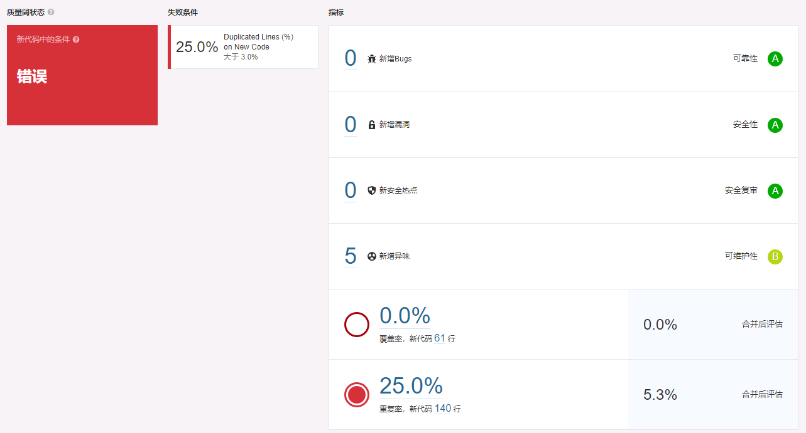

# Merge Request 时 SonarQube 报错时该如何排查自己的问题

## 前言

小伙伴们在提交 Merge Request 后，CI Pipeline 内的 SonarQube 执行失败了，此时小伙伴们往往会满脑子疑问，不知道该怎么排查，这里将教会小伙伴们怎么排查问题出在哪。

## Quality Gate

又称质量门，质量阈。在 SonarQube 执行一次分析后，Quality Gate 会根据多个维度的指标分析并综合得出一个结论。

结论有两种：

- Success：表示本次分析后，新代码的质量指标符合规则，可以发布或者合入。
- Fail：表示本次分析后，新代码的质量不符合标准，不可以发布或者合入。

当 Quality Gate 判定本次分析结果为 Fail 时，CI Pipeline 也会执行失败。

## 当 Pipeline-SonarQube 失败时

### 遭遇错误

大多数情况下，研发会看到类似的错误

此时的错误原因就是 Quality Gate 返回了失败结果，所以 Pipeline 也会算作失败

### 错哪了？

此时报错会显示一段话， View details on http://sonar.xxx.com:9000/xxxx
直接复制这段链接用浏览器打开即可看到错误信息。

这个页面会告知研发，本次分析的具体结果，以及具体哪里有问题，还有为什么会失败。

研发只需要检查这部分新问题并修复，再提交一次 Merge Request 即可。