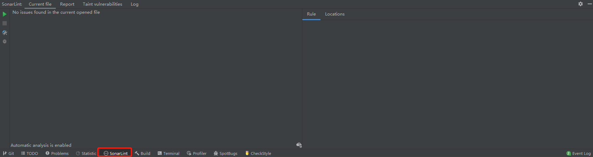

# SonarLint 连接 SonarQube

## 前言

SonarQube 官方文档上说明了开发者可以在本地执行代码分析，SonarLint 天然支持连接 SonarQube 服务器。

本地静态检查可以提高工程流水线效率，所以我们要试一下 SonarLint 连接 SonarQube Server，并看看最终效果如何。

## 下载安装 SonarLint

笔者使用的是 idea，所以可以去官方的插件市场下载 SonarLint 的插件安装包，当然，在线用户可以在 idea 里面直接打开插件市场并安装。

找到适合自己 idea 版本的插件并安装插件。

安装并重启 idea 后可以看到如下界面

Tips: SonarLint 本身就有一定的代码分析能力，并且整套概念框架与 SonarQube 一样，为了代码质量，就算不连携 SonarQube，我们可能也应该使用该静态检查工具。

## 绑定 SonarQube

1. 点击 SonarLint 的设置按钮

   

2. 进入页面后勾选 `Bind project SonarQube / SonarCloud`

   

3. 点击`Configure the connection...`后，点击新界面中的加号键以新增一个准备连接的 `SonarQube` 服务器。

   

4. 自己定义一个连接名，选择 SonarQube，在 SonarQube 下方填入服务端的地址，然后下一步。

   

5. 这一步要求填入认证信息，我们去 SonarQube 的服务端，登录自己的账号并生成一个 token。

   
   

6. 填入 token 并执行下一步
   
   

7. 一路下一步到结束未知完成服务器配置。

   
   
   
8. 回到开始的配置页面，选择刚刚配置的连接，并选择自己项目的 Project key。

   

至此，配置结束。

## 参考文献

1. [JetBrains-Marketplace-SonarLint](https://plugins.jetbrains.com/plugin/7973-sonarlint/versions)