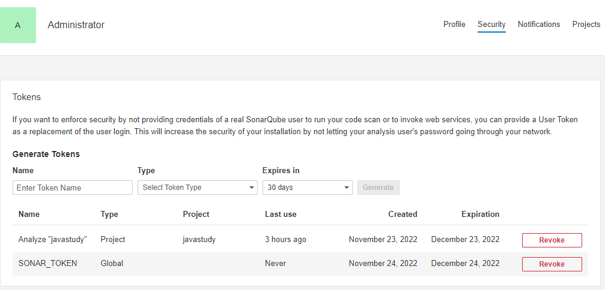

# SonarQube 集成进 GitLab CI

## 背景

SonarQube 在公司搭建成功，但是实际上仍然处于独立运行阶段，并没有与其他 DevOps 平台产生很好的协作关系，这样会导致整条 CI/CD 流水线不能完全自动化，还是需要人工干预。

我们需要让 SonarQube 能自动分析新加入的代码。通过加入原来已经存在的 CI 流程，让每一个 Merge Request 都执行一轮分析是一种很好的实现方案。

## 连接两个平台

### GitLab 对接 SonarQube

GitLab 允许第三方应用接入，创建 OAuth app 来对接 SonarQube，详情请查看 [GitLab Integration](https://docs.sonarqube.org/8.9/analysis/gitlab-integration/) 的 Authenticating with GitLab 章节，公司已经完成对接。

后续若有机会重新对接，则更新此部分。

### SonarQube 对接 GitLab

详情请查看 Importing your GitLab projects into SonarQube 章节，若后续有机会重新对接，则更新此部分。

## 在 GitLab 的 CI/CD 流程中分析代码

为了在 GitLab 的 CI/CD 中分析我们的代码，我们需要完成以下2件事:

1. 设置环境变量
2. 配置 gitlab-ci.yml

### 配置环境变量

我们需要为 GitLab 配置2个环境变量:

如何配置请看[GitLab CI/CD variables](https://docs.gitlab.com/ee/ci/variables/#creating-a-custom-environment-variable) ，可以按自己的需要配置不同类型的环境变量。

1. SONAR_TOKEN，用以登录 SonarQube，值来自于 SonarQube 服务器。以路径`User > My Account > Security`进入 token 生成界面。
    1. 生成界面大致如图所示：
       
2. SONAR_HOST_URL，表示 SonarQube 服务器地址，例如`http://localhost:9000`

### 配置 gitlab-ci.yml 文件

配置直接引用自官方文档:

```yaml
sonarqube-check:
  image: gradle:jre11-slim
  variables:
    SONAR_USER_HOME: "${CI_PROJECT_DIR}/.sonar"  # Defines the location of the analysis task cache
    GIT_DEPTH: "0"  # Tells git to fetch all the branches of the project, required by the analysis task
  cache:
    key: "${CI_JOB_NAME}"
    paths:
      - .sonar/cache
  script: gradle sonarqube -Dsonar.qualitygate.wait=true
  allow_failure: true
  only:
    - merge_requests
    - master
    - develop
```

### 项目配置

注意，build.gradle 文件中需要在 plugins 中加入 `org.sonarqube`。

最终效果为可以在项目目录下执行 gradle sonarqube 或 gradlew sonarqube，只要命令能成功执行即可，不需要启动分析。

## 参考文献

1. [GitLab Integration](https://docs.sonarqube.org/8.9/analysis/gitlab-integration/)
2. [Configure GitLab as an OAuth 2.0 authentication identity provider](https://docs.gitlab.com/ee/integration/oauth_provider.html)
3. [Generating and Using Tokens](https://docs.sonarqube.org/8.9/user-guide/user-token/)
4. [GitLab CI/CD variables](https://docs.gitlab.com/ee/ci/variables/#creating-a-custom-environment-variable)