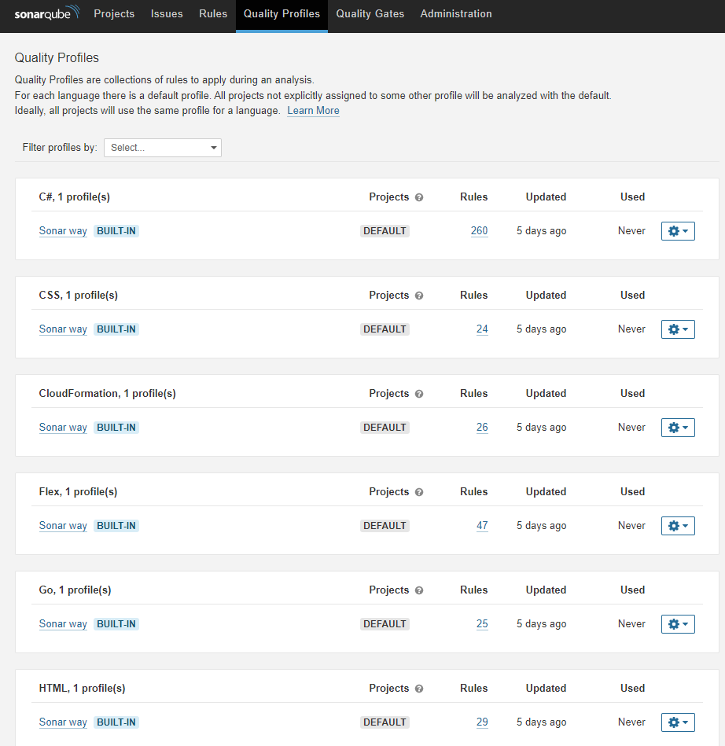
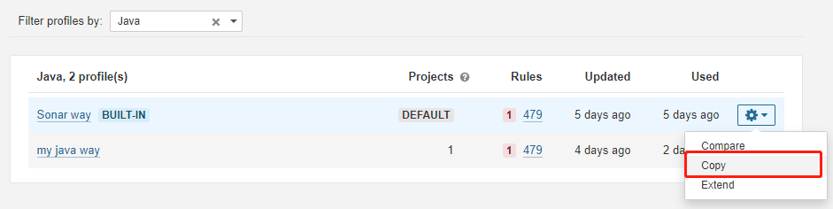
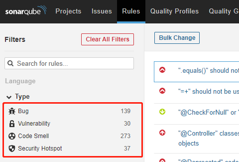
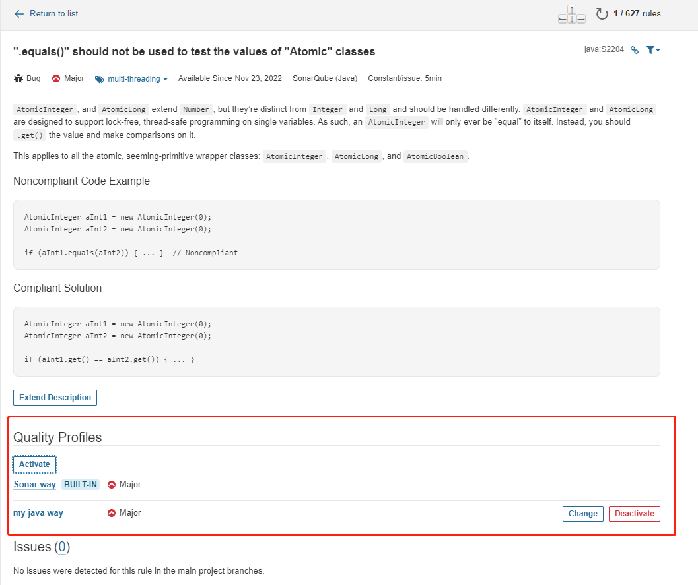
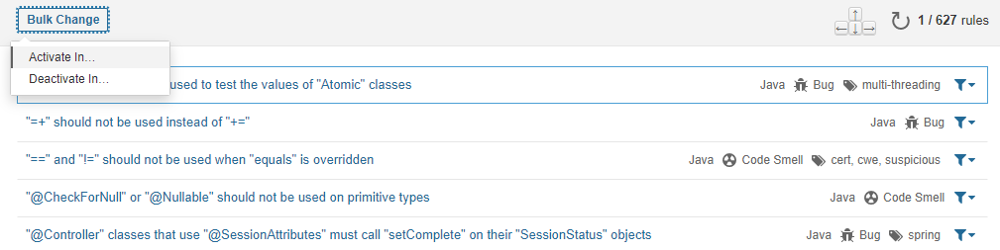
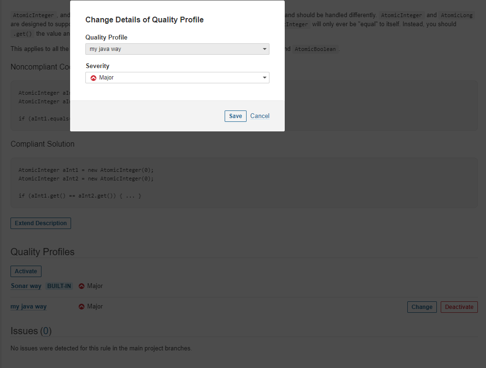

# SonarQube Quality Profiles 的使用

## 介绍

Quality Profiles 是一个规则集合，在分析时，SonarQube 会使用这个集合内的规则来分析。

也就是说，SonarQube 的分析结果与 Quality Profiles 的设计是强相关的。

在翻译插件中，Quality Profiles 被译为质量配置。

## 预置的 Quality Profiles

SonarQube 在安装后就会预置大量的 Quality Profiles 在系统内，每个支持分析的语言都会有一个内置的 Quality Profiles。

这些内置的 Profiles 会随着版本更新而更新，一般情况下，我们直接使用内置的 Profiles 就行，因为那些 Profiles 都来自业界通用规范。

如果我们没有自定义 Profiles 给某个项目使用，那么这个项目就会默认使用内置的 Profiles。

## 自定义 Quality Profiles

当我们想要修改代码质量的标准时，可以通过自定义 Quality Profiles 并让某个项目以此为标准进行分析即可。

我们可以从内置的 Profile 上复制出一份我们自定义的 Profile

对自定义的 Profile，我们可以禁用或启用一些判定规则，也可以修改这些规则对应的问题的严重程度。但是我们不能修改一个 Bug 为一个 Code Smell。

### 禁用启用规则

我们可以在自定义的 Profile 中禁用某些规则

- 规则决定了符合这个特征的代码是什么类型的问题
  

选中某一个规则，进入详情页面，下方有一个 `Activate` 按钮，点击这个按钮即可选择该规则在哪些 Profiles 中生效。

我们也可以批量操作，在列表里面点击 `Bulk Change`

### 严重级别修改

进入一个规则的详情页面，点击 `change` 按钮，即可修改该问题的严重级别。

