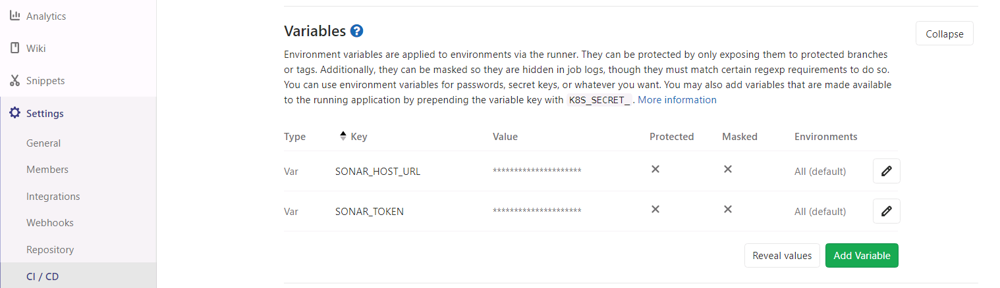
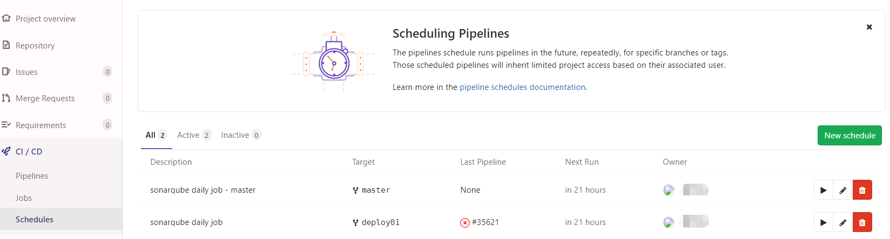
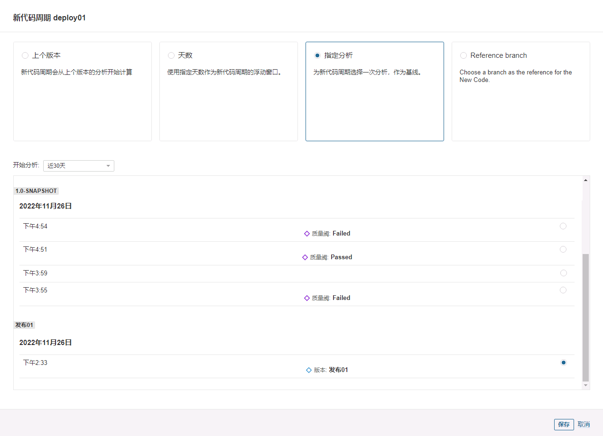

# 新项目加入 SonarQube

## 前言

当一个新启动的项目想要享受 SonarQube 带来的质量保证服务该怎么做？

本章会为项目的管理者演示加入流程。

## 前置要求

代码需要使用 devops 平台进行集成，例如 GitLab 或 GitHub 等。

- 本章以 GitLab 为例。
- 本章都以 Gradle 项目作为例子。

## 集成思路

为了让项目能获得合意的质量保证服务，我们需要思考如下几个问题:

1. SonarQube 要在什么时候分析我们的项目？
2. 如何保证我们只关注新代码？
3. 怎么让研发仅关注他们自己的新代码？

## SonarQube 分析时机

以我当前对 SonarQube 的浅见，我们可以设定三个分析节点:

1. 提交代码前: 研发在提交代码到远程仓库时，应当使用 SonarLint 对本地的新代码进行一轮检查，以减少后续任务中 SonarQube 检测出问题导致返工的情况。
2. 合并代码请求时: GitLab 在 merge request 提交后会执行一个 CI 流水线，我们可以在该流水线内加入 SonarQube 分析任务，分析结果是否通过由 Quality Gate 决定。我们可以在 Quality Gate 给出错误结果时要求研发返工修复问题，这样我们可以确保发布用的分支内，新代码的质量符合高标准。
3. 定时分析: 因为新代码界定问题，我们需要定时刷新一遍发布分支的分析结果，以确保每次针对合并请求的分析中，对新代码界定是准确的。

对于配置管理员来说，他仅需要完成第2与第3个配置，第1个配置由研发自行完成。

### 合并代码请求任务配置

#### Gradle 配置

首先配置 `build.gradle` 文件，配置插件 `org.sonarqube`，配置后使用命令 `gradle sonarqube`检查插件是否能够使用。

```groovy
plugins {
    id "org.sonarqube" version "3.4.0.2513"
}
// 上下两种方式二选一，能用就可以
apply plugin: 'org.sonarqube'
```

之后在 `build.gradle` 文件内配置 sonarqube 插件使用时会用到的属性:

```groovy
sonarqube {
    properties {
        property "sonar.projectKey", "java-demo"
        property "sonar.host.url", "http://localhost:9000"
        property "sonar.login", "sqp_ccaf11520a999d21753b8a2f2e2602c5d43f7914"
    }
}
```

- `sonar.projectKey` 表示项目的标识，所有执行后的分析都会存档到该项目下。
- `sonar.host.url` 表示 SonarQube server 的地址。
- `sonar.login` 表示执行该任务时使用的认证 token

其中 `sonar.host.url` 与 `sonar.login` 可以不配置在这里，可以以更安全方式的配置放在 GitLab 上。

#### GitLab 配置

首先配置 `.gitlab-ci.yml` 文件，加入如下配置。

```yaml
sonarqube-merge-check:
  stage: test
  variables:
    SONAR_USER_HOME: "${CI_PROJECT_DIR}/.sonar"  # Defines the location of the analysis task cache
    GIT_DEPTH: "0"  # Tells git to fetch all the branches of the project, required by the analysis task
  script: gradle sonarqube -Dsonar.qualitygate.wait=true -Dsonar.newCode.referenceBranch=master
  only:
    - merge_requests
```

- `Dsonar.qualitygate.wait=true` 表示等待 SonarQube 中 Quality Gate 的响应。
- `-Dsonar.newCode.referenceBranch=master` 表示本次分析时以 master 分支为基线来界定新代码。多发布分支场景下，该处的分支名应该为发布分支名。

使用这组命令能保证开发分支一定会和特定的发布分支比较以保证新代码界定的准确性。

这样，GitLab 在执行由于合并请求诞生的 CI Pipeline 时就会使用 SonarQube 分析一次了。

另外，之前可以不在 `build.gradle` 内配置的参数可以在这里配置，当然，也可以不在这里配置，而使用 GitLab 全局配置。

```yaml
variables:
  SONAR_TOKEN: "sqa_98c2a7fa6a6d8699acc4213342f2b4a5c2cac811"
  SONAR_HOST_URL: "http://localhost:9000"
```

### 定时分析

在确保 `build.gradle` 的配置正确后，在 `.gitlab-ci.yml` 内加入如下信息

```yaml
sonarqube-release-check:
  stage: test
  variables:
    SONAR_USER_HOME: "${CI_PROJECT_DIR}/.sonar"  # Defines the location of the analysis task cache
    GIT_DEPTH: "0"  # Tells git to fetch all the branches of the project, required by the analysis task
  script: gradle sonarqube -Dsonar.qualitygate.wait=true -Dsonar.branch.name=master
  only:
    - schedules
```

- `-Dsonar.branch.name` 表示本次分析为项目分析，并且指定了分支名，这在多发布分支中是有用的，其他发布分支应当使用各自对应的分支名。

这样，GitLab 就会周期性的开启分析任务，以持续刷新数据。

### GitLab 项目配置

#### 变量配置

如果上方的 SonarQube 地址和认证用信息都不想暴露给其他开发者的话，可以使用项目配置中的变量配置。


当然，这么做还能方便管理，我们不需要因为这些变量散落在各个分支的代码里面所导致的高维护成本而苦恼。

- 比如我们 SonarQube 服务器的域名变了，只需要在这里更改变量即可，不需要提交代码到分支内。

这个变量配置可以以更大粒度的方式进行配置，即 GitLab 全局变量配置。

#### 周期 CI 任务

在 GitLab 中为每一个发布分支配置一个周期分析任务，当然，也可按照自己的需要决定哪些分支要周期分析。



### SonarQube 项目配置

1. 手动执行一遍项目分析，可以在 GitLab 内的定时任务部分手动执行一次 Pipeline。这样，我们就能得到一个初始的代码分析样本。
2. 进入 SonarQube 服务器的网页，点击项目配置 (Project Settings)，点击新代码周期 (New Code)。
3. 选定要配置的分支，选择指定分析，指定初始版本。这样，之后所有的分析都会以这次分析为基准来判定新代码。
   
4. 注意，每次版本发布后都要重复上述动作，以更新新代码判定基线。

## 尾声

还记得我们之前提出的三个问题么？
我们解决了问题1的时候顺便解决了问题2和3。

- SonarQube 的项目配置允许我们自由配置新代码的界定方案，恰当使用就能让我们持续关注正确的新代码。
- GitLab 由 Merge Request 引起的 CI Pipeline 最终会把责任引导到对应的研发上去，所以此时研发也能关注到自己的新代码。