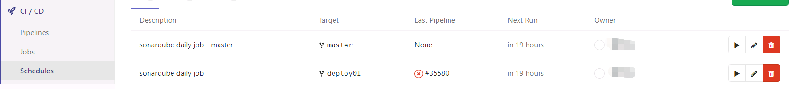
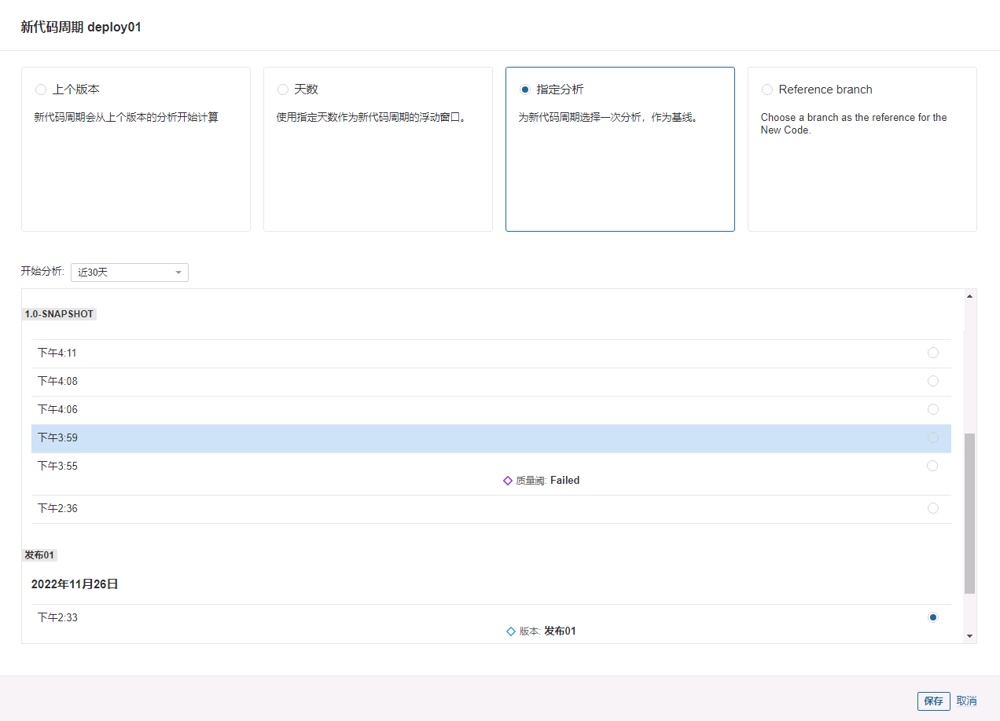

# SonarQube 新代码界定

## 前言

SonarQube 的 Writing Clean Code 方案中，重点概念是我们仅关注 New Code，即新代码，这样代码的演进才有可持续性，也是符合现实的高性价比方案。

- 新代码 (**New Code**) 是指相较于之前的版本，新增或修改的代码。

但是不同的组织，不同的项目，不同的场景，对新代码的界定需求都会产生差异。

1. 例如代码合并场景，分支 A1 要合入分支 A，我们往往只需要关注 A1 相较于 A 的变化。
2. 例如版本发布场景，我们需要关注当前代码库相较于上一个发布版本的变化。

而 SonarQube 也在新代码界定上给出了一些有用的方案。

## 新代码界定方案

### 界定方案生效粒度

1. 全局级别，配置全局默认的生效级别，控制粒度最大。
    - 入口: **Administration > Configuration > General Settings > New Code**
2. 项目级别，为个别项目可以自定义设置新代码界定方案而设计，控制粒度为项目级别。
    - 入口: **Project Settings > New Code**
    - 需要版本至少为 Developer Edition
3. 分支级别，为个别分支自定义界定方案设计的入口，粒度最细。
    - 入口同项目级别，可以在下方配置分支的新代码定义。

### 新代码定义

1. 上一个版本：以上一个版本的分析结果作为界定基准，所有与该分析结果不同的代码都是 New Code。
    - 不过目前对于上个版本的定是什么还没有明朗。使用该方案时，会直接与最开始的分析进行比较，令人疑惑。
2. 指定一个分析作为基准线：这个方案比较适用于项目版本迭代发布场景，我们可以指定标记一个分析为一个版本，之后所有的分析都会以这个版本分析作为基线，基于这个基线的改动都算 New Code。
    - 该方案只能在分支粒度内使用。
3. 比较其他分支：与另一个分支的代码进行比较，不同于这个分支的代码都算作 New Code。
4. 指定比较 N 天前： 与 N 天前分析的代码作比较，不同于 N 天前的代码都算作 New Code。

注意，所有的比较都是分析和分析之间的比较，每一个分析都会保存一份代码副本，这也是用来比较的基础。

## 分支合并场景

当一个项目里面有多个发布分支的时候，我们要如何定义每一个待合并分支的新代码部分？

在 GitLab CI 流程上做手脚是一个不错的选择，在原来的 script 部分加点参数:

```
script: gradle sonarqube -Dsonar.qualitygate.wait=true -Dsonar.newCode.referenceBranch=master
```

`-Dsonar.newCode.referenceBranch=master` 表示本次代码分析中，新代码会以 master 分支的代码作为基准线。

我们可以给每一个发布分支的 `gitlab-ci.yml` 文件中的 script 部分加入这个参数，其中分支名为本发布分支的分支名即可。

这样，每一次 GitLab CI 中合并请求被触发时，就会自动执行分析并指定发布分支为基准线。

### 注意问题

但是我们仍然要注意，每一个新代码的比较界定是基于分析的，SonarQube 不会去 GitLab 上拉一遍代码再作比较。如果想要得到预期的 New Code，请保证发布分支的分析永远保持最新。

- 例如如果 A 的代码有问题，但是被合并了，B 此时基于合并后的分支创建了没有问题的新代码并请求合并，此时 SonarQube 的新代码界定仍然会因为 A 的代码认为有问题，因为 A 合并后的发布分支并没有重新进行分析。

解决思路:

- 最理想化的是，每一次合并请求被通过后都执行一遍分析发布分支的 Job。
    - 但是目前没有找到比较好的不会带来其他负面影响的方案。
    - only: pushes 时当一个开发分支被多次 push 也会导致分析，可能出现令人混乱的结果。
- 如果没有那么追求实时性，可以使用 GitLab 的定时任务，定时执行发布分支的分析任务，只要 `gitlab-ci.yml` 文件中对应任务的 only 字段设定为 schedules 即可。
    - 例如使用如下配置:
        ```yaml
        sonarqube-release-check:
          stage: test
          variables:
          SONAR_USER_HOME: "${CI_PROJECT_DIR}/.sonar"  # Defines the location of the analysis task cache
          GIT_DEPTH: "0"  # Tells git to fetch all the branches of the project, required by the analysis task
          script: gradle sonarqube -Dsonar.qualitygate.wait=true -Dsonar.branch.name=master
          only:
            - schedules
        ```
    - 同时 GitLab 上也需要开启定时任务以触发我们定义的任务。
        - 
        - 可以通过手动触发定时任务来验证我们的配置是否正确。

## 版本发布场景

与版本发布场景最契合的是指定一个分析作为基准线的方案。

我们可以在版本发布后，执行一次对项目分支的分析，然后对该分析创建一个版本号，之后配置新代码以该分析为基准。
- 创建版本号相当于打个标签，为了方便快速从大量的分析中找到可以作为基准的分析样本。

我们也可以在项目发布后直接使用最后一个对项目分支的分析作为基准，操作与上方同理。



## 参考文献

1. [Defining New Code](https://docs.sonarqube.org/latest/project-administration/new-code-period/)
2. [.gitlab-ci.yml keyword reference](https://docs.gitlab.com/ee/ci/yaml/)
2. [Scheduled pipelines](https://docs.gitlab.com/ee/ci/pipelines/schedules.html)


