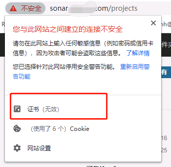
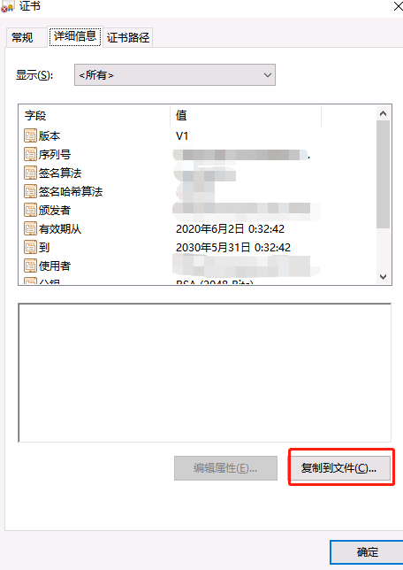
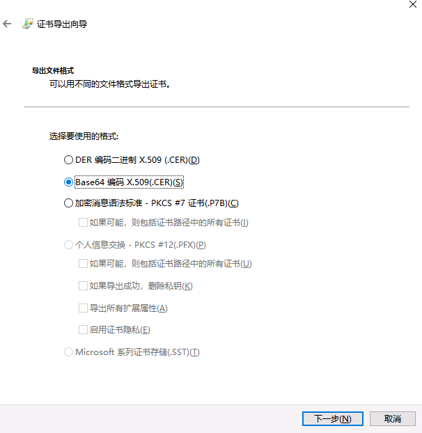

# SonarQube Server [https://xxxx] can not be reached 问题

## 问题发生过程

在配置 GitLab CI 后尝试启动 CI 流水线，结果失败了，报错为:
> SonarQube Server [https://xxxx] can not be reached

## 问题排查

在本地环境上执行了如下命令:

```
gradlew sonarqube -Dsonar.projectKey=java_demo  -Dsonar.host.url=https://xxx.xxx.xxx  -Dsonar.login=sqp_5dbd2fxxxxx9xxxxxfxxxxxdxxxxx2xxxxx2869
```

发现报了同样的错误，但笔者 Ping 了下目标服务器，并且还登录了 SonarQube，看起来没啥问题。

之后，添加了 `--stacktrace` 选项以打出调用栈:

```
gradlew --stacktrace sonarqube -Dsonar.projectKey=java_demo  -Dsonar.host.url=https://xxx.xxx.xxx  -Dsonar.login=sqp_5dbd2fxxxxx9xxxxxfxxxxxdxxxxx2xxxxx2869
```

报出了一个异常:
> Caused by: sun.security.validator.ValidatorException: PKIX path building failed: sun.security.provider.certpath.SunCertPathBuilderException: unable to find valid certification path to requested target

看样子是 SSL 认证问题，即本地的客户端不认服务端的 SSL 证书，那么接下来的问题解决就有了方向。

## 解决问题

### 无视 SSL 证书验证

笔者的环境不允许这么做

### 将服务端的证书假如到信任列表

我们需要做以下事情来完成证书信任:

1. 下载服务端的证书文件
2. 将证书文件加入到本地的受信列表

#### 导出证书

1. 首先进入到服务端的页面，查看证书

   
2. 将证书导出:

   
3. 选择编码:

   

4. 定义好文件名并点击下一步。
5. 完成证书导出。

#### 证书导入

注意 Windows 需要以管理员身份运行 CMD

1. 进入环境上 JDK/jre/lib/security 目录，例如`C:\Program Files\Java\jdk1.8.0_251\jre\lib\security`。
2. 执行命令
   ```
   keytool -import -alias sonar -keystore cacerts -file C:\xxx\sonar.cer
   ```
    1. alias ：表示指定证书别名
    2. file ：指定证书文件
3. 提示输入密钥库口令时，输入`changeit`即可。
4. 提示是否信任此证书，输入 Y 以将证书加入到密钥库。

查看证书: `keytool -list -keystore cacerts -alias sonar`

删除证书: `keytool -delete -alias sonar -keystore cacerts`

#### 新问题

出现了新问题

> javax.net.ssl.SSLPeerUnverifiedException: Hostname sonar.test.com not verified:

网上查了下，原因是证书本身不太 OK。最终笔者选择不使用 SSL 来解决问题。


## 参考文献

1. [Maven:sun.security.validator.ValidatorException: PKIX path building failed: sun.security.provider.certpath.SunCertPathBuilderException: unable to find valid certification path to requested target](https://www.cnblogs.com/wpbxin/p/11746229.html)
