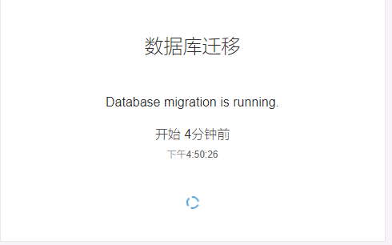
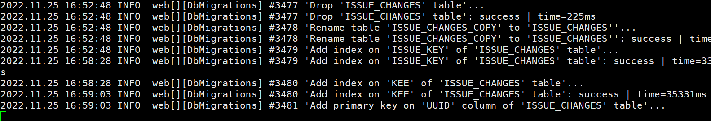

# SonarQube 服务端升级

## 背景

公司的 SonarQube 版本较老，是8.3，集成进 GitLab 后对新代码的判定不能符合当前公司的需要，我们仅需要注视新代码，而这个版本的 SonarQube 会将发起合并请求分支所有代码认定为新代码，这不符合要求。

所以我决定将 SonarQube 的版本升级到 8.9 LTS(Long term support) 版本先，看看情况。

此时最新的版本已经到了9.7，可能过几个月就要升级9.9 LTS 了。

## 升级过程

大致需要如下过程:

1. 数据备份
2. 搭建新版本服务器
3. 关闭旧版本服务器

### 数据备份

1. 首先找管理生产环境的大佬给环境打个快照，防止升级过程出现意外，还有恢复手段。
2. 按官方文档的警告，备份一下数据库。
    1. 使用`pg_dump`命令备份数据库
    2. 执行命令 `pg_dump -h localhost -U sonar sonar > /backup/postgres_sonar.bak`
        1. -h localhost 表示备份本机数据库
        2. -U postgres 表示使用 sonar 用户进行备份
        3. sonar 是 SonarQube 的数据库名，也是我们要备份的数据库
        4. `> /backup/postgres_sonar.bak` 表示将备份文件导出到目录 /backup/postgres_sonar.bak
    3. 恢复数据库的命令是 `psql -h localhost -U sonar -d sonar < /backup/postgres_sonar.bak`
        1. -h localhost 表示恢复本机数据库
        2. -U postgres 表示使用 sonar 用户进行恢复操作
        3. -d sonar 表示恢复到 sonar 数据库
        4. < /backup/postgres_sonar.bak 表示使用 /backup/postgres_sonar.bak 文件作为数据源进行恢复。

### 搭建新版本服务器

1. 去 [官方下载网站](https://www.sonarqube.org/downloads/) 下载目标版本的 SonarQube 压缩包。
2. 上传到生产环境准备安装新版本 SonarQube 的目录上，例如我们就可以选择 `/home/sonar`。
3. 解压压缩包。
4. 配置新版本的 SonarQube，编辑 conf/sonar.properties
    ```properties
    # ......
    sonar.jdbc.username=sonar
    sonar.jdbc.password=xxx
    # ......
    sonar.jdbc.url=jdbc:postgresql://localhost/sonar
    # ......    
    sonar.web.javaOpts=-Xmx3062m -Xms512m -XX:ReservedCodeCacheSize=512m -XX:+HeapDumpOnOutOfMemoryError
    # ......
    sonar.web.host=0.0.0.0
    # ......
    sonar.core.serverBaseURL=https://sonar.test.com
    # ......
    # LDAP CONFIGURATION
    # Enable the LDAP feature
    sonar.security.realm=LDAP
    # Set to true when connecting to a LDAP server using a case-insensitive setup.
    #sonar.authenticator.downcase=true
    # URL of the LDAP server. Note that if you are using ldaps, then you should install the server certificate into the Java truststore.
    ldap.url=ldap://ad.test.com:389
    
    # Bind DN is the username of an LDAP user to connect (or bind) with. Leave this blank for anonymous access to the LDAP directory (optional)
    #ldap.bindDn=cn=sonar,ou=users,o=mycompany
    #ldap.bindDn=CN=考试用户,OU=r&d,DC=test,DC=com
    ldap.bindDn=exam@test.com
    
    # Bind Password is the password of the user to connect with. Leave this blank for anonymous access to the LDAP directory (optional)
    ldap.bindPassword=1234+abcd
    # ......
    #ldap.user.baseDn=cn=users,dc=example,dc=org
    ldap.user.baseDn=OU=r&d,DC=test,DC=com
    # LDAP user request. (default: (&(objectClass=inetOrgPerson)(uid={login})) )
    ldap.user.request=(&(objectClass=user)(sAMAccountName={login}))
    
    # Attribute in LDAP defining the user’s real name. (default: cn)
    ldap.user.realNameAttribute=displayName
    
    # Attribute in LDAP defining the user’s email. (default: mail)
    ldap.user.emailAttribute=mail
    
    # GROUP MAPPING
    
    # Distinguished Name (DN) of the root node in LDAP from which to search for groups. (optional, default: empty)
    #ldap.group.baseDn=cn=groups,dc=example,dc=org
    ldap.group.baseDn=OU=r&d,DC=test,DC=com
    # LDAP group request (default: (&(objectClass=groupOfUniqueNames)(uniqueMember={dn})) )
    ldap.group.request=(&(objectClass=group)(member={dn}))
    
    # Property used to specifiy the attribute to be used for returning the list of user groups in the compatibility mode. (default: cn)
    ldap.group.idAttribute=sAMAccountName
    # ......
    sonar.path.data=/var/sonarqube/data
    sonar.path.temp=/var/sonarqube/temp
    # ......
    ```
   编辑 conf/wrapper.conf，`wrapper.java.command=java` 替换为 `wrapper.java.command=/home/sonar/jdk-11.0.7/bin/java` 以让 SonarQube 使用 jdk11。

5. 迁移插件，执行命令 `cp ~/sonarqube-ee-8.3.1/extensions/plugins/* ~/sonarqube-8.9.10.61524/extensions/plugins/` 以迁移插件实体，注意大版本跨度时要先比较一下插件是否仍然可以在高版本中使用，可以使用官方提供的 [插件版本矩阵](https://docs.sonarqube.org/8.9/instance-administration/plugin-version-matrix/) 来确认。

### 变更运行服务器

1. 关闭旧版本 SonarQube 服务器
    1. 进入旧版本 SonarQube 的 bin/linux-x86-64/ 目录下，执行 `./sonar.sh stop`
2. 启动新版本 SonarQube 服务器
    1. 进入新版本 SonarQube 的 bin/linux-x86-64/ 目录下，执行 `./sonar.sh start`
    2. `./sonar.sh status` 命令可以查看 SonarQube 的运行状态和进程号。
3. 访问新版本 SonarQube 服务器的链接 `http://yourSonarQubeServerURL:9000/setup` 以完成服务器初始化
    1. 我们会发现该页面会让我们执行数据库迁移，所以一定要准备一下恢复手段，比如备份数据库，以防万一。
       
    2. 迁移过程可以在 web.log 中查看。
       
4. 重新分析项目以获取最新的分析数据

#### 插曲

因为迁移插件过于暴力，SonarQube 起不来了，进入 sonarqube 的安装目录，找到 `logs` 目录，检查了一下 web.log，报了一个 ERROR，说这个版本的 SonarQube 不再支持 scmgit 和 scmsvn 插件。也难怪，毕竟这个版本已经天然支持 git 了。

所以为了解决问题，我们回到新版安装目录下的插件目录，移除掉对应的插件再启动。

之后又遇到了 abap 插件已经内置到官方 SonarQube 中的问题以及其他类似的插件问题，用同样的办法处理。

## 参考文献

1. [Upgrade the Server](https://docs.sonarqube.org/8.9/setup/upgrading/)
2. [Download SonarQube](https://www.sonarqube.org/downloads/)
3. [插件版本矩阵](https://docs.sonarqube.org/8.9/instance-administration/plugin-version-matrix/)