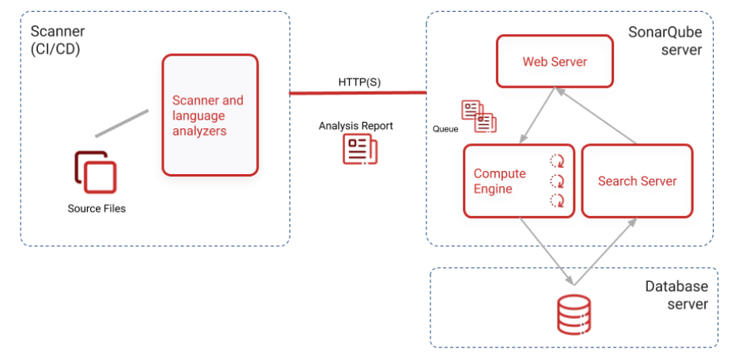
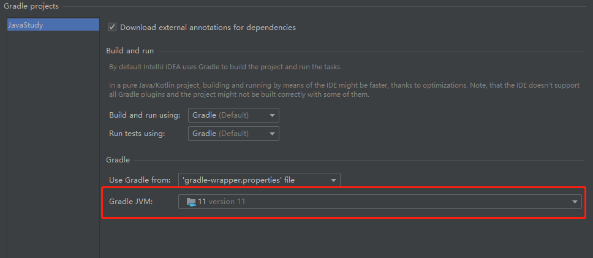

# Gradle 使用 SonarScanner

## 前言

SonarScanner 是用于扫描代码源文件并进行分析的客户端工具，我们平时手动执行的分析命令实际上都依托于 SonarScanner。


这里我们记录一下如何将 SonarScanner 集成进 Gradle。

## 命令方式

手工创建项目时，SonarQube 会引导用户执行这样一串命令:

```
gradlew sonarqube -Dsonar.projectKey=testProject -Dsonar.host.url=http://localhost:9000 -Dsonar.login=sqp_d62bfea7e1b28f6a88add1ad7e6344fbb44c5e74
```

这就是 Gradle 使用 SonarQube 进行分析的本质，调动 SonarScanner 对此时此刻的代码进行分析，并在 SonarQube 上生成一份详细的分析报告。

这串命令中:

1. `gradlew` 可以与 `gradle` 替换，用户需要根据自己的场景进行替换。
    1. `gradlew` 就是 gradle 的 wrapper，实际上就是内置 gradle 的操作脚本。
2. `-Dsonar.projectKey=testProject` 会指定该项目对应的项目 id。
3. `-Dsonar.host.url=http://localhost:9000` 指定了 SonarQube 服务器的地址和端口。
4. `-Dsonar.login=sqp_d62bfea7e1b28f6a88add1ad7e6344fbb44c5e74` 指定了进入 SonarQube 服务器时认证用的 token。

注意，这要求 `build.gradle` 文件中配置 SonarQube 插件:

```groovy
// build.gradle
plugins {
    id "org.sonarqube" version "3.4.0.2513"
}
```

## 点击即用

如果我们想要像 checkstyle 一样可以直接在 Gradle UI 界面双击 checkstyleMain 就能完成代码风格检查，我们该怎么做呢？

### 前提

1. Gradle 版本为 5+
2. Gradle 必须使用的 JVM 版本必须支持项目使用的 JVM 版本编译的 `.class` 文件。
   

### 配置 Gradle

1. 文件 `build.gradle` 配置 sonarqube 插件。
2. 因为直接双击启动任务时我们是没有输入参数的入口的，所以我们可以在 `build.gradle` 内提前配置好参数:
   ```groovy
   sonarqube {
       properties {
           property "sonar.projectKey", "javastudy"
           property "sonar.host.url", "http://localhost:9000"
           property "sonar.login", "sqp_ccaf11520a999d21753b8a2f2e2602c5d43f7914"
       }
   }
   ```

此时我们双击 verification --> sonarqube 即可立即进行扫描，最终扫描报告也会在 SonarQube 服务器上呈现，可以登陆上去查看。

- verification 里面找不到可以去 other 里面找找。

#### 其他可以配置的参数

详见: [Analysis Parameters](https://docs.sonarqube.org/latest/analysis/analysis-parameters/)

这里记录一些可能会用到的参数:

1. `sonar.newCode.referenceBranch`: 设置本次分析时，以某一个分支作为基准来判定 New Code。
2. `sonar.branch.name`: 设置本次分析所属的分支，默认是 master。

## 参考文献

1. [Install the Server](https://docs.sonarqube.org/latest/setup/install-server/)
2. [SonarScanner for Gradle](https://docs.sonarqube.org/latest/analysis/scan/sonarscanner-for-gradle/)
3. [SonarScanner](https://docs.sonarqube.org/latest/analysis/scan/sonarscanner/)
4. [Analysis Parameters](https://docs.sonarqube.org/latest/analysis/analysis-parameters/)

