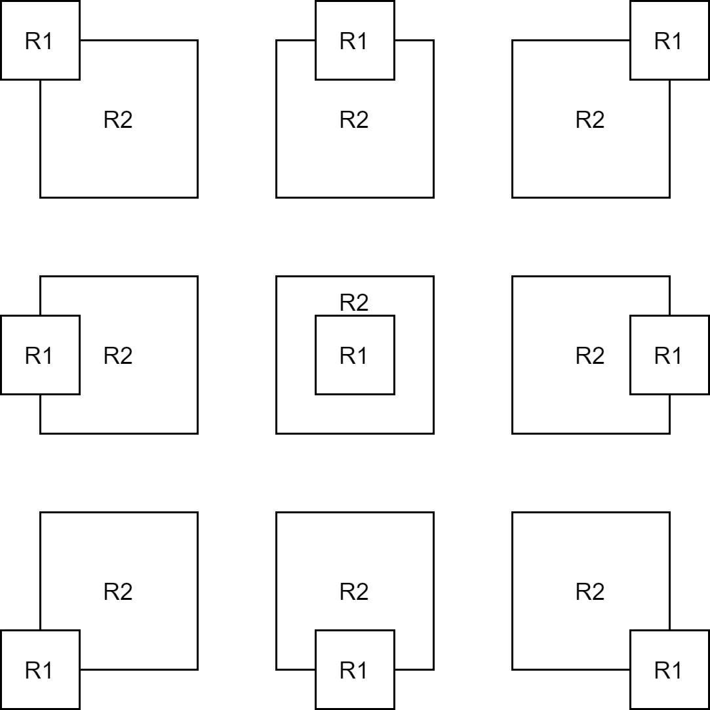
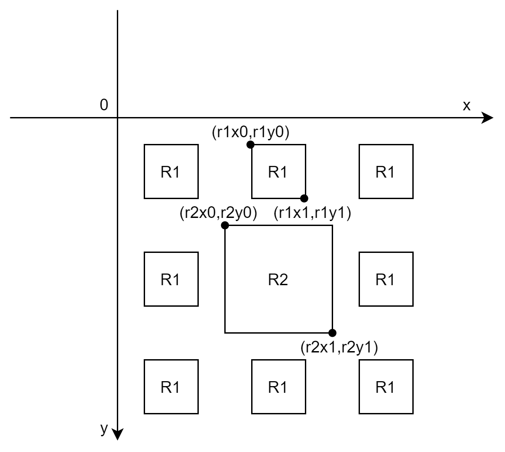

## 背景

在工作中，做图形处理的时候遇到了个需求：判断两个矩形是否重叠。

## 经历

1. 一开始，我在草稿本上画了两个矩形重叠的场景，试图通过**罗列所有的可能性，然后找到一定的规律，进行简化**，但是失败了，以我的水平没法简化，如果用这个方案来实现，就会是九个`if`语句，所以还需要找找有没有其他方法。
   


2. 说到算法，我第一反应就是去`LeetCode`上找找，有没有对应算法的题目， 经过多个关键字查找，我找到了一个和我需求相符的[题目](https://leetcode-cn.com/problems/rectangle-area/)
   。从题目中可以看出来，该题的答案一定会受两个矩形重叠面积的影响，直接翻[题解](https://leetcode-cn.com/problems/rectangle-area/solution/jian-dan-de-kao-lu-by-powcai/)
   。题解简单的思路令我豁然开朗。与我的思路相反，题解**罗列了所有不重叠的情况，找到了规律**。很明显，**判断不重叠远比判断重叠要简单**。


3. 按照题解的解题思路，我罗列了所有不重叠的情况。
   
   在这副图中很容易得出结论，只要满足以下四个条件之一，即可判断矩形不重叠：

- `r1x1 < r2x0`
- `r1y1 < r2y0`
- `r1x0 > r2x1`
- `r1y0 > r2y1`
  
**除此之外，两个矩形一定重叠。**


4. 按照这个逻辑写了代码，将判断重叠的算法抽象成方法后，该方法甚至不需要一个`if`。

```java
class Test {
    public int hasIntersection(int ax1, int ay1, int ax2, int ay2, int bx1, int by1, int bx2, int by2) {
        return !(ax2 < bx1 || ax1 > bx2 || ay2 < by1 || ay1 > by2);
    }
}
```

## 复盘

当时自己考虑怎么做的时候有点**直线思维**，因为业务上要求判断两个矩形重叠，重叠的时候做下一步动作，在思考的时候也按重叠的场景思考，最终按重叠的场景进行罗列。一题多解是正常的，但是这道题在多个解法的难度上并不是对称的，判断不重叠的逻辑可以优化到四个条件，而判断重叠的逻辑却不知道该怎么优化。以后解决问题的时候遇到瓶颈了，**可以试试从反面条件出发，说不定会有意外惊喜**。与这个情况相似的问题，我想到了**布隆过滤器**这个很有意思的玩意。

令我好奇的是，为什么判断不重叠比判断重叠简单？重新看了看罗列出来的条件，可以发现，判断重叠需要两个维度（x轴和y轴）的条件，而判断不重叠只需要满足那四个条件之一，而这四个条件都是一维的，都只在一个坐标轴上比较。这是不是说明维度越低难度越低呢？以后遇到难题可以考虑下**降维**。
