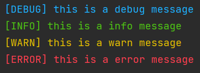

# compose_函数组合

## 前言

[上一章](2.curry_柯里化.md) 讲解了 curry 在函数式编程中的作用，这一章我们来讲解另一个必备工具，**函数组合**。

## 一个功能

我们就着上一章的实践功能，继续实现一个功能，笔者认为在不同的章节实现不同的功能，这样一级一级地搭出一个功能更能让读者领会到函数式编程的特性。

我们要实现的功能是日志输出功能，功能如下：

- `debug`: 在终端打印出以 `[DEBUG]` 开头的信息，且文字为蓝色。
- `info`: 在终端打印出以 `[INFO]` 开头的信息，且文字为绿色。
- `warn`: 在终端打印出以 `[WARN]` 开头的信息，且文字为黄色。
- `error`: 在终端打印出以 `[ERROR]` 开头的信息，且文字为红色。

按照传统思路，我们可以使用如下代码实现:

```python
def info(_message: str):
    output = f"[INFO] {_message}"
    print_green(output)


def debug(_message: str):
    output = f"[DEBUG] {_message}"
    print_blue(output)


def warn(_message: str):
    output = f"[WARN] {_message}"
    print_yellow(output)


def error(_message: str):
    output = f"[ERROR] {_message}"
    print_red(output)
```

让我们来使用一下:

```python
debug("this is a debug message")
info("this is a info message")
warn("this is a warn message")
error("this is a error message")
```

结果可以看到符合预期:


但是，这不符合函数式编程的作风，我们需要一个办法，让它函数式一点。

而我们要用的这些函数，只有需要一个参数就可以调用，柯里化在这里的作用不大，我们需要一个新的工具，就是函数组合 (compose)。

## 函数组合 (compose)

函数组合的概念很简单，就是把多个函数组合起来，一个函数的输出会成为另一个函数的输入，组合起来的函数会成为一个新的函数。

让我们从一个简单的代码实现开始看：

```python
def compose(f, g: Callable) -> Callable:
    def composed_function(arg):
        return f(g(arg))

    return composed_function
```

这个函数实现起来是很简单的，我们只需要制作一个函数，再将函数返回就行，这个被制作出来的函数要执行的功能也很简单，就是读取到参数后，先执行 `g` 函数，再用 `g` 函数的输出作为参数调用 `f` 函数，最终将结果返回。

而这个函数，将成为我们函数式编程生涯上的又一大利器。

## 优化代码

让我们回过头来看看刚刚的代码，可以轻易发现所有的函数都有共性，做了两件事情：

1. 生成要打印的文本
2. 调用对应的打印函数，打印对应的文本

我们可以发现，步骤 1 的输出，是步骤 2 的输出，那我们的 compose 函数就可以派上用场了。

不过在此之前，我们需要先解决步骤 1 的函数，还记得上个章节的`打招呼`函数吗，与步骤 1 所需要的函数是完全一样的：

```python
def greet(greeting, name: str) -> str:
    return f"{greeting} {name}"
```

我们完全可以直接拿来用：

```python
create_output = curry(greet)
```

不过笔者需要在这里澄清一件事情，在自己生产开发的时候千万别这么干，`greet` 函数终究是一个业务函数，并不稳定，如果某一天业务变了，这个函数改了，那日志系列的函数也会受到影响。我们不能去让新函数去锚定这种不稳定的函数，而应该抽象出一个稳定的函数，让 `greet` 函数和新函数都以此为锚点进行声明。比如这样：

```python
def compose_tag_message(tag, message: str) -> str:
    return f"{tag} {message}"

greet = curry(compose_tag_message)
create_output = curry(compose_tag_message)
```

这样两个业务就互不相干了，而 `create_output` 函数就是我们步骤 1 的函数，在这里我们会用到 `curry`。

之后我们就可以愉快地使用两大函数工具去构建我们需要的函数了：

```python
debug = compose(print_blue, create_output("[DEBUG]"))
info = compose(print_green, create_output("[INFO]"))
warn = compose(print_yellow, create_output("[WARN]"))
error = compose(print_red, create_output("[ERROR]"))
```

仅需要 4 行，我们就构建了 4 个新函数，并且效果和预期一模一样。

## 函数组合的特点与优势

现在回过头来看看我们做的事情，总结一下 compose 函数的特点。

1. 解开洋葱代码，`compose` 函数通过将洋葱式调用内化，让用户不再需要被洋葱代码烦恼。
    1. 洋葱代码的例子: `x = add(multi(sub(4, 2) ,2) ,2)`，这种用法看起来跟洋葱一样，所以叫洋葱代码。
    2. 使用函数组合后: `x = compose(add_2, multi_2, sub_2)(4)`，会清晰很多，易于阅读，从代码结构上来看，值就像走了一个管道 (pipe)，最后出来就是我们要的结果。
2. 结合方向，一般 `compose` 函数的结合方向都是从右到左的，这是来自数学含义，不过我们也可以定义一个从左向右结合的组合函数。
3. 组件新的函数，函数组合给了我们一个在不同场景下诞生新函数的工具，弥补了柯里化函数的不足。

## 状态追踪 (debug)

兴许有人会问，在组合的函数中，我想要看看中间某个函数的输出怎么办。

我们可以使用这样一个函数，且不会影响最终结果，只要把它插入在我们想要组合的地方即可：

```python
@curry
def trace(tag, message: str) -> str:
    output = create_output(tag, message)
    print(output)
    return message
```

## 不止组合两个函数

仅仅是将两个函数组合起来，是不够的，但我们不希望看到 `compose` 这个字眼满天飞，所以我们需要一个能组合多个函数的实现：

```python
def compose(*funcs: Callable) -> Callable:
    def composed_function(arg):
        result = arg
        for func in reversed(funcs):
            result = func(result)
        return result

    return composed_function
```

这个实现的核心思路没有变化，只是接收的参数变成了参数列表，仅此而已。

## 参考文献

1. [第 5 章: 代码组合（compose）](https://llh911001.gitbooks.io/mostly-adequate-guide-chinese/content/ch5.html)