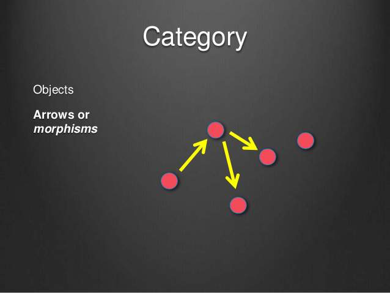

# 范畴论

## 前言

函数式编程 (Functional Programming) 的起源，来自一门叫做范畴论 (Category Theory) 的数学分支。所以理解函数式编程，是理解范畴论。

本篇基本转载自[阮一峰老师的博客](http://www.ruanyifeng.com/blog/2017/02/fp-tutorial.html) ，其中部分文字为自己补充。

## 正文

### 1 概念

什么是范畴？

wikipedia 的定义如下:

> “范畴就是使用箭头连接的物体。” (In mathematics, a category is an algebraic structure that comprises "objects" that are linked by "arrows".)

也就是说，彼此之间存在某种关系的概念、事物、对象等等，都构成"范畴"。随便什么东西，只要能找出它们之间的关系，就能定义一个"范畴"。



上图中，各个点与它们之间的箭头，就构成一个范畴。

箭头表示范畴成员之间的关系，正式的名称叫做"态射"（morphism）。范畴论认为，同一个范畴的所有成员，就是不同状态的"变形"（transformation）。通过"态射"，一个成员可以变形成另一个成员。

#### 1.1 举例

让我们举个例子帮助理解。

现在有一个单词：`中国人`，这个 `中国人` 可以视为一个对象，即一个成员。

我们知道，`中国人` 用英语表示即 `Chinese`，用日文平假名表示即 `ちゅうごくじん`（日语汉字表达也是 `中国人`，会起冲突所以这里使用平假名）。

现在我们有了三个成员：`中国人`，`Chinese`，`ちゅうごくじん`，这三者都是成员，那么使之变形的态射是什么呢？即**中译英**，**中译日**。

我们可以把 `中国人`，`Chinese`，`ちゅうごくじん`，**中译英**，**中译日**，看成一个整体，即一个范畴。

再延伸一点，我们可以把`汉语`，`英语`，`日语`，**中译英**，**中译日**，看成一个范畴。

### 2 数学模型

既然"范畴"是满足某种变形关系的所有对象，就可以总结出它的数学模型。

> - 所有成员是一个集合
> - 变形关系是函数

也就是说，范畴论是集合论更上层的抽象，简单的理解就是"集合 + 函数"。

理论上通过函数，就可以从范畴的一个成员，算出其他所有成员。

### 3 范畴与容器

我们可以把"范畴"想象成是一个容器，里面包含两样东西。

> - 值（value）
> - 值的变形关系，也就是函数。

下面我们使用代码，定义一个简单的范畴。

```javascript
class Category {
    constructor(val) {
        this.val = val;
    }
    
    addOne(x) {
        return x + 1;
    }
}  
```

`Category`是一个类，也是一个容器，里面包含一个值 `val` 和一种变形关系 `addOne`。

这里的范畴本质上就是一个无穷等差数列，差值为 1 。

这里的容器思想，就是后续函子概念的基础理论。

#### 4 范畴论与函数式编程的关系

伴随着范畴论的发展，就发展出一整套函数的运算方法。这套方法起初只用于数学运算，后来有人将它在计算机上实现了，就变成了今天的"函数式编程"。

**本质上，函数式编程只是范畴论的运算方法，跟数理逻辑、微积分、行列式是同一类东西，都是数学方法，只是碰巧它能用来写程序。**

所以函数式编程本质上是一种数学运算，数学运算的目的就是求值，不做其他事情，这也是函数式编程要求函数必须是纯的本质原因。

当然使用纯函数也有很多其他好处，所以函数式编程才会成为编程界一个趋势，有哪些好处这里暂且按下不表，在其他专题文章中解释。

## 参考文献

1. [函数式编程入门教程](http://www.ruanyifeng.com/blog/2017/02/fp-tutorial.html)