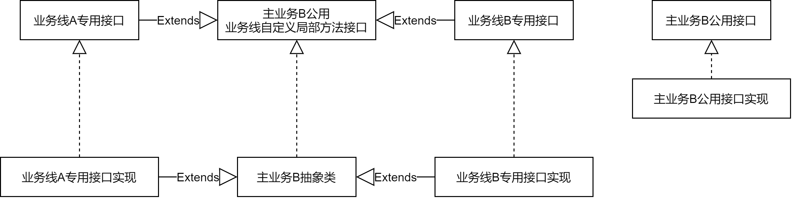

## 背景
- 在公司内遇到了一个需求，需要对一个小的项目做出改动。之前就觉得代码很狗屎，所以我在这次需求中趁机提出了重构计划。

## 代码现状
- 由于是公司的东西，所以业务相关的不会在此说明。
1. 这个项目只有一个Controller，一个主业务Service。
2. 这个项目存在主业务A和主业务B，全都写在一个Controller和一个Service里，造成了超大类。
3. 主业务B还能分出业务线A和业务线B。
4. Controller越级调用持久化服务。
5. 没有单元测试。
6. 面向过程编程。
- 个人感觉这种代码的未来就是难维护，难扩展，难测试，说未来是因为这是一个新生的项目，还没有经历过一次又一次代码的堆砌。

## 解决
1. 因为是第一次做重构，所以我这一次只分割了主业务，在Service层分割了业务B的两个业务线。
2. 下沉了通信服务，这个服务在两个主业务中都要用到。
3. 增加了一些BO(Business Object)类，但是发现有点鸡肋，后来知道了原因：充当BO类的角色的类其实已经存在了，但是这个类同时充当了PO(Persistence Object)类，搞得不伦不类，很难扩展。这个问题这一轮就不动了。

## 启发
- 在以前，我重构过自己写的APP，但是结果是一坨好看的shit更好看了，并没有脱离shit的范畴。那一次经历后，我觉得重构没有那么容易。
- 之后针对这个问题我去读了本书《用户体验要素》，这本书的读书笔记在我的博客上也有。还学了学《设计模式之美》，《设计模式之美》并没有看到设计模式的篇章就开始了这一次的重构，但这一次重构，我的认知已经不同了，有比较系统的知识了，这些知识不在这里展开。
- 现在说说这一次重构的启发：
1. **单一职责原则**是我这一次重构的指导性原则，在这一次重构中，主要目标就是分割业务。我分割完Service层后出现的变化：
	- 原本：1个接口和1个实现类。
	- 现在：
		1. 从原有的1个接口分割出了4个接口（业务线A专用1个，业务线B专用1个，业务线A和B公用1个，业务线A和B公用但需要自己定制部分方法1个），下沉出了1个接口（通信接口）。
		2. 实现类也对应的增加了4个，下沉了1个。
		3. 

	- 可以发现，分割后我们会面对**类爆炸**的问题。为了认知和面对这个问题，我去查了如何处理类爆炸的问题。最后的结论是**不要教条主义，权衡好使用设计模式和面向对象设计所带来的利与弊**。毕竟只要使用设计模式和面向对象设计，就一定会要面对类爆炸的问题。
	- 所以Controller我只分割了一个Controller，没有再因为主业务B能分出两个业务线而使用两个Controller。 

2. **接口的职责**：主业务B代码里其实有很多私有方法，其中不少方法是业务线A和B公用的，**如何让这些代码让两个业务线实现类复用成了我要解决的问题**。一开始我的想法是把这些方法写在主业务公用业务线自定义局部方法接口里，然后抽象类实现这些方法，子类也能调用，但转念一想，我不在接口里定义方法，抽象类里照样实现，并且访问权限控制在protected里不是照样可以？然后我思考了这两个做法的区别，也终于在这次实践中彻底的加深了对接口的理解：
	1. 接口提供的方法的访问都是public的，所以在接口定义的方法是外部调用者可以随意调用的。而抽象类中自己写的protected方法是只会让类本身和子类调用（这里不考虑同一个包）。所以在上方这个问题的场景下，我不应该在接口里定义这些方法，因为这些方法不是让外部调用者使用的，换句话说，**只有确定需要让外部使用者调用的方法，才会定义在接口里**。这样做有什么好处呢？这样比较符合**迪米特原则**，也叫最少知道原则，调用者不需要知道这么多私有方法，他们只需要关注接口内定义的方法，能干什么就行了。
	2. 我们在定义一个接口方法时，相当于定义了一个API，实现方要按照API定义的规范来实现，该返回什么就返回什么，该抛出异常就抛出异常，而调用方也按照API定义的规范来用，这样大家都相安无事，事情也能做成。这就是**面向抽象编程**，也是典型的**约定大于一切**的一种落地实现。

3. 领域驱动设计（Domain Drive Design），简称DDD，是我在《设计模式之美》中遇到的一个名词，当初也只是知道这么个名词，知道个大概，但是在重构过程中，查询类爆炸的问题时，对这个设计方法有了比较深的印象。DDD的模型中的代码结构可以不再像往常一样用三层架构模型来区分，而是使用domain来区分，然后一个domain包里专注一个领域，内部可以有PO类、BO类、VO类、Service、Controller等，里面有个概念是**基础设施**，比如做数据库存储的服务就属于基础设施，目前按我的理解来看，Service层以下的**贫血模型**都属于基础设施部分。区分领域有什么好处呢？
	1. 以往的三层架构其实是按技术实现来分包，开发人员在众多文件中搜索自己要维护的文件其实挺麻烦的，而区分领域后，开发人员只需要去自己负责的领域包里进行维护就行了。
	2. **充血模型**，相较于以往的贫血模型导致我们实际使用了面向过程的编码模式，充血模型可以保证我们更**面向对象**。

4. 单元测试，我们都知道Spring有单测框架，可以直接启动一个Spring环境来帮助我们做单测，但是这真的有必要么？所谓单元测试，是对一个单元进行测试，而忽略掉其所依赖的细节，比如测试主业务Service的某个方法，而该方法又依赖了Redis服务做数据存储，那我们就应该用Mock屏蔽掉Redis服务，如果把所有依赖的第三方资源都Mock掉，那启动Spring测试环境的意义何在？然而Spring还是提供了这样的功能，可能是我暂时遇到必须要用这个功能的场景。