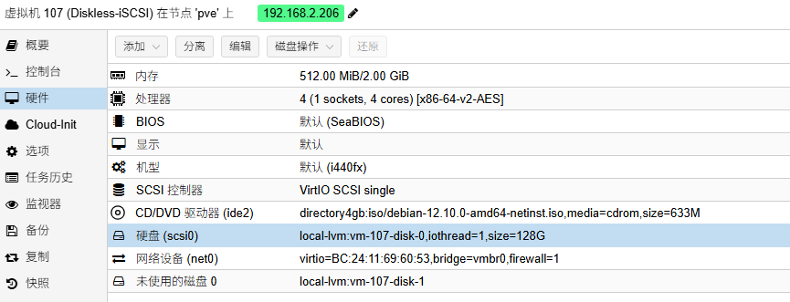
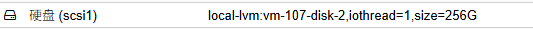

# 搭建 iSCSI 无盘系统实验

## 构建远程磁盘 Windows 系统

让我们从本地启动 Windows 来过渡到远程启动的概念。

我们本地启动电脑会启动 BIOS， BIOS 上有一个磁盘引导顺序，通过设置引导顺序我们可以启动我们需要的系统。
这种功能在多系统，以及重装电脑需要用 U 盘时尤其有用。

1. 如果引导盘选择 Windows 系统所在的磁盘，那就会引导 Windows 启动。
2. 如果引导盘选择 Win PE 所在的 U 盘，就会引导 PE 启动。

现在呢，这个顺序里面还有一种方式，叫 PXE 启动，我们简单的理解为，引导盘选择了网络上的某块磁盘。
如果这块磁盘安装了 Windows，那么就会引导 Windows 启动。

我们现在要做的是，构建一个用来放到网络磁盘上的 Windows。

### 搭建一台 windows 10 虚拟机

硬件如下


正常安装启动进入到 windows 界面后

打开 cmd 执行以下命令

```shell
cd C:\Windows\System32\Sysprep
sysprep.exe /generalize /oobe /shutdown
```

- `/generalize`：清除唯一 ID 和用户信息
- `/oobe`：下次启动进入“初次设置”
- `/shutdown`：处理完后自动关机

做完这一步后会关机，我们就可以收集我们需要的 Windows 了，这是以 VHD 文件存在的。

### 制作 VHD

注意我们的虚拟机 ID：105


还有我们使用的磁盘，我的 PVE 物理机上有 2TB 的 SSD 和 4TB 的 HDD，这次不小心装到了 HDD 上，所以叫 `directory4gb`


进入 PVE 的后台

```shell
pvesm list directory4gb --vmid 105
```

输出：
```shell
Volid                                Format  Type             Size VMID
directory4gb:105/vm-105-disk-0.qcow2 qcow2   images    42949672960 105
```

如果输出 2 行也不用怕，我们只要 disk-0，最大的那一行，第二行是 PVE 用的，对我们来说没必要。

现在我们知道这块虚拟机的磁盘的 URI 了，现在要找到这块磁盘在 PVE 上的具体路径，执行以下命令
```shell
pvesm path directory4gb:105/vm-105-disk-0.qcow2
```
你就会看到这块磁盘所在的具体路径了
```shell
/mnt/pve/directory4gb/images/105/vm-105-disk-0.qcow2
```
现在我们要把这块磁盘打包成我们需要的 VHD 文件
```shell
qemu-img convert -p -f raw /mnt/pve/directory4gb/images/105/vm-105-disk-0.qcow2 -O vpc /mnt/pve/directory4gb/win10cn.vhd
```
等待一会，我们就可以去 `/mnt/pve/directory4gb/` 找到我们的文件了。


## 搭建 iSCSI 服务器

现在我们要搭建网络磁盘服务器了，给我们的客户机一个新家。

### 安装 debian 虚拟机

PVE 上安装 debian 虚拟机，随便给些配置，实验而已。



正常启动引导安装。

**修改网络 IP 为静态 IP，`192.168.2.206`。**

配置静态 IP
```shell
sudo nano /etc/network/interfaces.d/ens18-static
```

修改内容为
```shell
iface ens18 inet static
    address 192.168.2.206
    netmask 255.255.255.0
    gateway 192.168.2.1
    dns-nameservers 192.168.2.1 8.8.8.8
```

关闭 DHCP 获取的 IP
```shell
sudo nano /etc/network/interfaces
```

```shell
source /etc/network/interfaces.d/*

# The loopback network interface
auto lo
iface lo inet loopback

# The primary network interface
allow-hotplug ens18
# iface ens18 inet dhcp   # 注释此行，不要从 dhcp 里获取 ip
```

### 安装 iSCSI 服务器

```shell
sudo apt install tgt
```

再给虚拟机挂一块磁盘，用来存放用户的数据，到这里我才知道之前给的磁盘大了，之前的磁盘只要放服务器内容就可以了。



debian 上挂载这个盘

查看是否有新增的盘
```shell
sudo lsblk
```
输出
```shell
NAME                  MAJ:MIN RM   SIZE RO TYPE MOUNTPOINTS
sda                     8:0    0   128G  0 disk
├─sda1                  8:1    0   487M  0 part /boot
├─sda2                  8:2    0     1K  0 part
└─sda5                  8:5    0 127.5G  0 part
  ├─debian--vg-root   254:0    0 126.5G  0 lvm  /
  └─debian--vg-swap_1 254:1    0   976M  0 lvm  [SWAP]
sdb                     8:16   0   256G  0 disk               # 新增盘
sr0                    11:0    1   633M  0 rom
```

分区格式化磁盘
```shell
sudo fdisk /dev/sdb
```
在交互界面中输入以下指令创建新分区：
```shell
n    # 创建新分区
p    # 主分区
1    # 分区编号
<Enter>  # 起始扇区默认
<Enter>  # 结束扇区默认（使用全部空间）
w    # 写入并退出
```

格式化
```shell
sudo mkfs.ext4 /dev/sdb1
```

创建目录并挂载
```shell
sudo mkdir -p /var/iscsi/vhd
sudo mount /dev/sdb1 /var/iscsi/vhd
```

验证挂载
```shell
df -h
```

设置开机自动挂载
```shell
sudo nano /etc/fstab
```
添加一行
```shell
/dev/sdb1  /var/iscsi/vhd  ext4  defaults  0  2
```
测试是否生效
```shell
sudo umount /var/iscsi/vhd
sudo mount -a
```

安装 `tgt`
```shell
apt install tgt
```

### 配置 iSCSI 服务器

把 vhd 文件上传到 iSCSI 服务器，不管你用什么手段都可以， scp 也好 sftp 也罢。

我们使用差量模式，即所有客户机共享一块基础 vhd，之后客户机的变更会在另一个差量 vhd 上体现出来。
这样能节省空间，也能保证各个客户机的业务隔离。

基于基础盘创建差异盘，本次我们实验 2 个客户机
先安装 `qemu` 工具集
```shell
sudo apt install qemu-utils
```

```shell
# 假设 base 镜像为 qcow2 格式（如果是 vhd 也行，只要设为 backing）
sudo qemu-img convert -f vpc -O qcow2 /var/iscsi/vhd/win10cn.vhd /var/iscsi/vhd/win10cnbase.qcow2

# 然后为 client1 创建差异盘
sudo qemu-img create -f qcow2 \
      -F qcow2 \
      -b /var/iscsi/vhd/win10cnbase.qcow2 \
      /var/iscsi/vhd/client1.qcow2
      
# 为 client2 创建差异盘
sudo qemu-img create -f qcow2 \
      -F qcow2 \
      -b /var/iscsi/vhd/win10cnbase.qcow2 \
      /var/iscsi/vhd/client2.qcow2
```

完成后用以下命令验证
```shell
sudo qemu-img info /var/iscsi/vhd/client1.qcow2
```
```shell
image: client1.qcow2
file format: qcow2
backing file: /var/iscsi/vhd/win10cnbase.qcow2
backing file format: qcow2
```

配置 tgt (iSCSI 服务器)
配置第一个客户机
```shell
sudo nano /etc/tgt/conf.d/client1.conf
```
```shell
<target iqn.2024-09.com.wangkanggh.diskless:client1>
    backing-store /var/iscsi/vhd/client1.qcow2
    initiator-name iqn.2024-09.com.wangkanggh:client1
</target>
```

验证
```shell
sudo systemctl restart tgt
sudo tgtadm --mode target --op show
```
看到 一个 LUN 指向了我们的差异盘就可以了。

按照这个逻辑再配置客户机2

