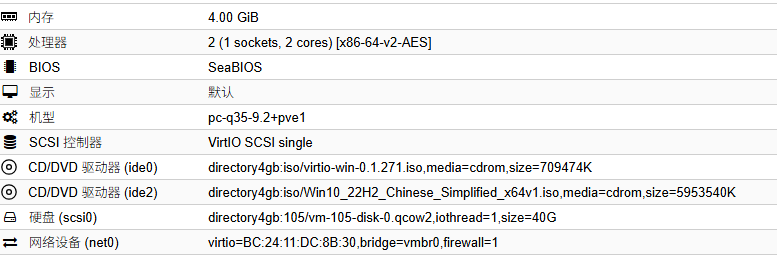

# 搭建 iSCSI 无盘系统实验

## 构建远程磁盘 Windows 系统

让我们从本地启动 Windows 来过渡到远程启动的概念。

我们本地启动电脑会启动 BIOS， BIOS 上有一个磁盘引导顺序，通过设置引导顺序我们可以启动我们需要的系统。
这种功能在多系统，以及重装电脑需要用 U 盘时尤其有用。

1. 如果引导盘选择 Windows 系统所在的磁盘，那就会引导 Windows 启动。
2. 如果引导盘选择 Win PE 所在的 U 盘，就会引导 PE 启动。

现在呢，这个顺序里面还有一种方式，叫 PXE 启动，我们简单的理解为，引导盘选择了网络上的某块磁盘。
如果这块磁盘安装了 Windows，那么就会引导 Windows 启动。

我们现在要做的是，构建一个用来放到网络磁盘上的 Windows。

### 搭建一台 windows 10 虚拟机

硬件如下



正常安装启动进入到 windows 界面后

打开 cmd 执行以下命令

```shell
cd C:\Windows\System32\Sysprep
sysprep.exe /generalize /oobe /shutdown
```

- `/generalize`：清除唯一 ID 和用户信息
- `/oobe`：下次启动进入“初次设置”
- `/shutdown`：处理完后自动关机

做完这一步后会关机，我们就可以收集我们需要的 Windows 了，这是以 VHD 文件存在的。

### 制作 VHD

注意我们的虚拟机 ID：105


还有我们使用的磁盘，我的 PVE 物理机上有 2TB 的 SSD 和 4TB 的 HDD，这次不小心装到了 HDD 上，所以叫 `directory4gb`


进入 PVE 的后台

```shell
pvesm list directory4gb --vmid 105
```

输出：
```shell
Volid                                Format  Type             Size VMID
directory4gb:105/vm-105-disk-0.qcow2 qcow2   images    42949672960 105
```

如果输出 2 行也不用怕，我们只要 disk-0，最大的那一行，第二行是 PVE 用的，对我们来说没必要。

现在我们知道这块虚拟机的磁盘的 URI 了，现在要找到这块磁盘在 PVE 上的具体路径，执行以下命令
```shell
pvesm path directory4gb:105/vm-105-disk-0.qcow2
```
你就会看到这块磁盘所在的具体路径了
```shell
/mnt/pve/directory4gb/images/105/vm-105-disk-0.qcow2
```
现在我们要把这块磁盘打包成我们需要的 VHD 文件
```shell
qemu-img convert -p -f raw /mnt/pve/directory4gb/images/105/vm-105-disk-0.qcow2 -O vpc /mnt/pve/directory4gb/win10cn.vhd
```
等待一会，我们就可以去 `/mnt/pve/directory4gb/` 找到我们的文件了。


