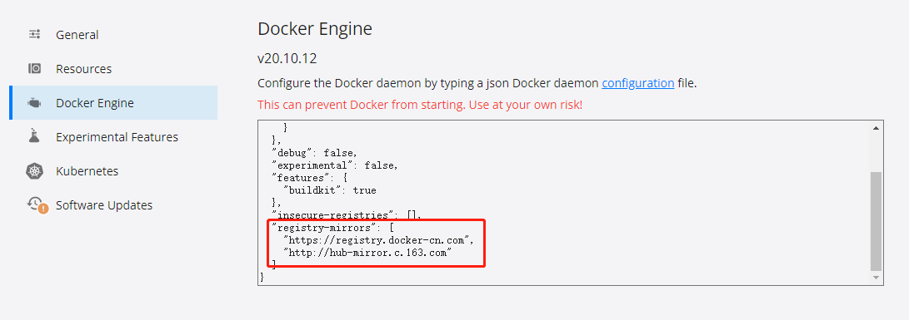

# docker 配置镜像源

## 镜像源地址

1. Docker中国区官方镜像

   https://registry.docker-cn.com
2. 网易

   http://hub-mirror.c.163.com

3. 中国科技大学

   https://docker.mirrors.ustc.edu.cn

## 使用镜像源

### Linux

修改 /etc/docker/daemon.json

```json
{
  "registry-mirrors": [
    "http://hub-mirror.c.163.com",
    "https://docker.mirrors.ustc.edu.cn",
    "https://registry.docker-cn.com"
  ]
}
```

重启 docker 服务

```shell
service docker restart

systemctl restart docker 
```

可以通过 docker info 命令检查配置是否已加载

```shell
docker info
```

### docker desktop

如下图配置，注意重启服务



## 参考文献

1. [docker 设置国内镜像源](https://blog.csdn.net/whatday/article/details/86770609/)
2. [Docker配置镜像源](https://blog.csdn.net/weixin_49244483/article/details/127195264)
3. [一起学Docker：Docker Desktop设置国内阿里镜像源](https://blog.csdn.net/haowll/article/details/125689724)