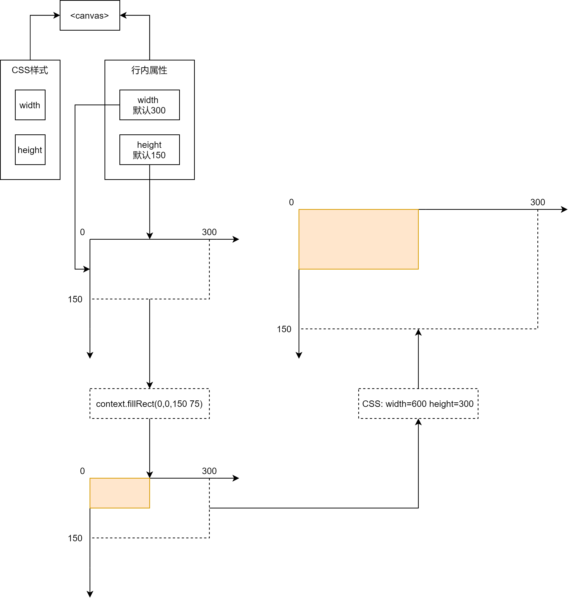

### 图解
**注意，该图解仅为笔者的理解，非官方图解**

基本可以理解为：
1. canvas先根据行内属性的width（默认300）和height（默认150）的参数确定了坐标系范围。
2. 前端使用context.fillRect(x,y,width,height)在坐标系上进行绘画（此处省略绘画前的准备步骤）。
3. 画好的图根据CSS样式的width和height参数进行等比例缩放。
4. 得到最终成像。

### 参考文献
[canvas 的行内属性width、height与css的width、height属性差别](https://blog.csdn.net/xiongshiyuan/article/details/85223867)