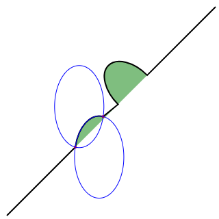

# SVG 学习记录

## 前言

学习 SVG 的途中发现知识量有些庞大，所以记录一些关键的容易用得上的信息。

- 本篇记录一些基础的图形绘画知识。

## 定位

SVG 是定位方式是网格定位，与传统的计算机绘图定位方式一致：

- 以页面的左上角为 (0,0) 坐标点，坐标以像素为单位，x 轴正方向是向右，y 轴正方向是向下。

## 基本形状

### 矩形

```xml
<svg>
    <rect x="10" y="10" width="30" height="30"/>
    <rect x="60" y="10" rx="10" ry="10" width="30" height="30"/>
</svg>
```

- x: 矩形左上角的 x 位置
- y: 矩形左上角的 y 位置
- width: 矩形的宽度
- height: 矩形的高度
- rx: 圆角的 x 方位的半径
- ry: 圆角的 y 方位的半径

如果没有设置圆角，则默认为 0。

### 圆形

```xml
<circle cx="25" cy="75" r="20"/>
```

- r: 圆的半径
- cx: 圆心的 x 位置
- cy: 圆心的 y 位置

### 椭圆

```xml
<ellipse cx="75" cy="75" rx="20" ry="5"/>
```

- rx: 椭圆的 x 半径
- ry: 椭圆的 y 半径
- cx: 椭圆中心的 x 位置
- cy: 椭圆中心的 y 位置

### 直线

```xml
<line x1="10" x2="50" y1="110" y2="150"/>
```

- x1: 起点的 x 位置
- y1: 起点的 y 位置
- x2: 终点的 x 位置
- y2: 终点的 y 位置

### 折线

```xml
<polyline points="60 110, 65 120, 70 115, 75 130, 80 125, 85 140, 90 135, 95 150, 100 145"/>
```

- points:
  点集数列。每个数字用空白、逗号、终止命令符或者换行符分隔开。每个点必须包含 2 个数字，一个是 x 坐标，一个是 y 坐标。所以点列表 (0,0), (1,1) 和 (2,2) 可以写成这样：“0 0, 1 1, 2 2”。

### 多边形

和折线很像，但是多边形会创建闭合曲线，成为一个图形

```xml
<polygon points="50 160, 55 180, 70 180, 60 190, 65 205, 50 195, 35 205, 40 190, 30 180, 45 180"/>
```

- points: 点集数列。每个数字用空白符、逗号、终止命令或者换行符分隔开。每个点必须包含 2 个数字，一个是 x 坐标，一个是 y 坐标。所以点列表 (0,0), (1,1) 和 (2,2) 可以写成这样：“0 0, 1 1, 2 2”。路径绘制完后闭合图形，所以最终的直线将从位置 (2,2) 连接到位置 (0,0)。

### 路径

最常见的图形

```xml
<path d="M 20 230 Q 40 205, 50 230 T 90230"/>
```

- d: 一个点集数列以及其它关于如何绘制路径的信息。

## 路径详解

`<path>` 元素是 SVG 基本形状里面最强大的一个，可以创建线条，曲线，弧形等等，也是上手门槛最高的一个。

path 元素的形状是通过属性 `d` 定义的，属性 `d` 的值是一个“命令 + 参数”的序列，我们将讲解这些可用的命令，并且展示一些示例

### 移动 (Move to) 命令

命令为`M x y` 或 `m dx dy`，会将画笔移动到目标坐标，大写 M 时使用绝对值坐标进行移动，小写 m 时则以上一个点为基准，进行相对移动。

- 所有命令的都支持大小写，并表现出和移动命令相同的特性。

在使用 M 命令移动画笔后，只会移动画笔，但不会在两点之间画线。因为 M 命令仅仅是移动画笔，但不画线。所以 M 命令经常出现在路径的开始处，用来指明从何处开始画。

### 直线 (Line to) 命令

命令样式: `L x y (or l dx dy)`

其中 L 表示直线命令， x 和 y 表示这条直线的终点坐标，这样一条直线就会从当前画笔所在的点到直线目标点之间生成了。

另外还有2个简写命令，用来绘制水平线和垂直线。H，绘制水平线。V，绘制垂直线。这两个命令都只带一个参数，标明在 x 轴或 y 轴移动到的位置，因为它们都只在坐标轴的一个方向上移动。

- `H x (or h dx)`
- `V y (or v dy)`

### 闭合路径命令

命令样式: `Z (or z)`

该命令从当前画笔所在点画一条直线到起点，常常用来简化闭合图形的代码。

### 曲线命令

这是一个难点，比较复杂。

#### 三阶贝塞尔曲线

##### 介绍

三阶贝塞尔曲线由4个点组成，如下图所示:

- 
- 

其中2个点为定位点，分别为起点和终点。另外2个点为控制点，在图中表现为 P1 与 P2。

##### 绘制命令

去除画笔所在的点可以作为起点，我们的三阶贝塞尔曲线命令还需要3个参数，命令如下：

- `C x1 y1, x2 y2, x y (or c dx1 dy1, dx2 dy2, dx dy)`

其中:

- (x1, y1) 是起点的控制点
- (x2, y2) 是终点的控制点
- (x, y) 表示这段曲线的终点

##### 简写命令

你可以将若干个贝塞尔曲线连起来，从而创建出一条很长的平滑曲线。通常情况下，一个点某一侧的控制点是它另一侧的控制点的对称（以保持斜率不变）。这样，你可以使用一个简写的贝塞尔曲线命令 S，如下所示：

- ` S x2 y2, x y (or s dx2 dy2, dx dy)`

S 命令可以用来创建与前面一样的贝塞尔曲线，但是，如果 S 命令跟在一个 C 或 S 命令后面，则它的第一个控制点会被假设成前一个命令曲线的第二个控制点的**中心对称点**。如果 S 命令单独使用，前面没有 C 或 S 命令，那当前点将作为第一个控制点。

#### 二阶贝塞尔曲线

##### 介绍

二阶贝塞尔曲线简单一些，由3个点构成

- 
- 

其中2个点为定位点，分别为起点和终点。剩下1个点为控制点，在图中表现为 P1。

##### 绘制命令

同样，去除画笔当前所在的点，我们可以需要2个参数确定1个控制点和1个终点，命令如下所示:

- ` Q x1 y1, x y (or q dx1 dy1, dx dy)`

##### 简写命令

就像三次贝塞尔曲线有一个 S 命令，二次贝塞尔曲线有一个差不多的 T 命令，可以通过更简短的参数，延长二次贝塞尔曲线。

- ` T x y (or t dx dy)`

和之前一样，快捷命令 T 会通过前一个控制点，推断出一个新的控制点。这意味着，在你的第一个控制点后面，可以只定义终点，就创建出一个相当复杂的曲线。需要注意的是，T 命令前面必须是一个 Q 命令，或者是另一个 T 命令，才能达到这种效果。如果 T 单独使用，那么控制点就会被认为和终点是同一个点，所以画出来的将是一条直线。

#### 弧形

弧形命令 A 是另一个创建 SVG 曲线的命令。基本上，弧形可以视为圆形或椭圆形的一部分。假设，已知椭圆形的长轴半径和短轴半径，并且已知两个点（在椭圆上），根据半径和两点，可以画出两个椭圆，在每个椭圆上根据两点都可以画出两种弧形。所以，仅仅根据半径和两点，可以画出四种弧形。为了保证创建的弧形唯一，A 命令需要用到比较多的参数：

- ` A rx ry x-axis-rotation large-arc-flag sweep-flag x y`
- `a rx ry x-axis-rotation large-arc-flag sweep-flag dx dy`

弧形命令 A 的前两个参数分别是 x 轴半径和 y 轴半径，它们的作用很明显，不用多做解释，如果你不是很清楚它们的作用，可以参考一下椭圆ellipse命令中的相同参数。弧形命令 A 的第三个参数表示弧形的旋转情况，下面的例子可以很好地解释它：

```xml
<?xml version="1.0" standalone="no"?>
<svg width="320px" height="320px" version="1.1" xmlns="http://www.w3.org/2000/svg">
    <path d="M10 315
           L 110 215
           A 30 50 0 0 1 162.55 162.45
           L 172.55 152.45
           A 30 50 -45 0 1 215.1 109.9
           L 315 10" stroke="black" fill="green" stroke-width="2" fill-opacity="0.5"/>
</svg>
```

如图例所示，画布上有一条对角线，中间有两个椭圆弧被对角线切开 (x radius = 30, y radius = 50)。第一个椭圆弧的 x-axis-rotation（x 轴旋转角度）是 0，所以弧形所在的椭圆是正置的（没有倾斜）。在第二个椭圆弧中，x-axis-rotation 设置为 -45，所以这是一个旋转了 45 度的椭圆，并以短轴为分割线，形成了两个对称的弧形。参看图示中的第二个椭圆形。

对于上图旋转了的椭圆，只有 2 种弧形可以选择，不是 4 种，因为两点连线（也就是对角线）正好穿过了椭圆的中心。像下面这张图，就是普通的情况，可以画出两个椭圆，四种弧。



上面提到的四种不同路径将由接下来的两个参数决定。如前所讲，还有两种可能的椭圆用来形成路径，它们给出的四种可能的路径中，有两种不同的路径。这里要讲的参数是 large-arc-flag（角度大小）和 sweep-flag（弧线方向），large-arc-flag 决定弧线是大于还是小于 180 度，0 表示小角度弧，1 表示大角度弧。sweep-flag 表示弧线的方向，0 表示从起点到终点沿逆时针画弧，1 表示从起点到终点沿顺时针画弧。下面的例子展示了这四种情况。

```xml
<?xml version="1.0" standalone="no"?>
<svg width="325px" height="325px" version="1.1" xmlns="http://www.w3.org/2000/svg">
    <path d="M80 80
           A 45 45, 0, 0, 0, 125 125
           L 125 80 Z" fill="green"/>
    <path d="M230 80
           A 45 45, 0, 1, 0, 275 125
           L 275 80 Z" fill="red"/>
    <path d="M80 230
           A 45 45, 0, 0, 1, 125 275
           L 125 230 Z" fill="purple"/>
    <path d="M230 230
           A 45 45, 0, 1, 1, 275 275
           L 275 230 Z" fill="blue"/>
</svg>
```

## 参考文献

1. [SVG 教程-MDN](https://developer.mozilla.org/zh-CN/docs/Web/SVG/Tutorial)
2. [基本形状-MDN](https://developer.mozilla.org/zh-CN/docs/Web/SVG/Tutorial/Basic_Shapes)
3. [路径-MDN](https://developer.mozilla.org/zh-CN/docs/Web/SVG/Tutorial/Paths)
4. [Bézier curve-WIKIPEDIA](https://en.wikipedia.org/wiki/B%C3%A9zier_curve)