# 三阶贝塞尔曲线绘制圆弧

## 简略正文

四分之一的圆弧控制点魔法值也是由公式算得的，如下图所示
> 因此，对于4分，它是(4/3)*tan(pi/8) = 4*(sqrt(2)-1)/3 = 0.552284749831。
> 
> 

## 绘制用程序

一般我们绘制一个圆弧前，会已知的信息有:

1. 圆心坐标
2. 圆弧起始点坐标
3. 圆弧圆心角角度

为了能够快速计算绘制贝塞尔曲线搜需要的其他信息，我们可以设计制作一个计算程序，这个程序最终可以得出:

1. 圆弧终点坐标
2. 圆弧控制棒 1 终点坐标
3. 圆弧控制棒 2 终点坐标a

整体计算流程如下图:

原始绘图文件为:

[贝塞尔曲线绘制圆弧](../assets/贝塞尔曲线绘制圆弧.drawio)

## 参考文献

1. [关于几何：如何使用贝塞尔曲线创建圆？](https://www.codenong.com/1734745/)