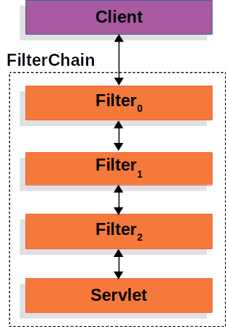
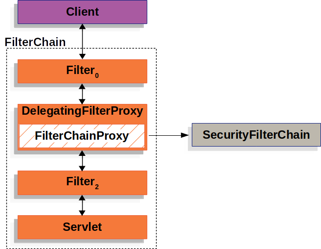
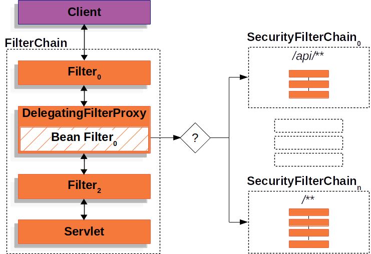
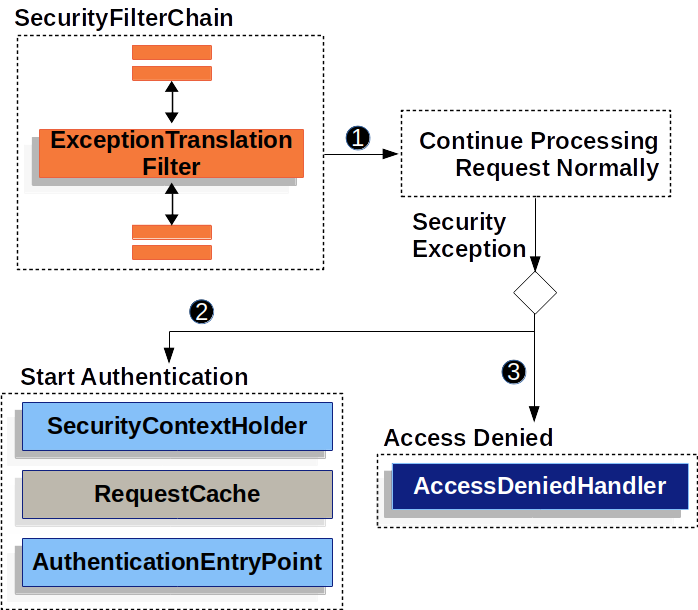

## 参考资料
[官方文献](https://docs.spring.io/spring-security/reference/index.html)


## 简介

`Spring Security`是一种框架，即已完成的半个应用程序，它提供了如下三个领域的功能：

1. 认证
2. 授权
3. 针对常见攻击行为的防御手段


## 本章概要

这个章节讲述的并非`Spring Security`提供的各种认证、授权等功能如何使用，而是讲述其的核心架构，在一个`Http`请求进入`Servlet`后`Spring Security`是如何工作，以保证其各种功能都能正常执行。
注意，本章节只涉及到`Servlet`应用程序，不会涉及`Reactive`应用程序。


## 依赖核心——Servlet Filter

`Spring Security`让自己起效果的核心思路是**在业务执行之前，就把一切要做的安全措施全部噶彭一下都给做掉**，那么，做到这一点呢？或者说哪里适合这么做呢？诶~`Servlet`的`Filter责任链`就非常适合这件事，**在过滤器链结构中，只要`Spring Security`的过滤器在执行`Servlet`接口的业务代码之前被执行即可**。于是呢，`Spring Security`就自己实现了一个`Filter`，然后插进了`Servlet`的`Filter链`，接下来，`Servlet`执行`过滤器链(Filter Chain)`的时候就会自然而然地进入了`Spring Security`的逻辑。




### 将安全业务委托出去——`DelegatingFilterProxy`

这，也是`Spring Security`架构的起点，它实现了一个`DelegatingFilterProxy`类作为进入`Security`世界的入口。
注册关键代码在注册类中:
- Parent Class: AbstractFilterRegistrationBean
```java
@Override
protected Dynamic addRegistration(String description, ServletContext servletContext) {
	Filter filter = getFilter();
	return servletContext.addFilter(getOrDeduceName(filter), filter);
}
```
- Real Class: DelegatingFilterProxyRegistrationBean
```java
@Override
public DelegatingFilterProxy getFilter() {
	return new DelegatingFilterProxy(this.targetBeanName, getWebApplicationContext()) {

		@Override
		protected void initFilterBean() throws ServletException {
			// Don't initialize filter bean on init()
		}

	};
}
```
细心的读者应该已经发现了，`getFilter()`方法返回的也并非真的返回了`DelegatingFilterProxy`的实现类，而是其匿名内部类，**该类重写了初始化方法，以做到在Servlet启动时并没有真正初始化，而是等到Spring核心加载完成后，以懒加载的方式初始化。**
- 为什么要懒加载？
- 因为这是`Spring Security`，是基于`Spring`核心开发的一套框架（它需要`Spring`的优点），而`Servlet`的初始化要早于`Spring`上下文的初始化，如果在`Servlet`初始化阶段就去初始化`Spring Security`的`Filter`会找不到目标`Bean`。

相信读者也从类名明白了`DelegatingFilterProxy`这个类的意图，就是桥接`Servlet`与`Spring`，**最终目标是让`Spring Security`能在`Spring`上下文中工作，又能从`Servlet`的过滤流程中收到触发过滤的信号。** 所以该类中有一个委托对象——`FilterChainProxy`，而这个类的实例，是一个`Spring`的`Bean`，如下图所示。




当第一个请求进入了`Servlet`过滤器链，进入`DelegatingFilterProxy`并触发`doFilter()`方法时，`DelegatingFilterProxy`才会去寻找`Spring`上下文，并从`Spring`工厂中找出`Spring Security`定位为被委托的过滤链——`FilterChainProxy`。
代码如下：
Real Class: DelegatingFilterProxy
```java
@Override
public void doFilter(ServletRequest request, ServletResponse response, FilterChain filterChain)
		throws ServletException, IOException {

	// Lazily initialize the delegate if necessary.
	Filter delegateToUse = this.delegate;
	if (delegateToUse == null) {
		synchronized (this.delegateMonitor) {
			delegateToUse = this.delegate;
			if (delegateToUse == null) {
				WebApplicationContext wac = findWebApplicationContext();
				if (wac == null) {
					throw new IllegalStateException("No WebApplicationContext found: " +
								"no ContextLoaderListener or DispatcherServlet registered?");
				}
				delegateToUse = initDelegate(wac);
			}
			this.delegate = delegateToUse;
		}
	}

	// Let the delegate perform the actual doFilter operation.
	invokeDelegate(delegateToUse, request, response, filterChain);
}
```

## Spring Security自己的过滤链——SecurityFilterChain


当程序进入了`FilterChainProxy`，就相当于进入了`Spring Security`的领域，`Spring Security`可以放开手脚自己干了，只要最终仍然按照**Servlet规范**，让链式调用继续执行即可。

### 介绍
`Spring Security`自己定义并实现了一套过滤器链`SecurityFilterChain`，虽然这个类的类名以`FilterChain`结尾，但它的工作方式与`Servlet`的过滤链`ApplicationFilterChain`完全不同。
- `ApplicationFilterChain`持有一组预先配置好的`Filter`集合（代码内是数组），并负责调用每一个`Filter`的`doFilter()`方法。
- `SecurityFilterChain`仅仅是提供一个预先配置好的`Filter`集合，不负责调用过滤方法，真正负责调用过滤方法的类是`FilterChainProxy`。

笔者的自问自答：
- `Spring Security`定义一套自己的过滤器链有什么好处？
- 笔者认为，`Servlet`的过滤器链不在`Spring`方的控制范围内，而基于控制反转、用户可自己方便配置、高扩展性等需求，`Spring`有必要自己实现一条过滤器链。
- `SecurityFilterChain`的定位应该是提供`Spring Security`框架要提供的功能——认证、授权、防御常见的外部攻击。而`ApplicationFilterChain`的定位更加宽泛。


### 与`FilterChainProxy`的关系

- `SecurityFilterChain`由`FilterChainProxy`持有，且可以持有多个
- `SecurityFilterChain`支持匹配请求`url`，`FilterChainProxy`在获取`Filter`集合的时候会先匹配请求的`url`，如果匹配上了才会调用`SecurityFilterChain`的`getFilters()`方法`SecurityFilterChain`。




关键代码如下:
- Real Class: FilterChainProxy
```java
private List<Filter> getFilters(HttpServletRequest request) {
	for (SecurityFilterChain chain : this.filterChains) {
		if (chain.matches(request)) {
			return chain.getFilters();
		}
	}
	return null;
}
```
代码说明了，会提供**第一组**与`url`匹配上的过滤器链。


### 安全业务执行点——`Security Filter`

- `SecurityFilterChain`提供的`Filter`实现的接口就是`Servlet`的`Filter`接口，但职责收束到了认证、授权、防御常见的外部攻击。
- `SecurityChainProxy`会依次执行这些`Filter`，**所以这些`Filter`的顺序至关重要。**
- `Spring Security`默认提供了一组`Filter`实现，并具有默认的顺序，相关过滤器及顺序可以查询官方文档或者源码(版本4.2.0可以查看`FilterComparator`，版本5.6.0可以查看`FilterOrderRegistration`)，此文限于篇幅不标出。


### 处理认证安全异常——`ExceptionTranslationFilter`

`ExceptionTranslationFilter`也是`Filter`的一种实现，同样被插入了`SecurityFilterChain`，它可以将自己这个节点之后的调用链上产生的认证相关异常`AuthenticationException`、`AccessDeniedException`转换成对应的`Http`响应应并返回，相当于是一个统一认证异常处理器。

- **值得注意的是，在该节点被调用前抛出的认证异常不会由此过滤器受理**。
- 默认情况下，处理器会将用户引导至登录页，用户可以对处理器的行为进行配置。




## 总结

`Spring Security`的核心架构其实很简单，就是将自己的过滤链插入到了`Servlet`的过滤链，这一章不涉及相关业务功能的实现所以看起来并不吃力，将这一章节作为初始章节，也是因为将核心架构了然于心后，之后面对千变万化的安全业务也可以泰然处之。
