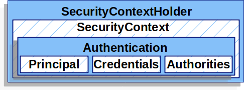
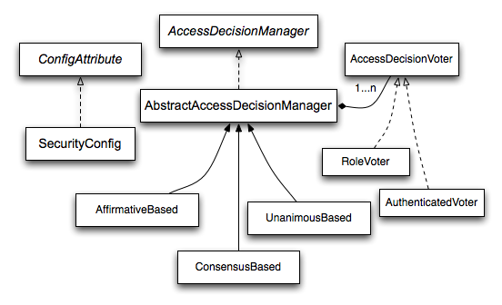

## 参考文献
[官方文档——权限架构](https://docs.spring.io/spring-security/reference/servlet/authorization/architecture.html)


## 定义权限——GrantedAuthority

上一章说道，核心数据结构中有一个`Authentication`类，我们并没有提及该类中的`Authorities`是什么。



实际上这里面的`Authorities`是一个集合，集合内装着的是`GrantedAuthority`的实例。
`GrantedAuthority`本身是一个接口，该接口本身只有一个方法，该方法会返回与权限对应的字符串，比如`ROLE_ADMIN`。
```java
String getAuthority();
```

在`Authentication`中的`GrantedAuthority`集合就代表了该`Authentication`代表的用户被授予了什么权限。


## 如何判断权限是否足够

`Spring Security`将与权限相关的行为定义成了如下一句话：
**`访问者`是否有`权限` `执行或访问`某一个`安全对象`。**
整个权限判断架构都可以从这句话出发，其中`安全对象`看起来宏大，实际上在我们的应用中常见的是：一个方法是否可以被执行或一个`web`请求是否可以受理。


### 进入安全对象前的拦截器——AbstractSecurityInterceptor

在进入安全对象前，`AbstractSecurityInterceptor::beforInvocation`方法会被调用，做执行之前的行动，其中就包含了权限校验。校验权限时会调用`AccessDecisionManager::decide`以进行具体的权限校验。

### 权限校验器——AccessDecisionManager

`AccessDecisionManager`本身只是一个接口，定义了以下方法:
```java
void decide(Authentication authentication, Object secureObject,
	Collection<ConfigAttribute> attrs) throws AccessDeniedException;

boolean supports(ConfigAttribute attribute);

boolean supports(Class clazz);
```
`supports(Class clazz)`定义了该接口的实现是否支持针对目标安全对象进行权限校验。通常情况下，入参是`MethodInvocation.class`或者`FilterInvocation.class`。

`supports(ConfigAttribute attribute)`定义了实现是否支持对传入的配置参数进行权限校验。

`decide(Authentication authentication, Object secureObject,
	Collection<ConfigAttribute> attrs)`方法真正执行了权限校验，**当校验通过时，什么都不做，反之则抛出`AccessDeniedException`**。

#### 基于投票机制的权限校验系统

`AccessDecisionManager`虽然定位是权限校验器，但`Spring Security`实现它的思路用的是投票机制，所以我们可以看到`Spring Security`提供的几种实现类实际上都是**投票计数器，最终再根据一定规则给出最终的权限判定**。这里贴一张由`Spring`官方提供的`UML`图。



`AccessDecisionManager`实际上是先经由一个抽象类`AbstractAccessDecisionManager`实现，再由具体的实现类继承的。`AbstractAccessDecisionManager`本身维护了一个集合，该集合里存放的就是`AccessDecisionVoter`，即选民，它们会给出投票。

`AccessDecisionManager`实质上有三种具体实现，其中:
`AffirmatieBased`只要在投票过程中收到一张赞成票就会判定权限通过,与之完全相反的`UnanimouseBased`，只要在发现一张反对票就会判定没有权限进入安全对象。
而`ConsensusBased`会比较赞成票和反对票的数量，谁多谁获胜，平局的时候可以根据用户配置的策略进行判定，默认权限通过。

我们也可以自己实现一个`AccessDecisionManager`来应对特殊需求，比如某些`Voter`具有一票否决权，或者一些`Voter`的投票比重比较高等等。

#### 投票者——AccessDecisionVoter

投票者的核心方法:
```java
int vote(Authentication authentication, Object object, Collection<ConfigAttribute> attrs);
```
`Voter`可以投出三种类型的票，**赞成、否决、弃权**。当`Voter`认为自己可以对该类型的对象做出权限决断的时候，则必须投出赞成或否决票，否则应当投出弃权票。

在`Spring Security`中，最常见的选民实现是`RoleVoter`，一种根据角色来判定权限的机制。我们也可以根据自己的业务需求实现一个自己的`AccessDecisionVoter`。