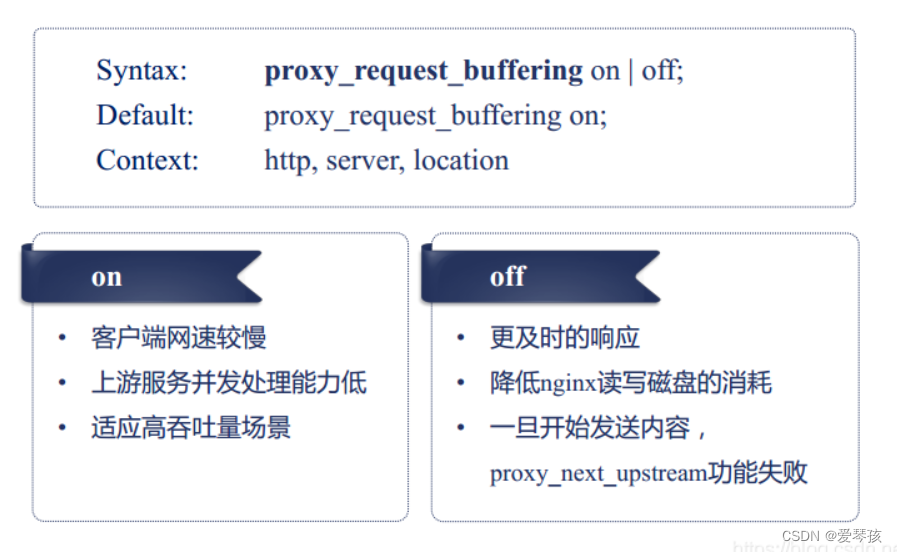
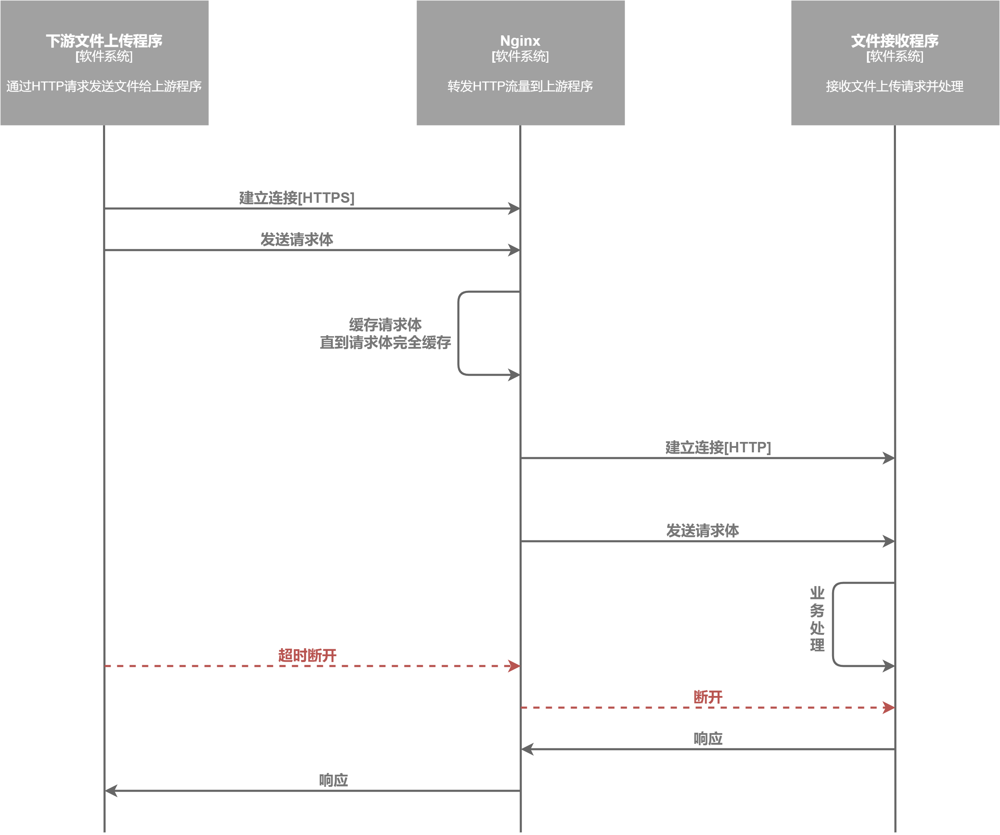
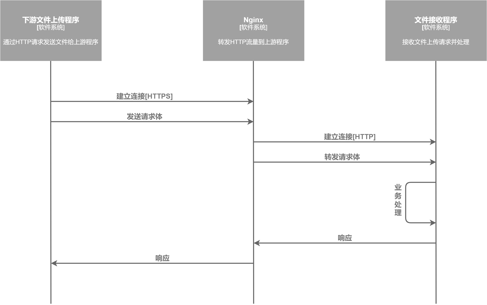

# nginx缓冲请求体与文件上传功能的冲突

## 背景

如果我们开发了一个文件存储服务程序，而该服务程序被`nginx`所代理，那么上传大文件时的种种问题我们一定会遇到，其中，我们经常遇到的冲突大概率与**缓冲请求体**有关。

## 问题

上传文件的程序为`apache`的`httpclient`，该程序设定了超时时间，为200s。要上传一份10个G的大文件到目标服务器。中间经过了`nginx`代理。

最终结果是文件上传失败。

### 排查问题

1. 在文件接收端日志看到的异常是`org.apache.catalina.connector.ClientAbortException: java.io.EOFException`
2. 在上传程序端日志看到的异常是`java.net.SocketTimeoutException: Read timed out`

从这两条异常信息来推理，是由于上传程序自己断开了文件传输连接，断开的原因是**超时**。

为什么客户端会认为超时了呢？重新模拟了一遍上传过程，发现文件流到后端的文件接收程序要等很长一端时间，这段时间这个文件流到哪去了?答案只能是`nginx`。

于是笔者有一个猜想，是不是因为`nginx`已经预先缓冲了整个请求体，也就是把整个文件都给缓冲了，导致客户端与`nginx`之间**没有必要再交互了**，但连接仍然存在，于是客户端进入了超时倒计时，超时后则自己断开了连接。
客户端断开连接后，`nginx`也会断开与服务端的连接，导致服务端报了`EOFException`。

之后笔者调大了客户端的超时时间，或禁用了`nginx`的请求体缓冲功能，两个方案都可以让文件传输成功。侧面证明了笔者的猜想基本正确。


### 禁用缓冲请求体功能

```
Syntax:	proxy_request_buffering on | off;
Default:	
proxy_request_buffering on;
Context:	http, server, location
This directive appeared in version 1.7.11.
```

> Enables or disables buffering of a client request body.
>
> When buffering is enabled, the entire request body is read from the client before sending the request to a proxied server.
>
> When buffering is disabled, the request body is sent to the proxied server immediately as it is received. In this case, the request cannot be passed to the next server if nginx already started sending the request body.
>
> When HTTP/1.1 chunked transfer encoding is used to send the original request body, the request body will be buffered regardless of the directive value unless HTTP/1.1 is enabled for proxying.



on表示nginx接收完完整的body后才和upstream建立连接，off则是先建立连接，然后发送请求的时，从下游读取body，同时往上游转发。默认情况下是on，即nginx先生成要发往上游的包体，然后才去和上游建立连接。

这样做是为了不耽误时间，不占用较长时间连接。因为一边读一边转发的问题是，一般下游和nginx之间的网速较慢，而nginx和upstream的网速较快(内网)，这样边读边发会浪费很多时间。

#### proxy_request_buffering on


#### proxy_request_buffering off


### 无视客户端关闭连接

```
Syntax:	proxy_ignore_client_abort on | off;
Default:	
proxy_ignore_client_abort off;
Context:	http, server, location
```

> Determines whether the connection with a proxied server should be closed when a client closes the connection without waiting for a response.

这个配置比较有意思，但是要慎重使用，当该配置为`on`时，能解决文件上传失败的问题，原理是`nginx`不会因为客户端断开了连接而自己断开与服务端的连接，但是客户端仍然因为超时断开了连接，此时**客户端并不知道文件是不是真的上传成功了**。

## 参考文献

1. [Module ngx_http_proxy_module](http://nginx.org/en/docs/http/ngx_http_proxy_module.html)
2. [proxy_request_buffering](http://nginx.org/en/docs/http/ngx_http_proxy_module.html#proxy_request_buffering)
3. [proxy_ignore_client_abort](http://nginx.org/en/docs/http/ngx_http_proxy_module.html#proxy_ignore_client_abort)
4. [Nginx处理请求体那点事](https://blog.csdn.net/qq_28165595/article/details/124567028)