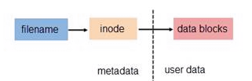

# Linux_软链接与硬链接

## 1. 原理

我们知道文件都有文件名与数据，这在 Linux 上被分成两个部分：用户数据 (user data) 与元数据 (metadata)
。用户数据，即文件数据块 (data block)，数据块是记录文件真实内容的地方；而元数据则是文件的附加属性，如文件大小、创建时间、所有者等信息。在
Linux 中，元数据中的 inode 号（inode 是文件元数据的一部分但其并不包含文件名，inode
号即索引节点号）才是文件的唯一标识而非文件名。文件名仅是为了方便人们的记忆和使用，系统或程序通过 inode
号寻找正确的文件数据块。如下图展示了程序通过文件名获取文件内容的过程。



## 2. 软链接与硬链接

为解决文件的共享使用，Linux 系统引入了两种链接：硬链接 (hard link) 与软链接（又称符号链接，即 soft link 或 symbolic
link）。链接为 Linux 系统解决了文件的共享使用，还带来了隐藏文件路径、增加权限安全及节省存储等好处。

### 2.1 硬链接

**若一个 inode 号对应多个文件名**，则称这些文件为硬链接。换言之，硬链接就是同一个文件使用了多个别名。硬链接可由命令 link 或
ln 创建。

```shell
link oldfile newfile
```

```shell
ln oldfile newfile
```

由于硬链接是有着相同 inode 号仅文件名不同的文件，因此硬链接存在以下几点特性：

- 文件有相同的 inode 及 data block；
- 只能对已存在的文件进行创建；
- 不能交叉文件系统进行硬链接的创建（inode 号仅在各个文件系统下是唯一的）；
- 不能对目录进行创建，只可对文件创建；
- 删除一个硬链接文件并不影响其他有相同 inode 号的文件。

那什么时候考虑用硬链接呢？

当你希望有一个**文件能实时同步修改内容**的时候，你可以尝试硬链接，为什么可以做到同步更新呢？当你对文件写操作的时候，在内核层面操作的是inode
，因为硬链接的inode 相同，所以会同步更新。

### 2.2 软链接

软链接与硬链接不同，若文件用户数据块中存放的内容是另一个文件的路径名的指向（类似指针），则该文件就是软连接。软链接就是一个普通文件，只是数据块内容有点特殊。软链接有着自己的
inode 号以及用户数据块（见 图.）。因此软链接的创建与使用没有类似硬链接的诸多限制：


- 软链接的权限虽然是对所属者 所属组 其他人的执行权限都是rwx。但是最终该软连接的执行权限取决于源文件的权限。
- 可对不存在的文件或目录创建软链接；
- 软链接可交叉文件系统；
- 软链接可对文件或目录创建；
- 创建软链接时，链接计数 i_nlink 不会增加；
- 删除软链接并不影响被指向的文件，但若被指向的原文件被删除，则相关软连接被称为死链接（即 dangling
  link，若被指向路径文件被重新创建，死链接可恢复为正常的软链接）。

当然软链接的用户数据也可以是另一个软链接的路径，其解析过程是**递归**的。但需注意：**软链接创建时原文件的路径指向使用绝对路径较好
**。**使用相对路径创建的软链接被移动后该软链接文件将成为一个死链接**（如下所示的软链接 a
使用了相对路径，因此不宜被移动），因为链接数据块中记录的亦是相对路径指向。

## 3. Linux VFS

指虚拟文件系统。

为什么要需要这个虚拟文件系统？

为了支持各种不同的文件系统，Linux 内核在用户进程和文件系统的中间，又引入了一个抽象层。
VFS 定义了一组所有文件系统都支持的数据结构和标准接口。这样，用户进程和内核中的
其他子系统，只需要跟 VFS 提供的统一接口进行交互就可以了，而不需要再关心底层各种
文件系统的实现细节。

Linux 有着极其丰富的文件系统，大体上可分如下几类：

1. 网络文件系统，如 nfs、cifs 等；
2. 磁盘文件系统，如 ext4、ext3、xfs 等；
3. 特殊文件系统，如 proc、sysfs、ramfs、tmpfs 等。

实现以上这些文件系统并在 Linux 下共存的基础就是 Linux VFS（Virtual File System 又称 Virtual Filesystem Switch），即虚拟文件系统。

Linux VFS 存在四个基本对象：

- 超级块对象 (superblock object)
- 索引节点对象 (inode object)
- 目录项对象 (dentry object)
- 文件对象 (file object)。

超级块对象代表一个已安装的文件系统；索引节点对象代表一个文件；目录项对象代表一个目录项，如设备文件 event5 在路径
/dev/input/event5 中，其存在四个目录项对象：/ 、dev/ 、input/ 及 event5。文件对象代表由进程打开的文件。这四个对象与进程及磁盘文件间的关系如下所示，其中
d_inode 即为硬链接。为文件路径的快速解析，Linux VFS 设计了目录项缓存（Directory Entry Cache，即 dcache）。


## 4. Linux 文件系统中的 inode

在 Linux 中，索引节点结构存在于系统内存及磁盘，其可区分成 VFS inode 与实际文件系统的 inode。VFS inode 作为实际文件系统中
inode 的抽象，定义了结构体 inode 与其相关的操作 inode_operations（见内核源码 include/linux/fs.h）。


每个文件存在两个计数器：i_count 与 i_nlink，即引用计数与硬链接计数。结构体 inode 中的 i_count 用于跟踪文件被访问的数量，而
i_nlink 则是上述使用 ls -l 等命令查看到的文件硬链接数。或者说 i_count 跟踪文件在内存中的情况，而 i_nlink 则是磁盘计数器。当文件被删除时，则
i_nlink 先被设置成 0。文件的这两个计数器使得 Linux 系统升级或程序更新变的容易。系统或程序可在不关闭的情况下（即文件 i_count
不为 0），将新文件以同样的文件名进行替换，新文件有自己的 inode 及 data
block，旧文件会在相关进程关闭后被完整的删除。**（如果某个进程没有持有一个已经被删除的文件，则该文件实际占用的空间不会立即释放，等到该进程关闭后才会释放）**

## 参考文献

1. [Linux 软连接和硬链接](https://blog.csdn.net/MyySophia/article/details/104823673)