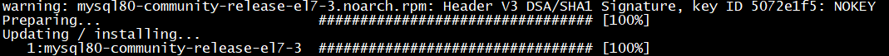
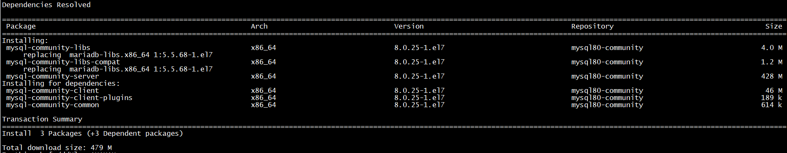
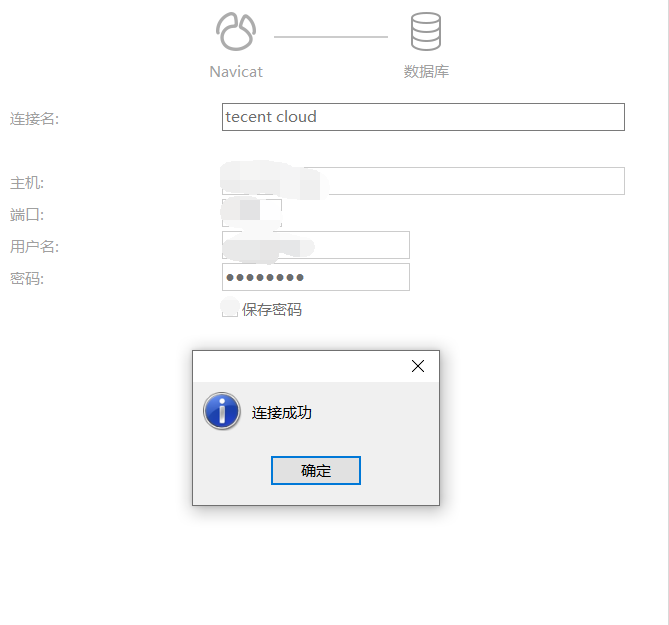

## 安装
1. 进入自定义的rpm包下载路径。
```bash
$ cd /opt/lib/
```
2. 下载mysql的rpm包，下载链接可以去[MySQL rpm包下载](https://dev.mysql.com/downloads/repo/yum/)找最新的版本
```bash
$ wget https://dev.mysql.com/get/mysql80-community-release-el7-3.noarch.rpm
```
3. 安装rpm包。
```bash
# rpm -ivh mysql80-community-release-el7-3.noarch.rpm
``` 


4. 安装mysql-community-server。
```bash
$ yum install mysql-community-server
```


&nbsp;
## 配置账户
1. 设置开机自启动服务。
```bash
$ systemctl enable mysqld
```
2. 启动服务。
```bash
$ systemctl start mysqld
```
3. 查看版本信息。
```bash
$ mysql -V
```


4. 修改密码。
```bash
# 查看临时密码
$ grep "A temporary password"  /var/log/mysqld.log

# 登录mysql
$ mysql -u root -p
```
```sql
# 修改密码
> ALTER USER 'root'@'localhost' IDENTIFIED BY 'xxxxxx';
```
修改后重新登录看看密码是否修改成功。

## 新建私人账户，允许远程登录
由于被攻击的时候常用root作为用户名来攻击，所以少用root用户、且让root账户只能本地登录的限制可以让数据库更安全。

接下来创建用于远程登录的私人账户。
```sql
# 创建新用户
# 'username'表示私人账户名，'password'表示私人账户密码。
# '%'表示允许所有IP使用此账户登录数据库。
> CREATE USER 'username'@'%' IDENTIFIED BY 'password';

# 授予权限，授予所有数据库的所有权限给用户'username'。
# WITH GRANT OPTION表示允许该用户授予权限
> GRANT ALL PRIVILEGES ON *.* TO 'username'@'%' WITH GRANT OPTION;

# 刷新权限，使权限立即生效。 本质：数据库>>内存
> FLUSH PRIVILEGES;
```

尝试远程登录：



登录成功，从此可以使用此账户玩耍了。