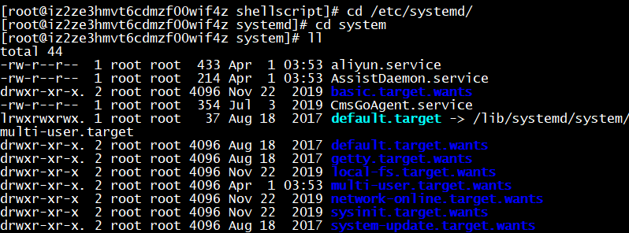

service文件一般存储在/etc/systemd/system目录下



写一个自己的service
```sh
vim keygenerator.service
```
```sh
[Unit]

Description=key generator server

After=syslog.target

[Service]

ExecStart=/usr/bin/java -jar -agentlib:jdwp=transport=dt_socket,server=y,suspend=n,address=5005 /opt/keygeneratorserver.jar

[Install]

WantedBy=multi-user.target
```
ExecStart表示启动服务实际执行的命令，好像只接受绝对路径，<font color="red">之后看看有没有办法使用相对路径</font>