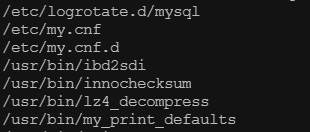

# RPM
RPM是RedHat Package Manager的缩写，Windows与之匹配的是“添加或删除程序”


## 1. RPM包管理的用途
1. 可以安装、删除、升级和管理软件；当然也支持在线安装和升级软件；
2. 通过RPM包管理能知道软件包包含哪些文件，也能知道系统中的某个文件属于哪个软件包；
3. 可以在查询系统中的软件包是否安装以及其版本；
4. 作为开发者可以把自己的程序打包为RPM 包发布；
5. 软件包签名GPG和MD5的导入、验证和签名发布
6. 依赖性的检查，查看是否有软件包由于不兼容而扰乱了系统；

## 2. 权限
RPM软件的安装、删除、更新需要root权限。
查询权限对所有用户开放。
普通用户如果拥有安装目录的权限，也可以安装。
## 3. RPM的简单用法
rpm安装的软件包都是.rpm作为后缀。
1. 初始化rpm数据库

通过rpm 命令查询一个rpm 包是否安装了，也是要通过rpm 数据库来完成的；所以我们要经常用下面的两个命令来初始化rpm 数据库；
```bash
[root@VM-0-6-centos ~]# rpm --initdb
[root@VM-0-6-centos ~]# rpm --rebuilddb # 耗时较长
```
注：这两个参数是极为有用，有时rpm 系统出了问题，不能安装和查询，大多是这里出了问题；

2. 查询功能

命令格式
```bash
rpm {-q|--query} [select-options] [query-options]
```
1\) 对系统中已安装的软件进行查询
a. 对特定软件查询
`rpm -q 软件名`
```bash
$ rpm -q mysql-community-server 
mysql-community-server-8.0.25-1.el7.x86_64
```

b. 查询所有已安装的包
`rpm -qa`

如果需要分页查看，则增加一个管道后使用more命令：
`rpm -qa | more`


c. 查询一个已经安装的文件属于哪个软件包；
`rpm -qf 文件路径`
```bash
$ rpm -qf /etc/my.cnf
mysql-community-server-8.0.25-1.el7.x86_64
```

d. 查询已安装软件包都安装到何处；
`rpm -ql 软件名`
```bash
$ rpm -ql mysql-community-server 
```


**剩下的常用命令和参数详细转载**

**常用命令组合：**
```bash
－ivh：安装显示安装进度--install--verbose--hash
－Uvh：升级软件包--Update；
－qpl：列出RPM软件包内的文件信息[Query Package list]；
－qpi：列出RPM软件包的描述信息[Query Package install package(s)]；
－qf：查找指定文件属于哪个RPM软件包[Query File]；
－Va：校验所有的RPM软件包，查找丢失的文件[View Lost]；
－e：删除包
```
```bash
rpm -q samba # 查询程序是否安装

rpm -ivh  /media/cdrom/RedHat/RPMS/samba-3.0.10-1.4E.i386.rpm # 按路径安装并显示进度
rpm -ivh --relocate /=/opt/gaim gaim-1.3.0-1.fc4.i386.rpm    # 指定安装目录

rpm -ivh --test gaim-1.3.0-1.fc4.i386.rpm　　　 # 用来检查依赖关系；并不是真正的安装；
rpm -Uvh --oldpackage gaim-1.3.0-1.fc4.i386.rpm # 新版本降级为旧版本

rpm -qa | grep httpd　　　　　 ＃[搜索指定rpm包是否安装]--all搜索*httpd*
rpm -ql httpd　　　　　　　　　＃[搜索rpm包]--list所有文件安装目录

rpm -qpi Linux-1.4-6.i368.rpm　＃[查看rpm包]--query--package--install package信息
rpm -qpf Linux-1.4-6.i368.rpm　＃[查看rpm包]--file
rpm -qpR file.rpm　　　　　　　＃[查看包]依赖关系
rpm2cpio file.rpm |cpio -div    ＃[抽出文件] 查看包解压后的安装路径

rpm -ivh file.rpm 　＃[安装新的rpm]--install--verbose--hash
rpm -ivh

rpm -Uvh file.rpm    ＃[升级一个rpm]--upgrade
rpm -e file.rpm      ＃[删除一个rpm包]--erase
```

**常用参数:**
```text
-i, --install                     install package(s)
-v, --verbose                     provide more detailed output
-h, --hash                        print hash marks as package installs (good with -v)
-e, --erase                       erase (uninstall) package
-U, --upgrade=<packagefile>+      upgrade package(s)
－-replacepkge                    无论软件包是否已被安装，都强行安装软件包
--test                            安装测试，并不实际安装
--nodeps                          忽略软件包的依赖关系强行安装
--force                           忽略软件包及文件的冲突

Query options (with -q or --query):
-a, --all                         query/verify all packages
-p, --package                     query/verify a package file
-l, --list                        list files in package
-d, --docfiles                    list all documentation files
-f, --file                        query/verify package(s) owning file
```
**RPM源代码包装安装**

.src.rpm结尾的文件，这些文件是由软件的源代码包装而成的，用户要安装这类RPM软件包，必须使用命令：
```bash
rpm　--recompile　vim-4.6-4.src.rpm   ＃这个命令会把源代码解包并编译、安装它，如果用户使用命令：

rpm　--rebuild　vim-4.6-4.src.rpm　　＃在安装完成后，还会把编译生成的可执行文件重新包装成i386.rpm的RPM软件包。
```

### 参考文献
[Linux rpm 命令参数使用详解［介绍和应用］](https://www.cnblogs.com/xiaochaohuashengmi/archive/2011/10/08/2203153.html)