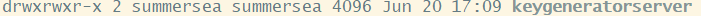
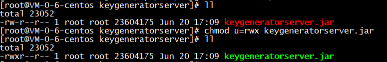
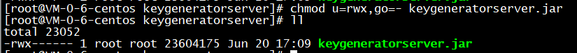
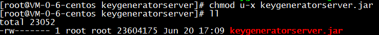
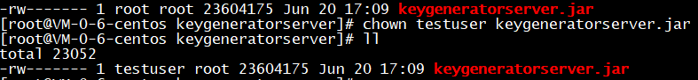
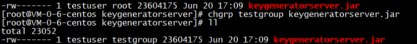

## 介绍

Linux修改文件权限有3个类型的命令，分别为`chmod`、`chown`、`chgrp`。

### 1. chmod

`chmod`是`change mode`的缩写，意思是可以修改文件的权限。
***
一个文件的权限如图所示



其中，第1个字母表示文件类型，`d`表示`文件夹`，也称`目录`。 之后9个字母按每3个一组分别表示**拥有者**`user`、**用户组**`group`、**其他人**`other`的权限。 其中`user`的缩写为`u`
,`group`的缩写为`g`,`other`的缩写为`o`。

`r`表示`可读权限` 二进制对应十进制为4
`w`表示`可写权限` 二进制对应十进制为2
`x`表示`执行权限` 二进制对应十进制为1
***
`chmod`命令有两种方式来修改权限

#### 1.1. 数字修改

这是一种常用的快速修改办法，命令如下：

```bash
chmod 640 文件路径
```

这种方式中数字为权限所代表的的二进制位对应的十进制数字和，按`user`、`group`、`other`的顺序进行排列。 例如上述命令表示修改文件的权限为：
`user`的权限为可读可写不可执行 `110b=6d`
`group`的权限为可读不可写不可执行 `100b=4d`
`other`的权限为不可读不可写不可执行 `000b=0d`

#### 1.2. 字母修改

这种修改办法不用二进制计算，比较好理解。 命令格式如下：

```bash
chmod u/g/o/a +(加入)/-(除去)/=(设定) r/w/x 文件或者目录
```

只看格式不太好理解，接下来直接演示实例。

```bash
chmod u=rwx 文件路径
```



该命令表示让`user`的权限变成可读可写可执行

也可以同时分别设置`user`、`group`、`other`的权限：

```bash
chmod u=rwx,go=- 文件路径
```



该命令会让目标文件的权限变为`user`可读可写可执行，`group`和`other`没有任何权限。

另外，除了使用`=`赋予权限外，还可以使用`+`或`-`来增加权限或除掉权限：

```bash
chmod u-x 文件路径
```



上述命令会让目标文件的`user`失去可执行权限。

### 2. chown

`chown`命令的单词可以拆分成`ch`和`own`，`own`应该是`owner`的缩写，命令意思是修改所有者。 命令如下：

```bash
chown testuser 文件路径
```



可以发现，修改前后目标文件的第一个`root`变成了`testuser`，说明所属用户变更了。

### 3. chgrp

`chgrp`命令的单词可以拆分成`ch`和`grp`，其中`grp`可以视为`group`的缩写，命令意为修改文件的所属用户组。 命令如下:

```bash
chgrp testgroup 文件路径
```



`root`组变更为`testgroup`组。

### 参考文献

[linux修改文件所有者和文件所在组](https://www.cnblogs.com/DawaTech/p/7249734.html)