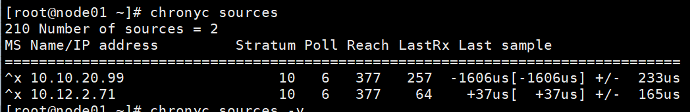

# 时间同步器_chrony_配置与运用

## 1 简介

Chrony 是一个实现了网络时间协议 NTP （Network Time Protocol）的客户端和服务器软软件。它能让计算机保持系统时钟与时钟服务器（NTP）同步，以此让你的计算机保持精确的时间，Chrony 也可以作为服务端软件为其他计算机提供时间同步服务。

Chrony 由两个程序组成，分别是 chronyd 和 chronyc。

chronyd 是一个后台运行的守护进程，用于调整内核中运行的系统时钟和时钟服务器同步。它确定计算机增减时间的比率，并对此进行补偿。

chronyc 提供了一个 cmd，用于监控性能并进行多样化的配置。它可以在 chronyd 实例控制的计算机上工作，也可以在一台不同的远程计算机上工作。

NTP 是网络时间协议 （Network Time Protocol）的简称，通过 udp 123 端口进行网络时钟同步。

## 2 安装

Linux 7 系统内置 chrony 服务。

## 3 客户端

chrony 作为客户端会去服务端上同步时间，让本机的时间与服务端相同。

### 3.1 配置

配置变更后需要重启 chronyd 服务

```shell
systemctl restart chronyd 
```

配置文件在 `/etc/chrony.conf`

```shell
# 使用 pool.ntp.org 项目中的公共服务器。以server开，理论上想添加多少时间服务器都可以。
# Use public servers from the pool.ntp.org project.
# Please consider joining the pool (http://www.pool.ntp.org/join.html).
server 0.centos.pool.ntp.org iburst
server 1.centos.pool.ntp.org iburst
server 2.centos.pool.ntp.org iburst
server 3.centos.pool.ntp.org iburst

# 根据实际时间计算出服务器增减时间的比率，然后记录到一个文件中，在系统重启后为系统做出最佳时间补偿调整。
# Record the rate at which the system clock gains/losses time.
driftfile /var/lib/chrony/drift

# 如果系统时钟的偏移量大于1秒，则允许系统时钟在前三次更新中步进。
# Allow the system clock to be stepped in the first three updates if its offset is larger than 1 second.
makestep 1.0 3

# 启用实时时钟（RTC）的内核同步。
# Enable kernel synchronization of the real-time clock (RTC).
rtcsync

# 通过使用 hwtimestamp 指令启用硬件时间戳
# Enable hardware timestamping on all interfaces that support it.
#hwtimestamp *

# Increase the minimum number of selectable sources required to adjust the system clock.
#minsources 2

# 指定 NTP 客户端地址，以允许或拒绝连接到扮演时钟服务器的机器
# Allow NTP client access from local network.
#allow 192.168.0.0/16

# Serve time even if not synchronized to a time source.
#local stratum 10

# 指定包含 NTP 身份验证密钥的文件。
# Specify file containing keys for NTP authentication.
#keyfile /etc/chrony.keys

# 指定日志文件的目录。
# Specify directory for log files.
logdir /var/log/chrony

# 选择日志文件要记录的信息。
# Select which information is logged.
#log measurements statistics tracking

# 引用其他配置文件
include /root/chrony.conf
```

### 3.2 chronyc 命令行

这里仅展示一些常用命令，需要更多命令时可以执行如下命令学习:

```shell
chronyc help
```

查看当前时间源信息，其中 -v 表示显示显示更详细的信息。

```shell
chronyc sources -v
```




强制同步系统时钟

```shell
chronyc -a makestep
```

### 3.3 timedatectl 命令行

涉及时间同步的命令行还有一个 timedatectl，我们在这个场景中常用这个命令以启动时间同步。

```shell
timedatectl set-ntp <true/false>
```

### 3.4 chronyc sources 信号源解释

- 列 M

  表示信号源的模式。^表示服务器，=表示对等方，＃表示本地连接的参考时钟。
- 列 S

  表示信号源的状态

        * 表示chronyd当前同步到的源。
        + 表示可接受的信号源，与选定的信号源组合在一起。
        - 表示被合并算法排除的可接受源。
        ？ 指示已失去连接性或其数据包未通过所有测试的源。它也显示在启动时，直到从中至少收集了3个样本为止。
        x 表示chronyd认为是虚假行情的时钟（即，其时间与大多数其他来源不一致）。
        〜 表示时间似乎具有太多可变性的来源。
- 列 Name/IP address

  显示了源的名称或IP地址，或参考时钟的参考ID。
- 列 Stratum

  显示了来源的层，如其最近收到的样本中所报告的那样。层1表示一台具有本地连接的参考时钟的计算机。与第1层计算机同步的计算机位于第2层。与第2层计算机同步的计算机位于第3层，依此类推。
- 列 Poll

  显示轮询源的速率，以秒为单位的时间间隔的以2为底的对数。因此，值为6表示每64秒进行一次测量。chronyd会根据当前情况自动更改轮询速率。
- 列 Reach

  显示了源的可达性寄存器以八进制数字打印。寄存器有8位，并在每个从源接收或丢失的数据包上更新。值377表示从最后八次传输中收到了对所有用户的有效答复。
- 列 LastRx

  显示多长时间前从来源接收到了最后一个好的样本（在下一列中显示）。未通过某些测试的测量将被忽略。通常以秒为单位。字母m，h，d或y表示分钟，小时，天或年。
- 列 Last sample

  显示上次测量时本地时钟与源之间的偏移。方括号中的数字表示实际测得的偏移量。可以用ns（表示纳秒），us （表示微秒），ms（表示毫秒）或s（表示秒）作为后缀。方括号左侧的数字表示原始测量值，已调整为允许此后施加于本地时钟的任何摆度。

  +/-指示器后面的数字表示测量中的误差范围。正偏移表示本地时钟位于源时钟之前。

## 4 服务端

### 4.1 配置文件

配置文件位置与作为客户端相同: `/etc/chrony.conf`。

要作为服务端运行时，需要加入以下配置:

```shell
# 同步许可
# Allow NTP client access from local network.
allow 192.168.0.0/16
allow all

# 开启同步层
# Serve time even if not synchronized to a time source.
local stratum 10
```

配置完后需要重启 chronyd 服务，并记得在时间控制中允许 npt 同步

```shell
systemctl restart chronyd
timedatectl set-npt true
```

排查问题时可以排查 firewall 或者 selinux。

## 5 参考资料

1. [chrony 详解](https://www.cnblogs.com/my-show-time/p/14658895.html)
2. [记一次chrony同步失败问题排查](https://www.likecs.com/show-402248.html#sc=252)
