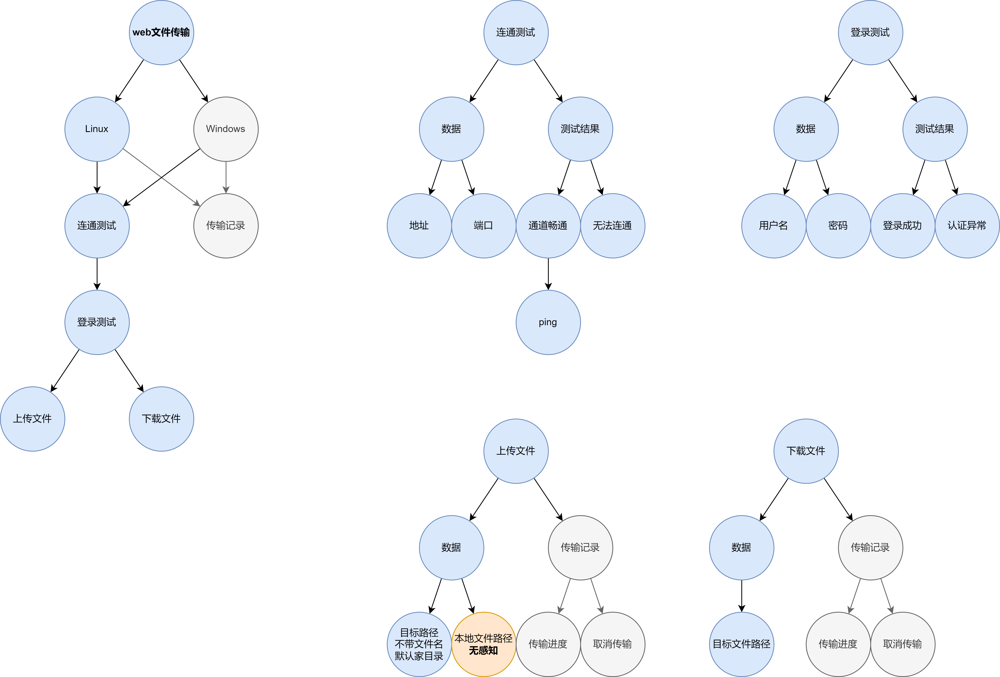
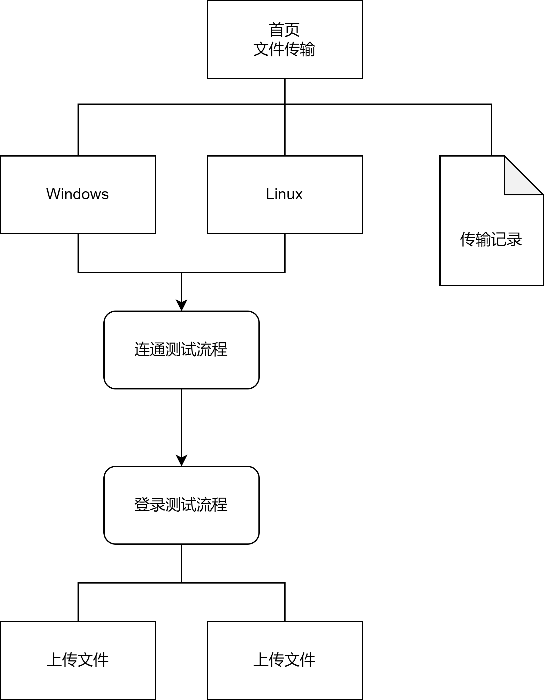

# 前言

本章会告诉我们，我们需要做什么，以及具体怎么做。

# 功能规格说明

1. 同一个上传接口，支持表单上传，也支持二进制上传。
2. 上传接口在表单模式下仅需支持单个文件上传。
3. 编写一个简单的文件传输页面，方便用户操作。
4. 安全需求：`HTTP`连接使用的安全协议不低于`TLSv1.2`。（疑似0.1遗留需求）
5. 支持查询传输进度。（0.1遗留需求）

# 系统设计

## 技术要求

1. Golang
2. redis
3. docker
4. vue

## API定义

### 进度查询

GET /record/{taskId}

**正常响应**

Response 200 OK

|参数     |类型|描述|
|:-------:|:-----:|:----:|
|data|object|正常响应内容|

data参数

|参数     |类型|描述|
|:-------:|:-----:|:----:|
|rate|number|进度比率 0~100|
|status|string|传输状态描述|

## 概念模型

1. 鉴于文件传输概念已经广泛应用于各个用户场景中，本项目也沿用文件传输的概念。
2. 为了利于多次文件传输，本项目也将站点概念独立出来，可以参考FileZilla的站点管理器，不过本项目没有管理功能。

|  模型 | 功能1 | 功能2 |
|:-----:|:-----:|:----:|
|  文件 |  上传 | 下载 |
| 站点 | 连通测试| 登录测试 |

## web页面

1. 支持对目标机器进行连通测试
2. 支持对目标机器进行登录测试
3. 支持文件上传
4. 支持拖拽上传
5. 支持文件下载，需要传入文件绝对路径
6. 支持文件传输进度查询

### 信息架构图

### 视觉辞典

[comment]: <> (![img.png]&#40;&#41;)

# 任务规划

1. 文件上传支持表单上传一个文件
2. 界面设计
3. 编写页面
4. 接口对接并测试
5. 完成传输进度监控
6. 完成进度传输查询API
7. 无效任务定期移除
8. 日志输出到docker日志里
