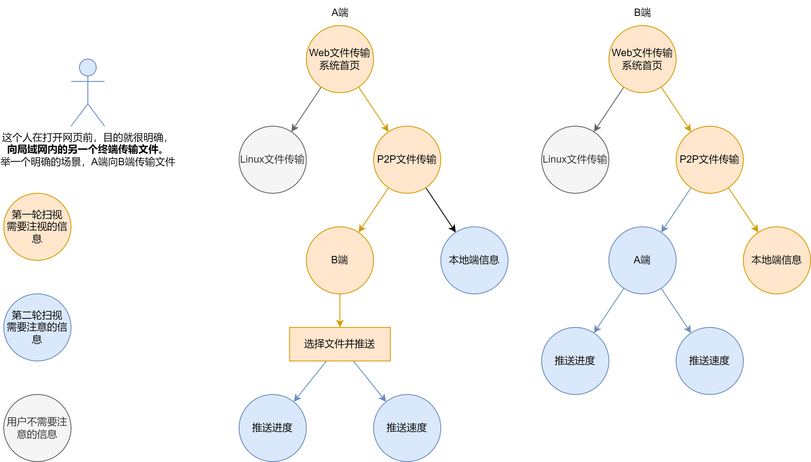
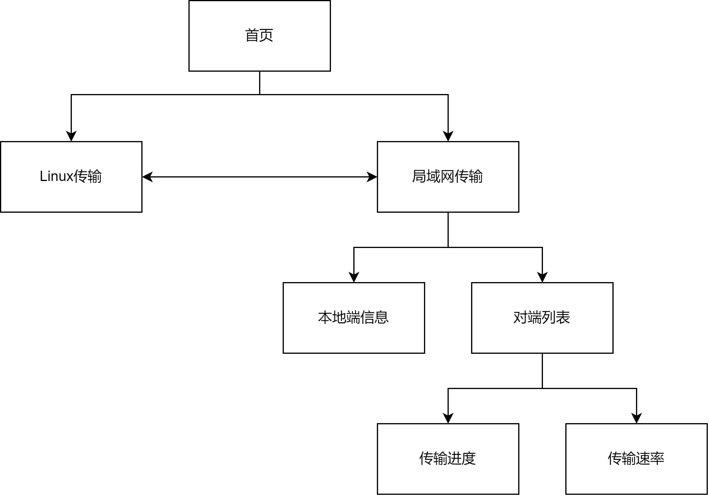

# 文件传输系统0.2——局域网点对点文件传输系统设计

## 目标与背景

1. 当下市场上的智能终端有相当多的厂商，例如华为，苹果，小米等厂商的手机、电脑、平板等。
2. 不同的厂商都在致力于打造自己的生态圈，想要在互联网上建立一道生态壁垒。
3. 相同生态内终端的信息传输无比通畅，但不同生态终端间的数据传输却可能无比麻烦。
4. 目前解决不同终端间文件传输的方案有多种多样:
    1. 例如我们可以使用 QQ、微信这些聊天软件传输，但是这种传输方式，数据流会经过第三方服务器。
       这么做，流量消耗可能是一个问题，另一个更大的问题是，用户是否可以无条件相信第三方中转站？毕竟中转站是有能力偷窥用户数据的。
    2. 在开源项目中也有一个解决方案，其实现就是 Snapdrop，一个基于点对点的文件传输系统，没有流量和隐私问题，是一个非常棒的案例。
       但是这个应用仍有不足的地方，它无法传输文件大小超过接收端空闲内存的文件。另外，这个应用的用户体验仍然有较大的进步空间。

笔者要做的就是模仿Snapdrop，并**尝试超越**该项目。

## 分析 Snapdrop

### 可借鉴之处

1. 提供了基于WebRTC文件传输的案例
2. 提供了信令服务器的实现案例

### 不足之处

1. 无法传输大型文件，视接收端的空闲内存大小而定。
2. 同时传输多个文件的连续性体验不好，接收端必须在下一个文件传输完成前点击下载，这意味着接收端必须有人去看管。理想情况下应该是接收端自动把文件下载到本地。
    1. 这个问题可以通过设置浏览器的下载设置解决，关闭浏览器的询问下载位置即可，没有该设置的浏览器无解。

## 用户定位

1. 局域网下多生态智能终端用户。
   这种用户在轻度文件传输上最容易想到的办法是依赖通讯软件，例如 QQ，微信，但是注意，不是所有人都有这么多账号。
   当然，这种用户在跨生态轻度文件传输场景中，最方便且性价比最高的办法应该是 Snapdrop。
   但是 Snapdrop 在批量传输场景上的用户体验其实并不算太好，需要一个人守着接收端持续在适当时间点击下载。

## 场景模拟

1. 小A有 iPhone 13 Pro 与 HUAWEI nova 6 两部手机，小A不习惯使用苹果的生态，平时使用 nova 6 作为生活常用机。
    1. 出去旅行拍照时会携带并使用 iPhone 13 Pro，但是每当其他人要求小A把照片分享出来时，小A就会因为无法快速把这些文件分享出来犯了难。
       因为小A的生活用手机是 nova 6 ，所有的社交账号都在 nova 6 上，并且 iPhone 13 Pro 没有插入电话卡，无法在外面上网，需要依托 nova 6 的热点。
       小A 希望有一个技术能让 TA 无论在哪都能**方便地**把**大量文件**从 iPhone 传输到 nova 6上。
2. 小B是一个看剧狂热爱好者，喜欢看电影，看番剧，但小B同时也是一个工作压力很大的社畜。
   他一天最放松的时间就是躺在床上并拿出他的平板看一部电影，或者看几集番剧。
   同时，小B很在意视频的画质，以及视频的完整度，小B很讨厌看到一半发现自己看的视频是被删减了的。
    1. 现在的在线视频网站普遍有画质低或者视频被删减的情况。例如B站上的视频经常被删减，另外翻译过度受到了主旋律的影响，小B很在意翻译的正确性。
       像其他网站，例如D站，樱花等网站，普遍画质不会很高，一般最高是 720P。
    2. 小B迫于时代变化，回归了资源搜索与下载的方式。但是小B的平板不太好做这些工作，这些工作交给小B的笔记本电脑效率是最高的。
       但是很不巧，笔记本电脑的生态和小B的平板电脑并非完全畅通，文件传输方面只有一个华为传输助手。
       华为传输助手是一个客户端，笔记本电脑平常并不会打开，但是打开这个客户端准备传输需要一点时间。
       小B希望找到一个用户体验更好用的跨生态文件传输系统，**开箱即用，操作简便**。
       另外一部电影的大小动辄好几个 GB，他需要一个能**不限文件大小**的文件传输系统。

## 功能规格说明

### 基础规格

1. 在文件传输环节，系统应当支持基于 P2P 网络传输文件。
2. 支持传输非常大的文件，至少支持 20G 大小的文件传输。
3. 支持批量传输文件，使用队列式传输，每个对端持有一个队列，多个队列之间可以并行传输，一个队列同时只能有一个文件在传输。
4. 文件传输方案使用**推送式**传输，以 Snapdrop 为参考对象。
5. 系统界面需要实时显示每个对端当前传输任务进度。
6. 系统界面需要实时显示每个对端当前传输任务速率。

### 展望规格

1. 文件输出端在批量传输文件时，可以操作传输队列:
    1. 取消正在传输的文件。
    2. 取消还未开始传输的文件。
    3. 调整传输队列中任务的顺序。
    4. 添加传输任务到队尾。
2. 请求式传输，文件输出端广播自己等待下载的文件给所有接收端，接收端根据自己的需求，下载对应的文件，适用点播离线视频场景。
3. 一对多文件推送，目前未发现适用场景。
4. 对端概要信息显示:
    1. 对端昵称
    2. 可修改本地端点的昵称，广播给其他对端。其他对端收到广播后在界面上修改对应的昵称。
5. 对端详细信息显示:
    1. 对端 ID
    2. 终端 OS
    3. 浏览器类型
6. 权限控制
    1. 无条件接收推送的文件
    2. 需同意接收推送的文件

## 技术要求

1. Golang ( Websocket )
2. docker
3. vue
4. TypeScript
5. WebRTC
6. Service Worker API
7. UI 设计 ( mastergo )

### 视觉基础设计

## 信息架构图

## 视觉辞典

## 任务规划

1. DONE 信令服务器开发
2. DONE 前端 WebRTC 通道打通
3. DONE Service Worker API 实现整条传输管道流式传输
4. TODO 前端 UI 设计
5. TODO 落实前端UI
6. TODO 打通文件推送式传输
7. TODO 实现文件传输队列
8. TODO 支持批量文件传输
9. TODO 显示传输进度
10. TODO 显示传输速度

## 参考文献

1. [Snapdrop-webapp](https://drop.ioiox.com/)
2. [Snapdrop-Github](https://github.com/RobinLinus/snapdrop)
3. [WebRTC中的ICE Candidate](https://zhuanlan.zhihu.com/p/476577799)
4. [WebRTC技术简介](https://zhuanlan.zhihu.com/p/421503695)
5. [Get started with WebRTC](https://web.dev/webrtc-basics/#toc-rtcdatachannel)
6. [WebRTC 1.0: Real-Time Communication Between Browsers](https://w3c.github.io/webrtc-pc/#event-icecandidate)
7. [Javascript Session Establishment Protocol draft-ietf-rtcweb-jsep-03](https://datatracker.ietf.org/doc/html/draft-ietf-rtcweb-jsep-03#section-4.2.4)
8. [WebRTC Code Samples](https://github.com/webrtc/samples)
9. [WebRTC samples](https://webrtc.github.io/samples/)
10. [yetithefoot/stuns](https://gist.github.com/yetithefoot/7592580)
11. [RobinLinus/snapdrop](https://github.com/RobinLinus/snapdrop)
12. [WebRTC API](https://developer.mozilla.org/en-US/docs/Web/API/WebRTC_API)
13. [JS 实现流式打包下载](https://zhuanlan.zhihu.com/p/446145066)
14. [使用 Service Workers](https://developer.mozilla.org/zh-CN/docs/Web/API/Service_Worker_API/Using_Service_Workers)