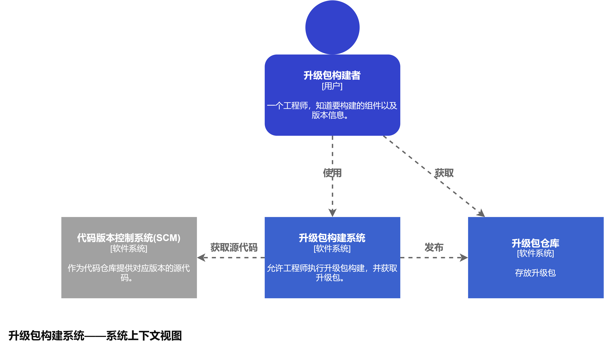
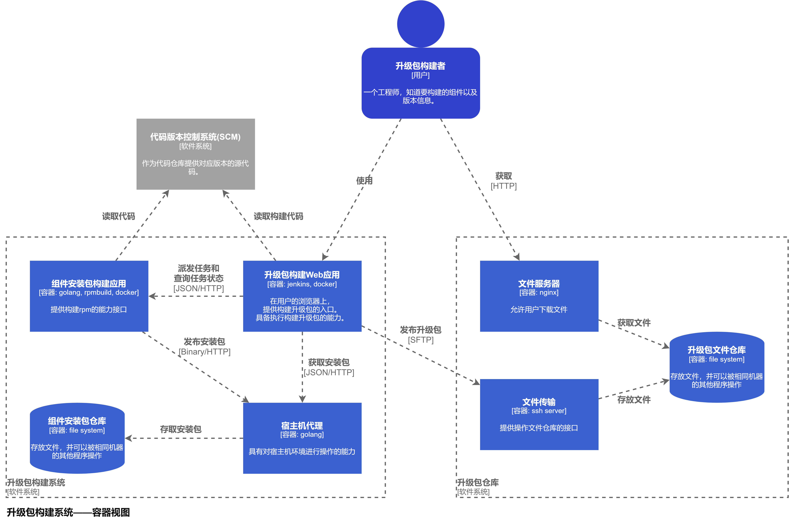
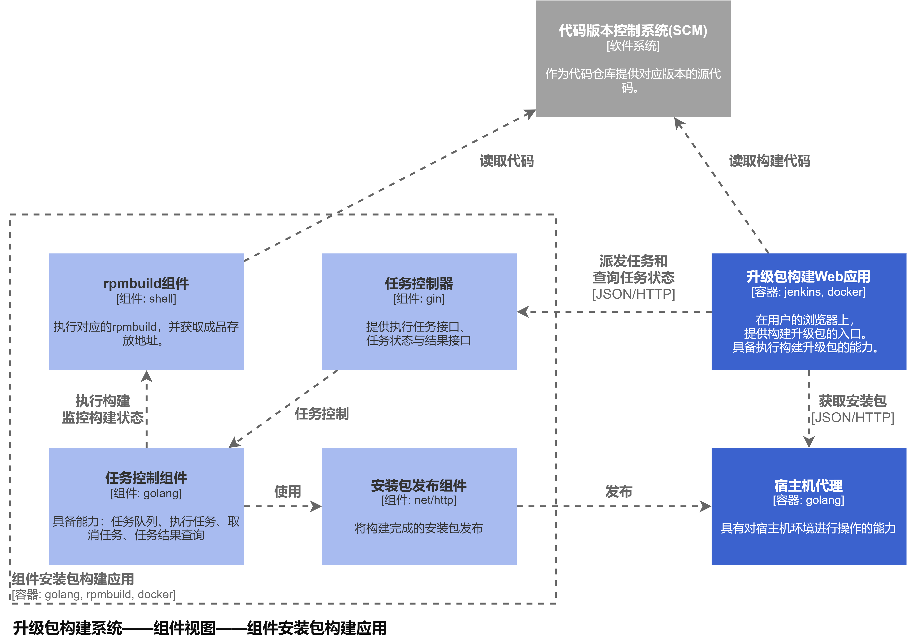

# Jenkins自动化流水线demo的设计与实践

## 前言

本文档派生自[自动打升级包系统设计](./build_upgrade_package_automatically_design.md)
，因为用jenkins来落地看起来比较现实，所以决定学习jenkins，通过实践一个demo让我进行成长，并积累经验，开拓视野，以尽量完美的品质完成自动打升级包系统落地的目标。

## demo设计

既然学习jenkins是来源于一个最终目标，那么demo设计成与目标高度相关的产品也比较好。一来这样可以节省一部分从头开工的时间，二来这样实践下来更容易找出目前的方案哪里还有问题，需要怎么解决。

所以从顶层设计或功能范围来说，这个demo需要完成以下目标：

1. 完成流水线管道`pipeline-build-rpm`，用以构建第一方rpm
    1. 这个rpm包只需要参照公司已有的rpm构建方式进行构建。
    2. 不要求对rpm包进行签名。
    3. 完成至少两个管道。
    4. 对对应的代码库具备监测更新并触发自动构建能力。
2. 完成流水线管道`pipeline-build-upgrade`: 使用pipeline-build-rpm的产品组件出一个升级包
    1. 不需要满足可回滚特特性。
    2. 不需要满足增量升级特性。
    3. 构建产品需要满足一键安装要求。
3. 任意一条`pipeline-build-rpm`构建完成后需要触发`pipeline-build-upgrade`。

## demo实践

### 架构设计

根据C4模型，笔者设计了系统上下文与容器图。
- 系统上下文
  
  
- 容器图
  
  
- 组件图——安装包构建器
  
  

### 通信交互设计
#### 组件安装包构建应用

1. 新增rpm构建任务
    1. 请求接口
      
          |  url | method | 
          |:-----:|:-----:|
          | /rpm/build/task | POST |
    2. 参数设计(JSON)
   
          |  key | valueType | required | description |
          |:-----:|:-----:|:----:|:----:|
          | project | string | true | 需要构建的项目名 |
          | master | string | true | 需要构建的项目代码分支 |
    3. 响应设计(JSON)
     
       |  key | valueType  | description |
       |:-----:|:-----:|:----:|
       | taskId | string | 新增任务的taskId，后续可以通过该id来查询任务状态以及结果 |
    4. 样例
          ```
          POST /rpm/build/task 
          
          {
              "project": "xxx-fileclient"
              "branch": "master"
          }
          ```
2. 查询rpm构建状态
    1. 请求接口

       |  url | method | 
       |:-----:|:-----:|
       | /rpm/build/task | GET |
    2. 参数设计(Url Parameter)

       |  key | valueType | required | description |
       |:-----:|:-----:|:----:|:----:|
       | taskId | string | true | 任务的taskId |
    3. 响应设计(JSON)

       |  key | valueType  | description |
       |:-----:|:-----:|:----:|
       | status | string(enum) | 任务状态，初步设计为排队中、执行中、已完成 |
       | result.published_url | string | 安装包的发布地址，可通过GET该地址下载安装包，任务状态为已完成时会有该信息 |
    4. 样例
          ```
          GET /rpm/build/task?taskId=cccc-eeee-vvvv-xxxx
          ```


### pipeline-build-rpm

Q: 为什么公司内已经有了一键rpm构建我还要重新实现一遍rpm构建？

A:
1. 因为公司的一键rpm构建终究需要人来点击以触发，另外公司已经部署的jenkins服务器，负载已经很高了，如果在这种情况下加入自动构建，可能会引发生产事故。我独立出一个jenkins服务器做这件事可以分担负载，也不会影响到公司已经投入生产的jenkins服务器。
2. 另外，升级包发布出去的时候要求rpm被签名，但是公司只有已经部署的jenkins服务器有签名能力，这么做之后要和公司生产环境上的jenkins进行交互以进行签名，这里跨服务器的交互以实现自动化流程也是一个很有意思的挑战，值得一试。

#### 研发流程，任务分割

1. 选择2个项目，一个项目复杂度低（简称项目A），一个项目复杂度高（简称项目B）。
2. 对项目A的rpm构建流程进行学习，仅需要搞清楚足以支持自动化的流程，不需要深入SPEC文件。
3. 完成rpm构建流程


### pipeline-build-upgrade
*建设中。。。*

## demo实践遭遇的问题清单

落地jenkins的demo时遭遇的某一些问题是值得记录的，每当遇到并解决一个有价值的问题，我会记录一份文档，在这里，我会列出这些文档的清单。

1. [Jenkins 配置pipeline使用私域的gitlab出现 CAfile:none](../../CI&CD/Jenkins_add_repos_url_but_err_cafile_none.md)

## 参考文档

1. [自动打升级包系统设计](./build_upgrade_package_automatically_design.md)
2. [Jenkins 配置pipeline使用私域的gitlab出现 CAfile:none](../../CI&CD/Jenkins_add_repos_url_but_err_cafile_none.md)
3. [如何画架构图](https://www.zhihu.com/question/27440059/answer/2082321229)
4. [The C4 model for visualising software architecture](https://c4model.com)
5. [用于软件架构的 C4 模型](https://www.infoq.cn/article/C4-architecture-model)