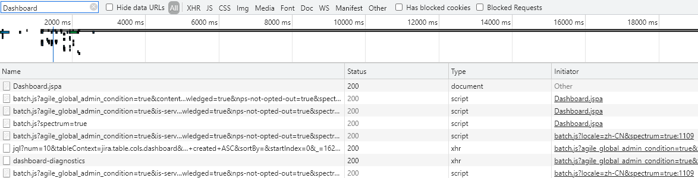

# Chrome 开发者模式过滤请求

### 原因

当我们初次接触一个网站系统且用开发者模式跟踪网络请求信息时，经常会发现有大量.png/.css/.js请求。通常情况下我们更需要关注前后端交互的请求，然而这些少数的请求往往会被淹没在资源请求里，所以我们需要用过滤器过滤掉不想要的请求。

### 直接过滤

1. 可以在输入框里直接输入文字来过滤，此时过滤基于文字与请求信息的匹配（不仅仅匹配名字）
   
2. 输入框右边列出了大多数请求类型，可以通过点击该类型来过滤出对应类型的请求。
   

### 条件过滤

1. 在输入框内输入`-`，Chrome会弹出各种过滤条件，我们可以按这些条件进行过滤。

   

   在过滤方法后面输入`:`后Chrome也会弹出输入建议，最终可以按条件得出过滤结果。
   
   

### 反向过滤

- 有时候会想要过滤掉不想看见的请求，这个时候只要输入`-`加要匹配的文字即可，此时匹配上的请求都会被过滤掉。
  
- 可以多条过滤，过滤条件中间加个空格分隔即可，比如`-.js -.css`。