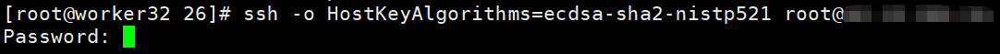
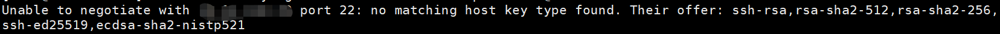

# ssh修改host key algorithms

为了模拟某个环境的host key环境，需要对server的hostkey进行修改，使用命令`ssh -vvv root@ip`，使用debug模式连接来确定目标机器支持的主机密钥算法:


## sshd_config 中的相关配置

1. 登录服务端，进入目录`/etc/ssh/`，`vim`打开`sshd_config`文件。
2. 可以找到如下图的字段，这里决定了上图显示的`host key algorithms`。

   
   
3. 按上图的配置方式，还需要添加`rsa-sha2-512`，`rsa-sha2-256`两种`host key`。

## 查看目标机器的主机密钥算法

除了使用`ssh -vvv`进行DEBUG的方法，还有一条命令可以探测目标机器的主机密钥算法:
`ssh -o HostKeyAlgorithms=ecdsa-sha2-nistp256 root@1.1.1.1`
这一条命令会让本地使用ssh连接目标机器，而连接途中的主机密钥算法被指定为`ecdsa-sha2-nistp256`。如果目标机器支持该算法，则会弹出输入密码的信息:



反之若不支持该算法，则会显示目标机器所支持的算法，相较于`ssh -vvv`的方式，该命令显示的信息比较集中，容易阅读:



## 添加操作

从sshd_config中的字段来看，值是一段路径，所以我们需要去`/etc/ssh`目录下创建两种对应的`key`。

1. 进入`/etc/ssh`
2. 执行`ssh-keygen`命令以创建`key`

```bash
ssh-keygen -t rsa-sha2-512 -f /etc/ssh/ssh_host_rsa-sha2-512_key
```

- `-t`参数可以用来指定加密算法
- `-f`参数可以用来指定生成文件的路径和文件名

3. 然后打开`sshd_config`文件，新增一栏

```bash
HostKey /etc/ssh/ssh_host_rsa-sha2-512_key
```

4. `systemctl restart sshd`重启服务即可。


5. 其他密钥创建命令示例: `ssh-keygen -q -t ecdsa -f /etc/ssh/ssh_host_ecdsa_key_521 -b 521 -C '' -N ''`

- `-q` 静默模式 quiet
- `-b` 指定生成的密钥位数
- `-C` 添加一个注释
- `-N` 添加一个新的密码短语(passPhrase)

## HostKeyAlgorithms

除了`HostKey`配置，还有`HostKeyAlgorithms`字段可以配置ssh服务端支持的hostkey加密算法。

- 需要注意的是，`HostKey`字段和`HostKeyAlgorithm`字段不能出现冲突，比如`HostKey`字段配置的密钥文件需要`ssh-rsa`算法，而`HostKeyAlgorithms`
  字段却不支持该算法，<font color=red>**最终会导致ssh服务挂掉**</font>，比较严重。
- 
- 所以对ssh配置进行操作的时候，尽量先开启`telnet`服务，保证有备用的远程操作手段。
- 另外，可以只配置`HostKeyAlgorithms`字段而不配置`HostKey`字段，这样Host Key算法就能随意配置了。