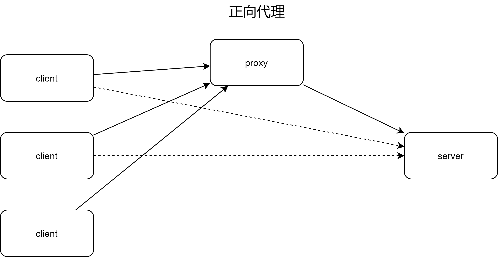
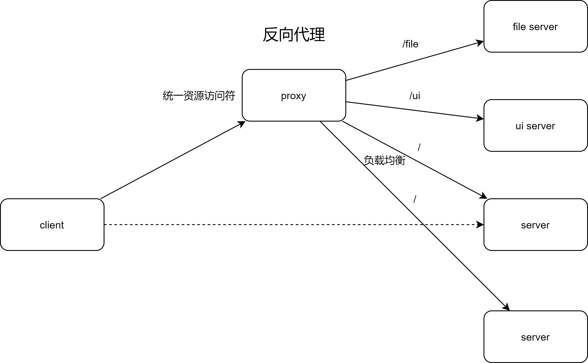

# 正向代理与反向代理

正向代理和反向代理容易混淆，自己画图记个笔记： 代理(proxy)的意思就是中间人，不管正向还是反向都只负责一个核心动作：
**让client经过proxy访问server**
正向代理和反向代理的不同点需要以不同的视角来观察

## 正向代理

正向代理： 在server视角下，不管有多少台client访问server，最终结果都是proxy在访问server，server对client无感知。 常见的应用就是翻墙、socks代理。

## 反向代理

反向代理： 在client视角下，只需要访问proxy就可以获取到自己想要的服务，对实际提供服务的服务器没有感知。 nginx可以根据统一资源访问符后面的附加路径匹配转发到目标server，实现基础路径+附加路径访问到不同的服务的功能。
而此时如果nginx和所有的服务在一台物理机上，物理机只需要开放proxy的端口，由proxy转发到各个服务的端口即可，不需要每个服务都开放防火墙端口。 常见应用就是nginx反向代理。