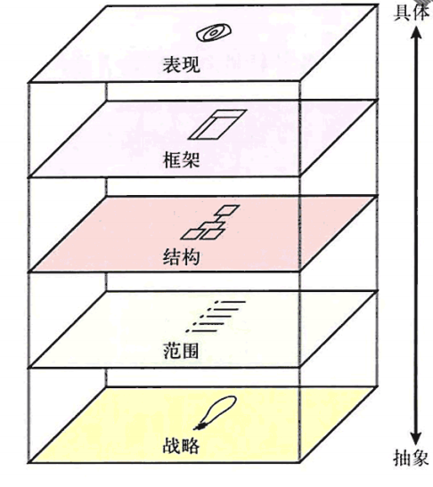
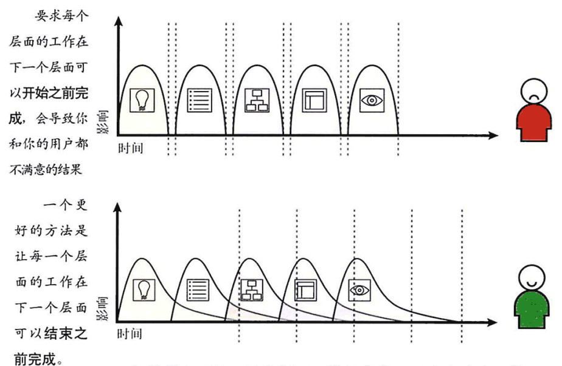
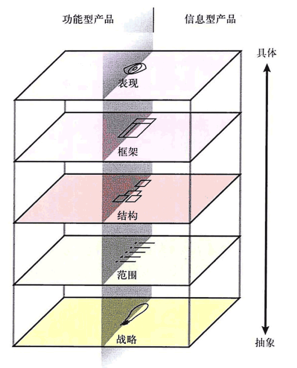
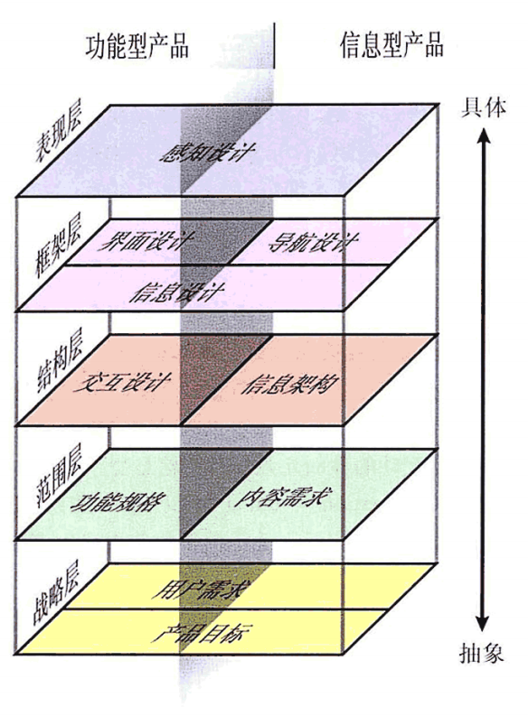

# 《用户体验要素》读书笔记 (2)

## 目录

- [《用户体验要素》读书笔记（一）](http://summersea.top:8090/archives/%E7%94%A8%E6%88%B7%E4%BD%93%E9%AA%8C%E8%A6%81%E7%B4%A0%E8%AF%BB%E4%B9%A6%E7%AC%94%E8%AE%B0%E4%B8%80)
- [《用户体验要素》读书笔记（二）](http://summersea.top:8090/archives/%E7%94%A8%E6%88%B7%E4%BD%93%E9%AA%8C%E8%A6%81%E7%B4%A0%E8%AF%BB%E4%B9%A6%E7%AC%94%E8%AE%B0%E4%BA%8C)
- [《用户体验要素》读书笔记（三）](http://summersea.top:8090/archives/%E7%94%A8%E6%88%B7%E4%BD%93%E9%AA%8C%E8%A6%81%E7%B4%A0%E8%AF%BB%E4%B9%A6%E7%AC%94%E8%AE%B0%E4%B8%89)
- [《用户体验要素》读书笔记（四）](http://summersea.top:8090/archives/%E7%94%A8%E6%88%B7%E4%BD%93%E9%AA%8C%E8%A6%81%E7%B4%A0%E8%AF%BB%E4%B9%A6%E7%AC%94%E8%AE%B0%E5%9B%9B)
- [《用户体验要素》读书笔记（五）](http://summersea.top:8090/archives/%E7%94%A8%E6%88%B7%E4%BD%93%E9%AA%8C%E8%A6%81%E7%B4%A0%E8%AF%BB%E4%B9%A6%E7%AC%94%E8%AE%B0%E4%BA%94)
- [《用户体验要素》读书笔记（六）](http://summersea.top:8090/archives/%E7%94%A8%E6%88%B7%E4%BD%93%E9%AA%8C%E8%A6%81%E7%B4%A0%E8%AF%BB%E4%B9%A6%E7%AC%94%E8%AE%B0%E5%85%AD)
- [《用户体验要素》读书笔记（七）](http://summersea.top:8090/archives/%E7%94%A8%E6%88%B7%E4%BD%93%E9%AA%8C%E8%A6%81%E7%B4%A0%E8%AF%BB%E4%B9%A6%E7%AC%94%E8%AE%B0%E4%B8%83)

## 认知用户体验要素

本篇对应用户体验要素第二章，目标是让读者初步了解用户体验要素的设计框架以及如何执行该框架，更详细的要素在后续章节中。

### 五个层面

#### 表现层

- 图片与文字，图标的表现形式。

#### 框架层

- 按钮、控件、照片和文本区域的位置。

#### 结构层

- 用户如何到达某个页面，且做完事情后可以到达什么地方。

#### 范围层

- 产品应当具有什么功能。

#### 战略层

- 经营者能通过产品得到什么？
- 用户能通过产品得到什么？

### 自下而上地建设

这五层的结构相当于盖房子，战略层打底，从而向上一层一层推导出要做的事情与决策。 但是这并不是说每一个“较低层面”上的决策都必须完成后再设计“较高层面”。事物都有两面性，在“较高层面”中的决定有时会促成对“较低层面”决策的一次重新评估。

**“较低层面”的工作结束之前，确保“较高层面”的工作已经展开。“较高层面”的工作结束之前，确保“较低层面”的工作已经结束。**

### 网络产品的两面性

网页这类型的产品具有双重性质，从按五个层面的框架来切分：左边描述**功能型的平台类产品**，右边描述**信息型的媒介类产品**。

- 功能型产品主要关注**任务**——所有的操作都被纳入一个过程，去思考人们如何完成这个过程。在这里，我们把网站看成用户用于完成**一个或多个任务**的**一个或一组工具**。
- 信息型产品主要关注**信息**——网站应该提供哪些信息，这些信息对用户的意义是什么。创建一个富信息的用户体验，就是提供给用户一个**可以寻找、理解，且有意义的信息组合**。

### 用户体验的要素

切开后的模型具有如图所示的待解决目标。

#### 战略层（第3章）

无论是功能型产品还是信息型产品，在战略层锁关注的内容一致。

- 用户需求：
    - 了解用户想从我们这得到什么。
    - 知道用户达到的这些目标将如何满足他们的其他目标。
- 产品目标
    - 我们自己对网站的期望
        - 商业目的
        - 政治目的
        - 树立品牌
        - 等等

#### 范围层（第4章）

- 功能型产品：功能规格
- 信息型产品：内容需求

#### 结构层（第5章）

- 功能型产品：交互设计
- 信息型产品：信息架构

#### 框架层（第6章）

- 功能型产品：界面设计
- 信息型产品：导航设计
- 信息设计：一种促进理解的信息表达方式。

#### 表现层（第7章）

- 感知设计

### 应用这些要素

虽然在框架中各要素划分的很明确，但是在现实世界中这些区域的界限并不清晰。比如你很难鉴定某个用户体验的问题是通过玩视觉小把戏还是改造最基本的导航设计来解决。某些问题可能要求同时重视多个要素，甚至有些问题会横跨在各个要素的边界上。

在每一层中，这些要素必须互相作用才能完成该层的目标。比如，信息设计、导航设计以及界面设计共同定义了网站的框架层，所有要素都会决定最终的用户体验。
