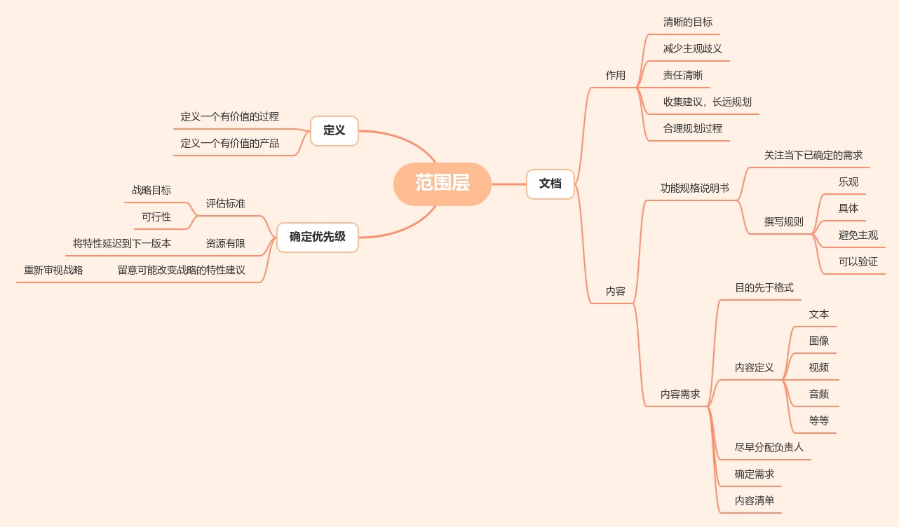
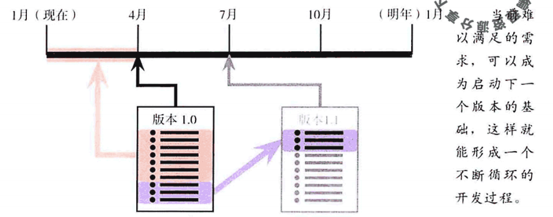
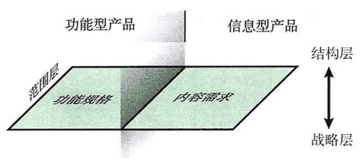

# 《用户体验要素》读书笔记（4）范围层-用户体验要素读书笔记4

## 目录

- [《用户体验要素》读书笔记（一）](http://summersea.top:8090/archives/%E7%94%A8%E6%88%B7%E4%BD%93%E9%AA%8C%E8%A6%81%E7%B4%A0%E8%AF%BB%E4%B9%A6%E7%AC%94%E8%AE%B0%E4%B8%80)
- [《用户体验要素》读书笔记（二）](http://summersea.top:8090/archives/%E7%94%A8%E6%88%B7%E4%BD%93%E9%AA%8C%E8%A6%81%E7%B4%A0%E8%AF%BB%E4%B9%A6%E7%AC%94%E8%AE%B0%E4%BA%8C)
- [《用户体验要素》读书笔记（三）](http://summersea.top:8090/archives/%E7%94%A8%E6%88%B7%E4%BD%93%E9%AA%8C%E8%A6%81%E7%B4%A0%E8%AF%BB%E4%B9%A6%E7%AC%94%E8%AE%B0%E4%B8%89)
- [《用户体验要素》读书笔记（四）](http://summersea.top:8090/archives/%E7%94%A8%E6%88%B7%E4%BD%93%E9%AA%8C%E8%A6%81%E7%B4%A0%E8%AF%BB%E4%B9%A6%E7%AC%94%E8%AE%B0%E5%9B%9B)
- [《用户体验要素》读书笔记（五）](http://summersea.top:8090/archives/%E7%94%A8%E6%88%B7%E4%BD%93%E9%AA%8C%E8%A6%81%E7%B4%A0%E8%AF%BB%E4%B9%A6%E7%AC%94%E8%AE%B0%E4%BA%94)
- [《用户体验要素》读书笔记（六）](http://summersea.top:8090/archives/%E7%94%A8%E6%88%B7%E4%BD%93%E9%AA%8C%E8%A6%81%E7%B4%A0%E8%AF%BB%E4%B9%A6%E7%AC%94%E8%AE%B0%E5%85%AD)
- [《用户体验要素》读书笔记（七）](http://summersea.top:8090/archives/%E7%94%A8%E6%88%B7%E4%BD%93%E9%AA%8C%E8%A6%81%E7%B4%A0%E8%AF%BB%E4%B9%A6%E7%AC%94%E8%AE%B0%E4%B8%83)

## 范围层

本篇对应原书的范围层，目的是定义好用户需求并排列好优先级，产生最终产品特性的蓝图。
> - 当你把用户需求和产品目标转变成**产品应该提供给用户什么样的功能和内容**时，战略就变成了范围。

 

### 定义

定义范围层同时在做两件事：定义一个**有价值的过程**和**有价值的产品**。

**过程**的价值在于，当整个事情还处于假设阶段的时候，它能迫使你去考虑潜在的冲突和产品中一些粗略的点。我们能确定现在能解决哪些事情，而哪些必须要再迟一点才能解决。

**产品**的价值在于，被定义的这个产品给了整个团队一个参考点，明确了这个项目中要完成的全部工作，它也提供了一门用于讨论这件事情的共同语言。定义好你的要求能保证再设计过程中不会出现模棱两可的状况。

用文档来定义产品需求，原因如下：

- 这样你才知道你正在建设什么
    - 每一个人都会知道这个项目的目标是什么，什么时候将到达这个目标。
    - 确保描述的意思一致，不出现歧义。
    - 把责任分配的更清晰，大大提高协作的效率。
- 这样你才知道你不需要建设什么
    - 把新出现的想法收集起来，找到一种适宜的方式，让它们符合你的长期规划，这才是真正的价值所在。
    - 让你知道哪些是你“不需要马上去做”的事情。

 

### 功能和内容

> - “我们要开发的是什么？”

在功能型产品方面，我们需要考虑**功能需求规格**——哪些应该被当成软件产品的功能；在信息型产品方面，我们需要考虑内容。书中使用**特性**
一词来同时表示软件的功能和所提供的内容。
**功能需求**的确定与**内容需求**的定义没有本质区别（毕竟都来源于需求）。功能需求通常会有一个“**功能规格说明书**”文档。 
内容需求常常伴随着功能的需求，现在常用**内容管理系统**
来做内容管理。功能需求也常常伴随着内容需求，比如该如何提示用户遇到了错误，**将错误提示纳入内容需求中会让用户体验得到改善**。

 

### 定义需求

需求分为三个主要类别：

- 人们讲述的、他们想要的东西。
- 人们口述的、所期望的解决方案并非他们实际需要的，或者说是一个治标不治本的办法，与用户探讨这些建议，有时候可以得出真正解决问题的、完全不同的需求。
- 人们不知道他们是否需要的特性。汇集企业各个部门的成员或不同类型的用户代表来进行头脑风暴会议，是一种打开设计者思路、让他们考虑以前从未想到的可能性的、非常有效的工具。

 

### 功能规格说明

功能规格说明不需要多厚或多详细，而是足够**清楚**和**准确**。

- 功能规格说明不需要包含产品的每一个细节——只需要包含在设计或开发过程中出现有可能混淆的功能定义。
- 不需要展望产品未来的理想化状态——只需要记录在创建这个产品时已经确定下来的决议。

#### 撰写规则

- **乐观**：描述系统要**做什么事**去“防止不好的情况发生”，而不是“不应该”做什么。

> *这个系统不允许用户购买没有风筝线的风筝。*
替换成下面这句会更好：
*如果用户想买一个没有风筝线的风筝，系统应该引导用户到风筝线页面。*

- **具体**

> *1. 最受欢迎的视频要重点标注。*（不够具体）
> *2. 上一周被播放最多的视频要显示在列表的最前端。*（足够具体）

- **避免主观语气**：功能规格必须可验证，即必须要能证明“**这个需求有没有被满足**”。

> *这个网站的风格应该是时尚、闪耀的。*（主观）
> *这个网站应该符合邮递员Wayne所期望的时尚。*（避免主观，却依赖个人）
> *网站的外观应该符合企业的品牌指南文档。*（清晰、毫不含糊的参考指南）

 

### 内容需求

内容需求不仅包括文本，有时候图像、音频和视频等不同的内容可以结合到一起，相互协作去满足某一个需求。

不要混淆内容格式和它的目的。当关注点是格式时，目的本身可能被遗忘。
> 一个FAQ的真正价值，在于它可以随时提供用户普遍需要的信息。当过于关注格式时，“**常见**”二字就被忽略了。

内容特性要达到的规模会极大地影响用户体验决策。内容需求应该提供每一个特性规模地大致预估（不必精确）：文本的字数、图片的像素大小、下载的文件字节、PDF或音频文件等相对独立元素的大小等。
> 设计一个只有小缩略图图片的产品和设计一个提供原始尺寸图片的产品是完全不一样的。

尽可能早地确定某个人来负责每一个元素内容，防止内容特性在建设和维护地时候过于沉重。
> 一旦某个内容特性被大家所认可，确定其对战略目标是有效，它都会不可避免地当成一个好主意——只要是别人来负责建设和维护它。

搞清楚哪些用户想要哪种内容，能帮助你决定用什么方式来呈现这些内容。
> “为孩子准备的信息”与“为父母准备的信息”是两种完全不同的方式；而“为所有人准备的信息”则应该是第三种处理方式。

记录一个**内容清单**，让团队的每个人确切地知道他们设计用户体验需要做哪些工作。

 

### 确定需求优先级

评估需求的标准：

- 是否满足战略目的（产品目标、用户需求）
- 实现这些需求的可行性有多大

如果时间有限，将某些特性延迟到下一个版本。

留意哪些看上去可能需要改变战略的特性建议，如果某个建议在范围之外，但听起来不错，那么你可能需要重新审视某些战略目标。
