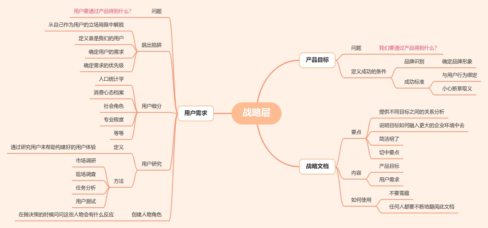
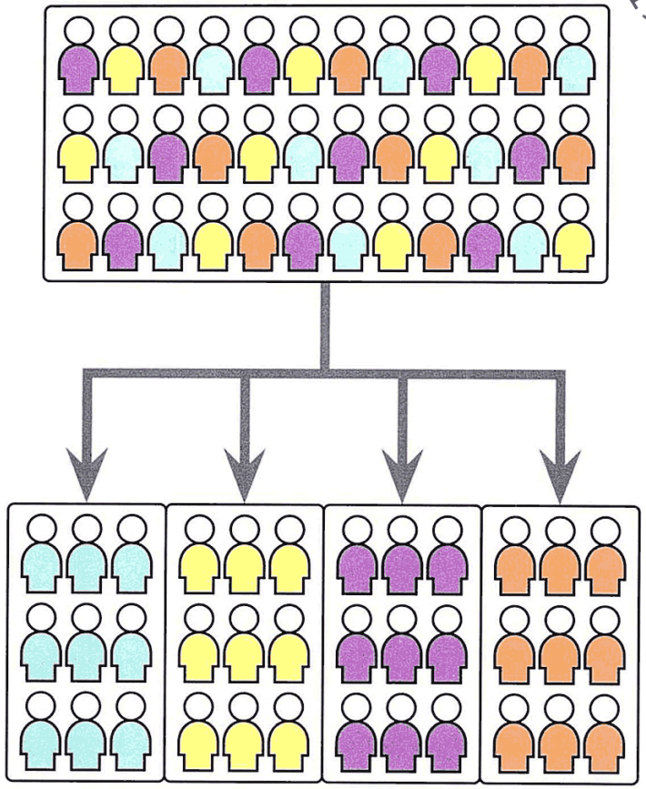
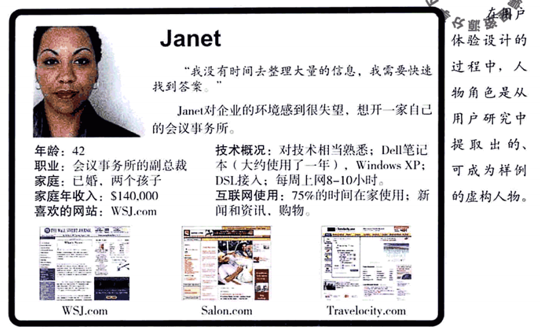
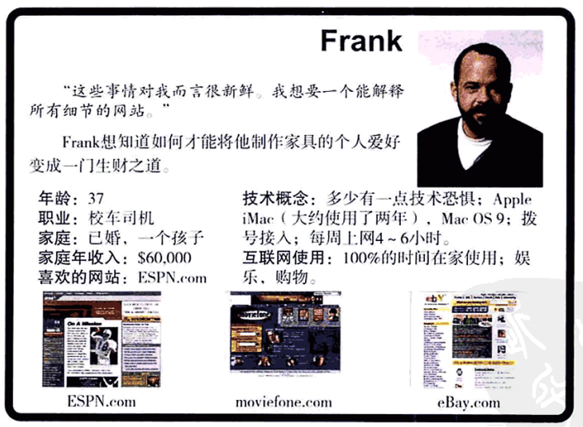

# 《用户体验要素》读书笔记（3）战略层-用户体验要素读书笔记3

## 目录

- [《用户体验要素》读书笔记（一）](读书笔记1.md)
- [《用户体验要素》读书笔记（二）](读书笔记2.md)
- [《用户体验要素》读书笔记（三）](读书笔记3-战略层.md)
- [《用户体验要素》读书笔记（四）](读书笔记4-范围层.md)
- [《用户体验要素》读书笔记（五）](读书笔记5-结构层.md)
- [《用户体验要素》读书笔记（六）](读书笔记6-框架层.md)
- [《用户体验要素》读书笔记（七）](读书笔记7-表现层.md)

## 战略层 产品目标和用户需求

本篇对应书本第3章，主要讲战略层。战略应该是设计用户体验的流程中的起点，并在流程中不断演变和改进。
> - 当战略被系统地修改与矫正时，这些工作就能成为贯穿整个过程的、持续的灵感源泉。

 

### 战略问题

在写第一行程序、描第一个像素，或配置第一个服务器之前，需要有人回答下面两个基本的问题：

- **我们要通过这个产品得到什么？**
- **我们的用户要通过这个产品得到什么？**

回答了第一个问题，才能据此描述出企业的**产品目标**，这是来自企业内部的目标。第二个问题则提出了关于**用户需求**的问题，这是来自企业外部的目标。

结合内外两个目标，**“产品目标”和“用户需求”组成了战略层**（定义），也是设计用户体验过程中做出每一个决定的基础。

此处的关键词是**明确**，越明确、清楚、确切地回答这两个问题，我们就越能精确地满足双方的需求。

 

### 产品目标

当产品目标无法口头表达出来时，对于应该如何完成产品，不同的人就容易有不同的想法。（要保证产品目标清晰明确，不存在二义性，且能确保表达过程中不出现歧义。）

避免在尚未充分了解问题之前试图得出产品目标。我们必须保证我们的决策不是随便决定的，**每一个我们做的决定，都应该建立在我们确切地了解了它的影响的基础之上**
。明确地定义“**成功的条件**”，而不是定义“通向成功的路径”。

#### 品牌识别

对于任何一个网站，它需要明确描述的基础目标之一就是**品牌识别**。品牌概念的范围很大（五感、情绪、概念等等），在用户与产品交互的同时，企业的品牌形象就不可避免地在用户的脑海中形成了。
**将品牌形象具体且明确的写进目标**，将会提高呈现出积极的品牌形象的机会。

#### 成功标准

理解你的目标，重点是理解你要怎样知道“**什么时候到达了终点**”。

成功标准指的是一些可以追踪的指标，在产品上线以后用来显示它是否满足了我们自己的目标和用户的需求。

书中举了两个成功标准的例子：
> - 单次访问时间，即每一次访问网站时的平均停留时间是多少？如果你鼓励用户随意轻松地发掘网站提供的服务，那么你一定希望看到单次访问时间有所增加。相反地，如果你想要提供快捷简便的信息或功能服务，那么你或许希望单次访问时间减少。
> - 印象数，即你的网站上每一个广告每天被展示的数量（*题外话，针对印象数这个概念，可以看看《监视资本主义：智能陷阱》这部纪录片，看看当今资本为了印象数是如何操控我们的生活的。*），这对于一个依赖广告收入的网站来说是决不可忽视的重要指标。但是你得小心地平衡这个目标和用户需求，毕竟打广告会令用户厌烦。

对用户体验决策而言有意义的成功标准，一定是可以明确地**与用户行为绑定**的标准，而这些用户行为也一定是可以通过设计来影响的行为。

**小心断章取义的标准**，它会造成误导。请后退一步，看看除了网站之外发生了什么事，以确定你了解事情的全貌。（学会掌控大局，不要被当前有限的信息限制了思考。）

书中在此举了一个例子：
> - 用户体验能极大地影响访问者地二次访问几率，所以测量回访数据可能是一个很好的方法，但有时候用户回不来可能是因为你的竞争对手展开了广告造势，或者你的公司因为负面新闻缠身等等。

 

### 用户需求

#### 抛弃自己的立场局限

> 我们很容易落入一个陷阱：认为我们正在为理想化的用户设计产品，理想化的用户就是“某些与我们完全一样的人”。事实上我们并不是为自己设计，而是为其他人设计。我们必须要了解“他们是谁”以及“他们的需求是什么”，必须要投入时间去研究这些需求，我们才能抛弃自己立场的局限，真正从用户的角度来重新审视网站。

简而言之，作为产品的设计者，我们必须要**定义谁是我们的用户**，以及**确定这些用户的需求**。我们可以调研他们，这些研究不仅能帮助我们了解用户需要什么，也能帮我们确定这些**需求的优先级别**。

#### 用户细分

用户细分指的是把大量的用户需求划分成几个可管理的部分。即将用户分成更小的群组，每一群用户都具有某些共同关键特征。

书中提及了一些最常见的办法：
> - **人口统计学**的标准划分：性别、年龄、教育水平、婚姻状况、收入等。数据概况可粗（男性：18\~49岁）可细（未婚、女性、大学毕业、25\~34岁、年薪5W美元）。
> - **消费心态档案**是用来描述用户对于这个世界，尤其是与你的产品有关的某个事物的观点和看法的心理分析方法。按人口统计特征划分出来的同一个用户群中，其世界观和感兴趣的事情往往不同。所以这个方法能让你得到很多无法从人口统计特征获取的新见解。
> - 用户对技术和网页本身的想法差异。对技术有恐惧心理的用户和高级用户在使用网站的方式上非常不同，因此我们的设计需要容纳不同类型的用户群。
> - 按用户对于产品或产品所提供的相关内容的知识有多少进行分类。卖厨具给一般人与给专业厨师的处理方式必然不同。
> - 按人们的**社会角色**或**专业角色**进行细分，学生家长和报考大学的学生对于信息的需求不尽相同。

需求相似的群组就合并，需求不同的一组人就分开，**最终目标是得到和你发现的“用户需求”数目一样多的细分用户群**。

另外，**很多需求是彼此矛盾的**，创建细分用户群可以让我们确实地分开这些需求，并且决定实现哪一种需求放弃另一种需求，**这个决策会影响日后与用户体验相关的每一个选择**。
> - 适合炒股新手的软件可能和适合炒股专家的软件大不相同。

#### 用户研究

**市场调研方法**：比如问卷调查、用户访谈、焦点小组
**现场调查**：了解用户在日常生活情景中的行为，费时费力又费钱，但是有效且全面。
**任务分析**：与现场调查方法相关的另一种更轻量级更低成本的做法，指仔细地分解用户完成任务的精确步骤。比如在用户访谈中，让用户讲述自己的故事，说出他们的经验。
**用户测试**：指请用户来帮忙测试你的产品。

##### 可用性

**最终目标**是**寻找产品更容易使用的途径**。

要达到这个目标，可以动用用户测试：
> - 测试一个已完成的网站。
> - 让用户测试原型
> - **卡片排序法**：给用户一沓索引卡片，每一张卡片附有信息元素的名字、描述，一张图像或内容的类型。然后用户根据小组或类别，依照自己感到最自然的方式将卡片排列出来。分析几位用户的卡片排列结果，就可以帮助我们了解用户对产品信息的看法。

#### 创建人物角色

创建**人物角色**（又名**用户模型**或**用户简介**），可以让你的用户变得更加真实。
> - 通过创建一张人物的面孔和名字，你将用户调查及用户细分过程中得到的分散资料重新关联起来，人物角色可以帮助你确保在整个设计过程期间把用户始终放在心里。

> - 这些任务角色档案可以印出来并且张贴在办公室周围，这样当我们要做决定的时候，可以问自己：“那会对Janet有用吗？Frank有什么反应呢？”人物角色能帮助我们在前进的每一步都记着用户。

 

### 团队角色和流程

> - 拟定决策的时候有一群人经常被忽略——普通员工。这些人通常比他们的经理更知道“什么行得通”和“什么不可行”——特别实在用户需求方面

**战略文档**：定义产品目标和用户需求的文档，也称之为**愿景文档**。

用户需求有时会被单独记录在**用户调研报告中**。
> - 这些文档不仅仅是列出目标清单——**它应当提供不同目标之间的关系分析，并且说明这些目标要如何融入更大的企业环境中去**。这些目标和分析意见来自于决策者、普通员工和用户自己，这些意见生动地说明了项目中的战略制定问题。
> - 并不是文档越多越好，没有必要把每一个数据来源和相关意见都写出来，**要让文档简洁明了并切中要点**。参阅者不会有那么多时间或兴趣翻阅上百页的参考资料。

不要制定完战略文档后将其雪藏，所有参与者都需要这份文档以帮助他们在工作中做出正确的决定。如果仅仅是因为包含敏感资料就不告知应该理解战略目标的团队，只会破坏他们理解事情的能力。

