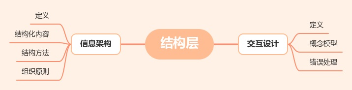
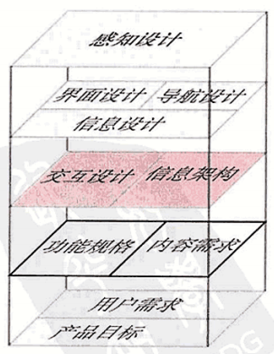
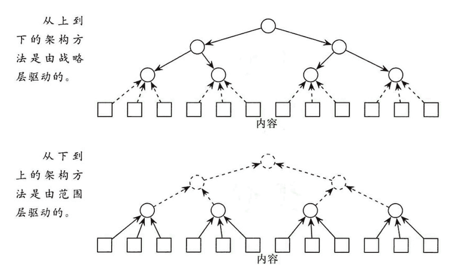
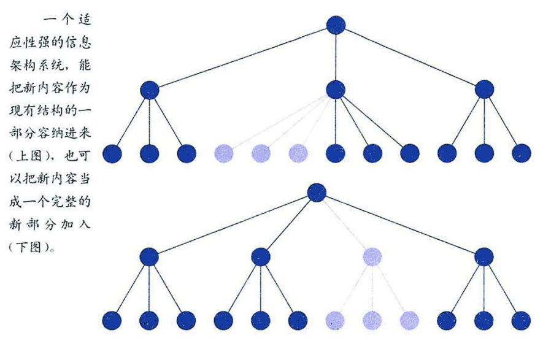
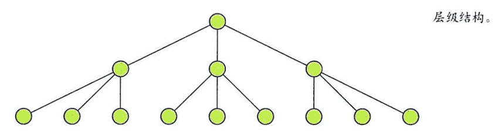
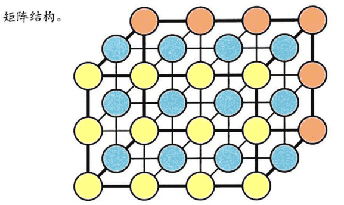
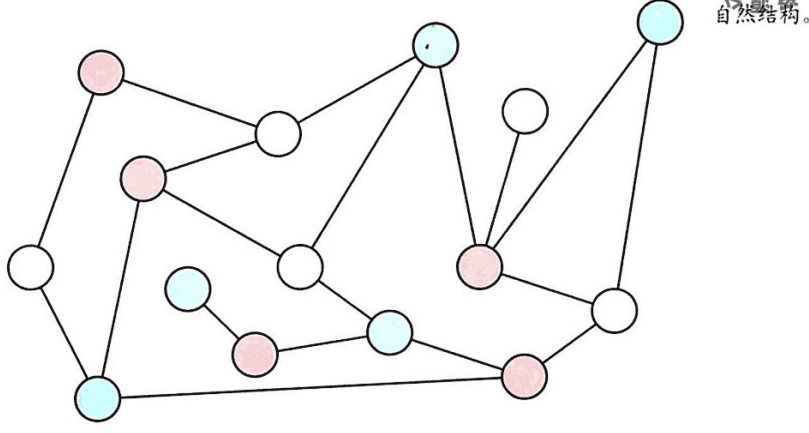
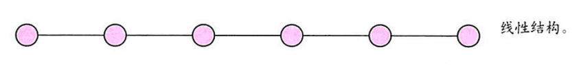
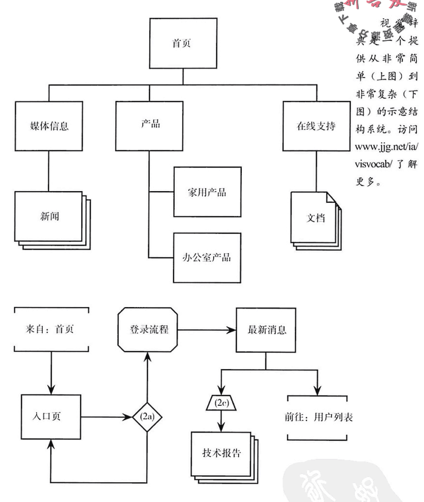

# 《用户体验要素》读书笔记（5）结构层-用户体验要素读书笔记5

## 目录

- [《用户体验要素》读书笔记（一）](读书笔记1.md)
- [《用户体验要素》读书笔记（二）](读书笔记2.md)
- [《用户体验要素》读书笔记（三）](读书笔记3-战略层.md)
- [《用户体验要素》读书笔记（四）](读书笔记4-范围层.md)
- [《用户体验要素》读书笔记（五）](读书笔记5-结构层.md)
- [《用户体验要素》读书笔记（六）](读书笔记6-框架层.md)
- [《用户体验要素》读书笔记（七）](读书笔记7-表现层.md)

## 结构层 交互设计与信息架构

本篇对应原书的第五章，结构层章节。主要目标是让范围层中分散的特性等片段**有结构地组成一个整体**，即创建一个**概念结构**。

### 概括

- **交互设计**：涉及“为用户涉及结构化体验”，**关注会影响用户执行和完成任务的元素**。
- **信息架构**：在内容建设方面构建用户体验，**关注将信息表达给用户的元素**，要考虑组织管理、分类、数序排列，相关学科：图书管理、新闻学、技术通信等。

两者都强调一个重点：确定各个要呈现给用户的元素的“**模式**”和“**顺序**”，完成这两者的涉及不仅仅需要技术，**还要求设计者理解用户的工作方式、行为和思考方式**。

 

### 交互设计

> 人类在使用产品的时候，用户和机器两者之间就会产生某种类似舞蹈的步伐。用户移动，系统响应；接着用户再移动，来回应系统的响应，这样舞蹈才能继续进行。
> 
> 每一位舞者都会告诉你，成功的舞蹈要求每一个参与者都能预测对方的移动。

这个比喻十分有趣，设计软件的时候我们应当考虑用户会如何行动，预测他们的行动，在此基础上进行设计。

> 与其针对机器的最佳工作方式来设计系统，还不如**设计一个对用户而言最好的系统**。

面向系统设计其实是大部分程序员的通病（包括我），停下来思考下怎么样做是对用户最好的，现代的算力并不总是紧缺的，如果紧缺的时候应当注意**平衡好用户与系统**两端。

#### 概念模型

> 用户对于“交互组件怎样工作”的观点称为**概念模型**。软件是否把某个特性处理成用户所熟悉的某个概念？

书中针对典型的电子商务网站给出了两个同类型的比喻。

|比喻|功能1|功能2|
|:-------:|:-------:|:-------:|
|购物车|“添加”与“删除”|“结账”|
|分类订货单|“编辑”|“寄出”|

在当下的现实中，购物车的概念模型被广泛地应用在网络商城，因为它是**传统的购物方式**，而如今，购物车已经是一个广泛存在的概念模型了，如果你要做商城，最好也按这个概念模型做，这能让用户快速熟悉你的网站。

如果你有一个好理由，打破传统也没关系，记得准备好另一个符合用户需求且在情理之中的概念模型以备使用。

不必将概念模型明确的告诉用户，这反而会混淆用户，让概念模型符合用户的直觉即可。

不要将比喻从现实世界中一字不落地照搬到产品中，过分运用要不得。

#### 错误处理

> 任何一个交互设计地项目都有很大地部分牵涉处理“用户错误”——当人们犯错误时系统要怎么回应，并且当错误第一次发生时，系统要如何防止人么你继续犯错？

- 最好的办法：设计出不可能犯错的系统，比如自动档汽车，想启动发动机只能挂档到P档上。然而大部分的用户错误并没有这么简单就可以避免。
- 系统应该帮助用户找出错误并改正它们，某些情况下可以让系统去改正错误，但是注意不要过分，因为有些被识别成错误的现象可能并非错误。
- 无法纠错的情况下，系统应当提供从错误中恢复的方式。最有名的例子就是“撤销（undo）”功能。

 

### 信息架构

> 信息架构研究的是**人们如何认知信息的过程**，对于产品而言，信息架构关注的就是**呈现给用户的信息是否合理并具有意义**。
> 
> 信息架构主要的工作是设计**组织分类**和**导航的结构**，让用户可以高效浏览网站内容。
> 
> 同时还要求创建**分类体系**，对应并符合产品目标和用户需求。

#### 结构化内容

分类体系有两种建立办法：

- **从上到下**：先从最广泛的、最有可能满足决策目标的内容开始分类，然后再依据逻辑细分出次级分类。
- **从下到上**：由根据对“内容和功能需求的分析”而来。先从已有的资料开始，把这些资料统统放到最低级别的分类中，然后再将他们分别归属到较高一级的分类。
  

> 结构质量最重要的标准，不是“整个过程一共需要多少步骤”，而是“**用户是否认为每一个步骤都是合理的**”，以及“**当前的步骤是否自然延续了上一个步骤中的任务**”。

> 一个高效结构的有点就是具备“**容纳成长和适应变动**”的能力。然而，新内容的积累最终将会使你再次审视网站的阻止分类原则

#### 结构方法

> 信息架构的基本单位是节点。节点可以对应任意的信息片段或组合——它可以小到是一个数字（比如产品的价格），也可以大到是整个图书馆。

常见结构：

- **层级结构**：也称树状结构或中心辐射结构，是最常见的一种结构。节点与相关节点之间存在父子关系，子节点代表着更狭义的概念。导航菜单、组织架构常用结构。
  - 

- **矩阵结构**：允许用户再节点与节点之间沿着两个或更多的“维度”移动。由于每一个用户的需求都可以和矩阵中的一个“轴”联系再一起，因此矩阵结构通常能帮助那些“带着不同需求而来”的用户，使他们能在相同内容中寻找各自想要的东西。
  - 说实话这单单阅读这一段文字并不易懂，但笔者认为excel表的筛选功能应该就是矩阵结构，不同的用户使用不同的筛选条件，在同一组信息中找到自己想要的东西。一般来说两个维度比较容易接受，比如一个excel文件可以有多张sheet，第三维度可以认为是有多个excel文件。
  - 

- **自然结构**：不会遵循任何一致的模式。节点是逐一被连接起来的，同时这种结构没有太强烈的“分类”的概念。适合一系列关系不明确或一直在演变的主题。
  - 笔者猜测这个结构可能在游戏地图上有所应用，比如warframe的自动生成地图，还有大多数rougelike游戏的随机地图。
  - 

- **线性结构**：来自于你熟悉的线下产品——事实上，你现在正在体验其中的一种（阅读）。连贯的语言流程是**最基本**的信息结构类型。书、文章、音像和录像全部被设计成一种线性的体验。
  - 

#### 组织原则

> - 节点在信息架构中是依据**组织原则**来安置的。组织原则决定哪些节点要编成一组，哪些节点要保持独立标准。
> - 一般来说，你在产品最高层级使用的组织原则应该紧密地与“网站目标”和“用户需求”相关。而在结构中较低地层级，内容与功能需求将对你所采取地组织原则产生重大影响。

- 公司的信息网站：不同内容所针对的观众。
    - 消费者、企业集团、投资者
- 新闻内容网站：时间顺序

> - 组织原则往往不止一个，重点是创建一个能与“**产品目标**”和“**用户需求**”相对应的、正确的结构。
> - 在创建结构时，我们就要具体地识别出用户心中至关重要的那些信息。成功地用户体验，就是能事先预知用户的期望并将其纳入设计之中。

#### 语言和元数据

> - 用户仍然有可能无法在结构中找到他们想走的路，这是因为他们无法了解你的**命名原则**：描述、标签，和网站使用的其他术语。
> - **受控词典**网站使用的一套标准语言，是一个用来强调一致性的工具。创造并遵守一个反映了用户语言的受控词典是防止企业内部的专用术语侵入网站的最佳方法。
> - **类词词典**会提供常用的、但未纳入该网站标准用语的词汇以供选择。
> - **元数据**指**关于信息的信息**，是以一种结构化的方式来描述内容的信息。

由于没有做过信息驱动类的工作，笔者暂时不明白元数据的具体概念和应用，只做摘录。不过书中确定了一点，**可靠的元数据能提供比全文搜索引擎更可靠的搜索结果**。

### 团队角色和流程

作者一遍又一遍地做架构图，找到了一种规范化地方式来绘制网站地构思。他创造了一个叫[**视觉辞典**](www.jjg.net/ia/visvocab/)的系统。

