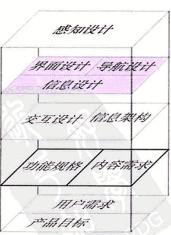
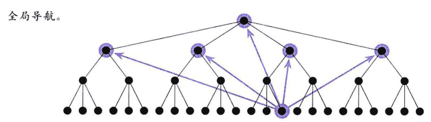
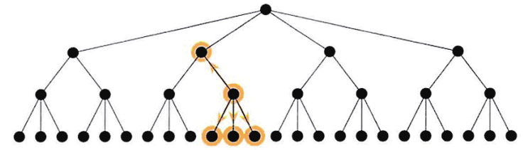
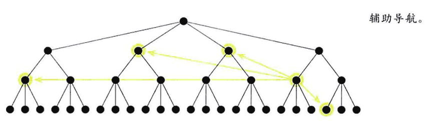
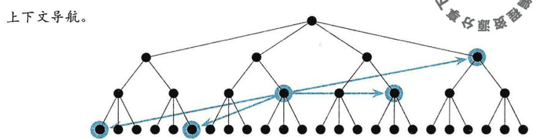
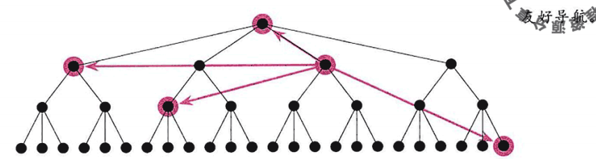
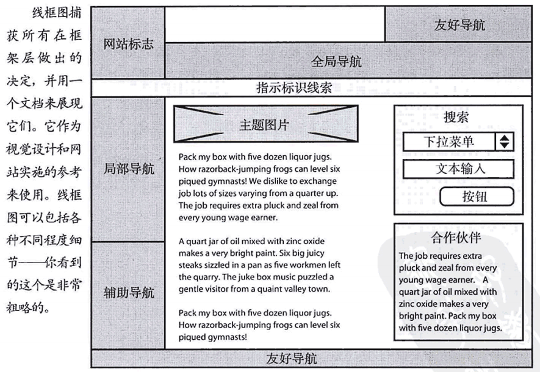

# 《用户体验要素》读书笔记（6）框架层-用户体验要素读书笔记6

## 目录

- [《用户体验要素》读书笔记（一）](读书笔记1.md)
- [《用户体验要素》读书笔记（二）](读书笔记2.md)
- [《用户体验要素》读书笔记（三）](读书笔记3-战略层.md)
- [《用户体验要素》读书笔记（四）](读书笔记4-范围层.md)
- [《用户体验要素》读书笔记（五）](读书笔记5-结构层.md)
- [《用户体验要素》读书笔记（六）](读书笔记6-框架层.md)
- [《用户体验要素》读书笔记（七）](读书笔记7-表现层.md)

## 框架层

本篇对应原书框架层。
> - 在框架层，我们要更进一步地提炼这些结构，确定详细的界面外观、导航和信息设计。

### 定义

> 前一章的结构层界定了我们的产品将用什么方式运作；框架层则用于确定**用什么样的功能和形式来实现**。
>
> 在结构层，我们看到一个较大的架构和交互的设计；在框架层，我们的关注点几乎全部在独立的组件以及它们之间的相互关系上。

该层包含三个要解决的模块:这些模块的问题边界很容易变得模棱两可，但是仍然定义成不同的领域来帮助我们评估是否已经找到了合适的解决方案。

- **界面设计**：功能型产品由此确定框架，即确定“按钮、输入框和其他界面控件”。核心是**提供用户做某些事的能力**。
- **导航设计**：信息型产品要解决此问题，这是专门用于呈现信息的一种界面形式。核心是**提供用户去某个地方的能力**。
- **信息设计**：功能和信息都要做，它用于呈现有效的信息沟通。核心是**传达想法给用户**。

 

### 习惯与比喻

> 让你的**界面与用户的习惯保持一致**很重要，但更重要的是，**界面要与它自身保持一致**。概念模型有助于你保持内部一致性。即使实在概念模型不同的地方，这些概念模型所共用的模块也应该以相似的方式来对待。

设计界面的时候要时刻注意**用户的学习成本**，大多数情况下，越低越好。

关于**比喻**，比喻本身具有**文化界限**，**有些用户可能来自和你完全不同的文化背景**，你的比喻可能在这些用户面前失效。
> 有效的比喻，就是要减少用户在“理解和使用你的产品功能”时**对猜测的要求**。

 

### 界面设计

> 界面设计要做的全部事情就是**选择合适的界面元素**。这些界面元素要能帮助用户完成他们的任务，还要通过适当的方式让它们容易被理解和使用。
>
> 哪个功能要在哪个界面上完成，是我们在结构层的交互设计中已经决定的；而**功能在界面上如何被用户人知到**，则属于界面设计的范畴。

好的界面设计：

- 让用户一眼看到“最重要的东西”。
- 不重要的东西不应该被注意到。

从这两点可以发现挑战在于如何弄清楚，**什么东西对用户来说重要，什么不重要**。与开发程序时要注意边缘条件、平等对待一切可能性的思路不同，考虑重要性的过程，要**考虑大多数**。

 

### 导航设计

> 任何一个网站的导航设计都必须同时完成以下三个目标：
> - 提供给用户一种在网站间跳转的方法。（用户能去哪）
> - 传达出导航元素和它们所导航的内容之间的关系。（用户能去哪）
> - 导航设计必须传达出它的内容和用户当前浏览页面之间的关系。（用户在哪）

常见的导航系统：

- **全局导航**：提供了**覆盖整个网站的通路**。一个经典应用就是在导航栏放上能到网站所有**主要栏目的链接**。不管你想去哪，你都能从全局导航中到达那里。
    - 

- **局部导航**：提供给用户在这个架构中到“**附近地点**”的通路。如果你的架构反映了用户对这个网站的内容结构的思路，那么局部导航通常都会比其他导航系统更有用。
    - 

- **辅助导航**：提供了全局导航或局部导航不能快速到达的**相关内容的快捷途径**。
    - 

- **上下文导航**：也叫“内联导航”，是嵌入页面自身内容的导航。典型应用就是文字超链接。用户需要额外信息的时候，恰恰是它们在读文本的时候。
    - 

- **友好导航**：用户通常不需要这些链接，但是用户需要的时候，它就在那里。比如联系信息、反馈表单、法律声明的链接通常都设置在友好导航中。
    - 

- **网站地图**：给用户一个简明、单页的网站整体结构的快捷浏览方式。网站地图通常作为网站的一个分级概要出现，提供一级、二级导航链接，通常不会有更低级的链接。如果需要设置低级链接的话可能是结构定义有问题。

- **索引表**：按字母顺序排列的链接列表，在大规模内容网站中非常有用。

 

### 信息设计

信息设计简略地说就是回答**信息如何呈现给用户**这个问题。

所谓如何呈现给用户，最关键的是用一种能“**反映用户思路**”和“**支持他们的任务和目标**”的方式来**分类和排列信息元素**。

 

### 指示标识

**指示标识**就是信息设计和导航设计的结合，现实中的例子就是颜色编码，医院地上的导航线就有颜色分类。

不过笔者并没有在网络世界中找到明显的指示标识的例子。但是**注意导航设计的信息如何呈现**是没有错的。

 

### 线框图

> 页面布局是将**信息设计、界面设计和导航设计放置到一起**，形成一个统一的、有内在凝聚力的架构的地方。
>
> 这一次需要平衡很多东西。这就是为什么页面布局被纳入到一个详细的文档，并称为页面示意图或**线框图**的原因。

> 线框图是整合在框架层的全部三种要素的方法：
> - 通过安排和选择界面元素来整合界面设计。
> - 通过识别和定义核心导航系统来整合导航设计。
> - 通过放置和排列信息组成部分的优先级来整合信息设计。

注意文档级别，文档本身并不是目的，为了文档本身而创建文档只是在浪费时间。
