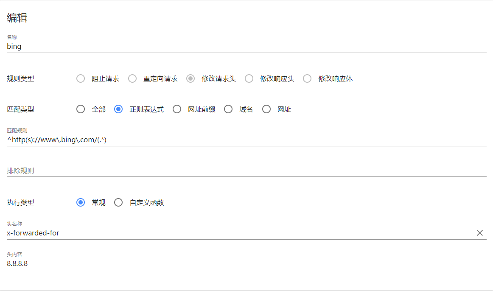

# bing 使用国际版本

## 背景

中国大陆网络访问 bing 一般会被重定向到 cn.bing.com，而国际 bing 的域名实际上是 www.bing.com 。

这就造成了使用 bing 的一个无形的门槛，尤其是 new bing 出世后现在。

## 解决方案

使用 chromium 内核的浏览器的方案: (Chrome, Firefox, Microsoft Edge)

1. 安装浏览器插件 Header Editor
2. 配置一个修改请求头的规则
    
3. 匹配规则为 `^http(s)://www\.bing\.com/(.*)`
4. 头名称为 `x-forwarded-for`
5. 头内容为 `8.8.8.8`
6. 保存

也可以直接导入:
1. 创建一个 txt 文件
2. 复制如下代码到 txt 文件内:
    ```json
    {
        "request": [],
        "sendHeader": [
            {
                "enable": true,
                "name": "bing",
                "ruleType": "modifySendHeader",
                "matchType": "regexp",
                "pattern": "^http(s)://www\\.bing\\.com/(.*)",
                "exclude": "",
                "group": "搜索引擎",
                "isFunction": false,
                "action": {
                    "name": "x-forwarded-for",
                    "value": "8.8.8.8"
                }
            }
        ],
        "receiveHeader": [],
        "receiveBody": []
    }
    ```
3. 导入该文件
4. 保存

之后就可以在地址栏输入 www.bing.com 直接进入国际 bing 了。

- 注意，需要科学上网。

## 原理分析

上面的操作本质上就是修改了请求头中的一个字段内容:

```json
{
  "x-forwarded-for": "8.8.8.8"
}
```

这个字段一般是服务器用来追踪访问者 IP 用的，可见中国境内访问 bing 被强制跳转到 cn bing 的原因是 bing 服务器对请求头做了检测，并让来自中国境内 IP 的请求重定向到 cn bing。